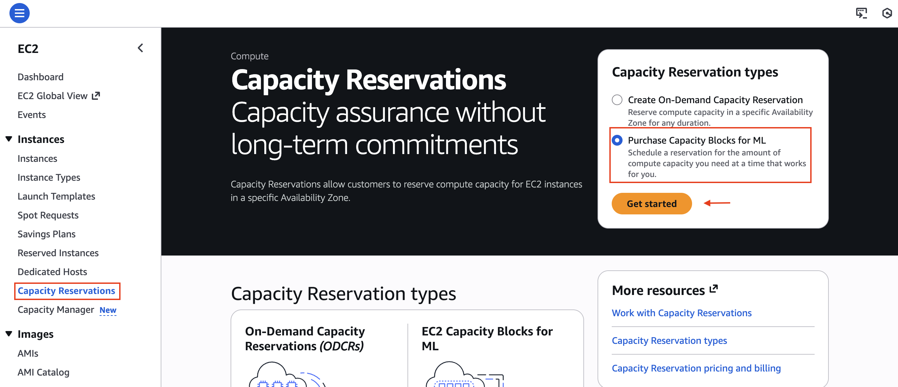
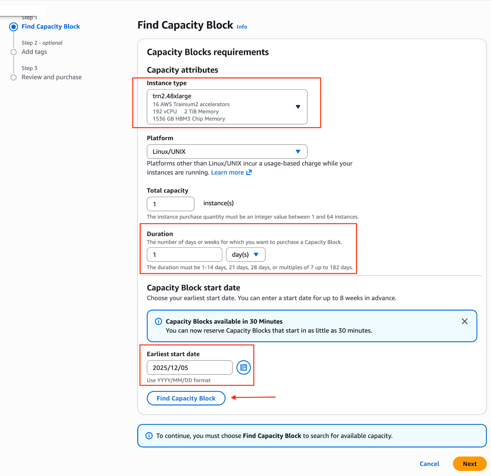
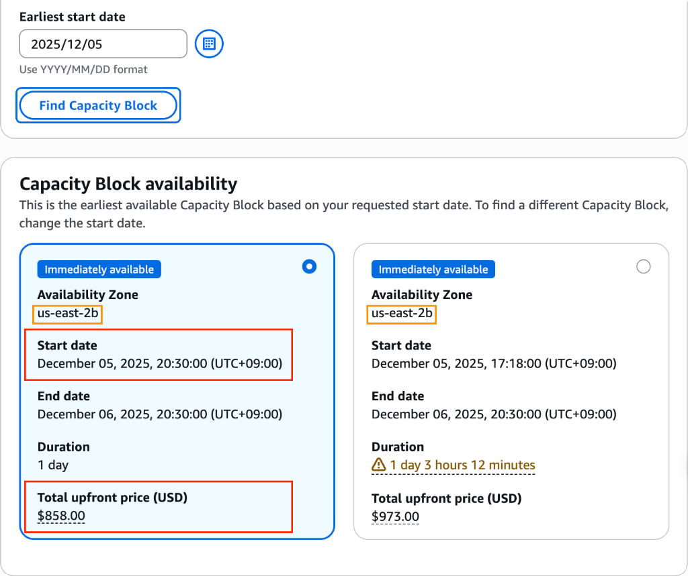
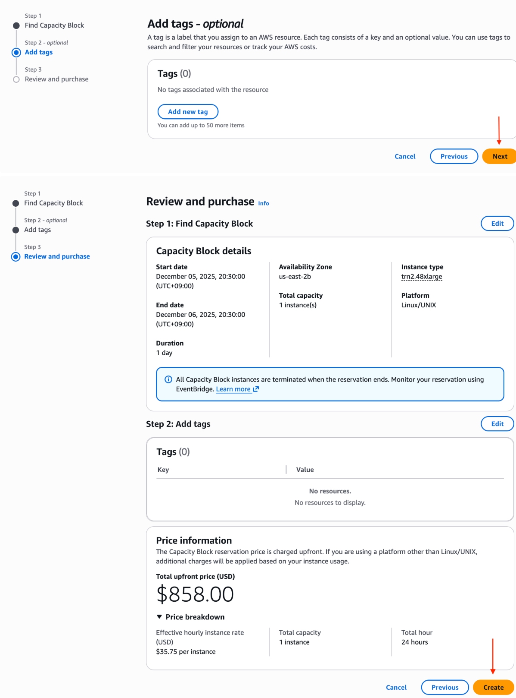
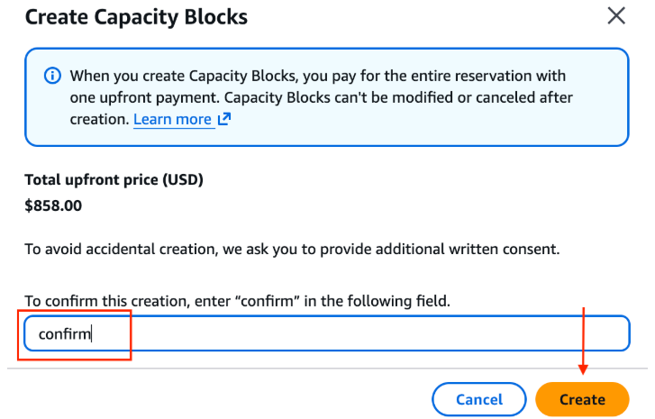
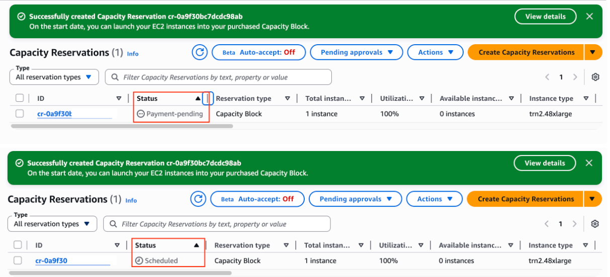
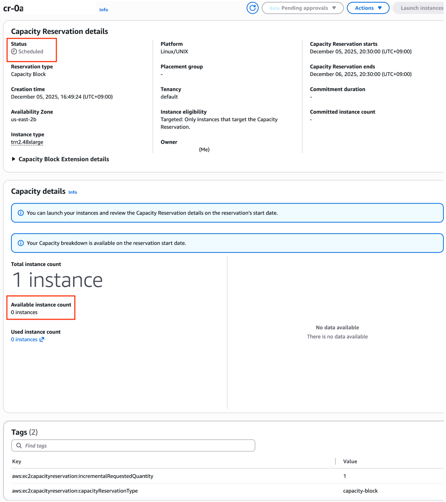
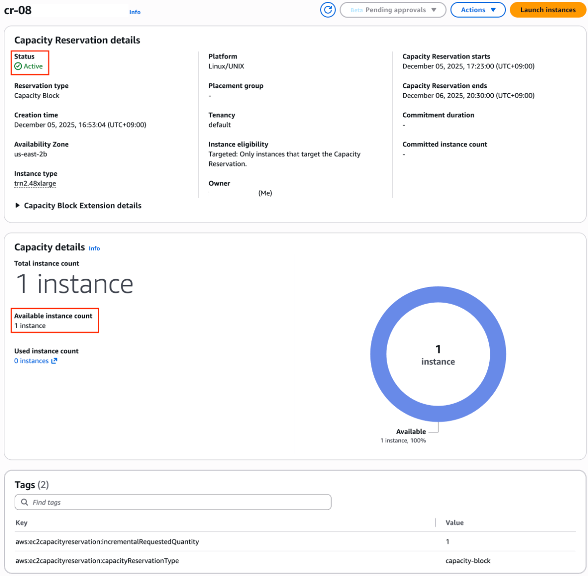

# Capacity Blocks for ML Practical Guide

This page walks you through how to use **Capacity Blocks for ML**, step by step. For a detailed comparison of GPU/Trainium purchase options, see the [GPU/Trainium Purchase Options page](purchase-options/index.md).

---

## 🎯 Key Features of Capacity Blocks

| Item | Description |
|------|------|
| **Reservation window** | View and reserve capacity from as early as 8 weeks to as late as 30 minutes before the start time |
| **Reservation duration** | From 1 day up to 182 days (in 1-day increments for 1–14 days, and in 7-day increments beyond that).<br>※ Subject to availability, you can extend a Capacity Block after purchase ([Extending a Capacity Block](https://docs.aws.amazon.com/AWSEC2/latest/UserGuide/capacity-blocks-extend.html)) |
| **Quantity** | Up to 64 instances |
| **Payment** | Paid in full upfront at reservation time. No cancellations or changes after purchase (regardless of usage) |
| **Supported instances** | P instances (P4d, P4de, P5, P5e, P5en, P6-B200, P6-B300, P6e-GB200) </br> and Trainium instances (Trn1, Trn2) |
| **Capacity assurance** | 100% assured once the reservation is confirmed, with instances co-located within an EC2 UltraCluster |
| **Start and end times** | Regardless of region, blocks start at 11:30 UTC </br> and begin ending at 11:00 UTC |

The number of instances and reservation durations you can reserve depend on capacity availability. Check what is currently available by following the steps in [Purchasing a Capacity Block](#purchasing-a-capacity-block) below.

---

## 📋 Prerequisites

### 1. Check Service Quotas

Capacity Blocks quotas are separate from On-Demand quotas. Check them in Service Quotas:

```
Service: Amazon EC2
Quota name: Running Capacity Block P Hosts (or Trn)
```

!!! warning "A non-zero quota is required to reserve"
    New accounts may have a default quota of 0. Request a quota increase in advance, and contact your AWS account team for assistance if needed.

### 2. Check Regions and Pricing
The table below lists the instances and regions that support Capacity Blocks, along with the current reservation rates, based on [Amazon EC2 Capacity Blocks for ML pricing](https://aws.amazon.com/ec2/capacityblocks/pricing/). Reservation prices are updated regularly based on supply and demand trends; the next update is scheduled for January 2027. A Capacity Block is charged at the rate in effect at the time of purchase, even if it starts after a price update. Because available regions and offerings change frequently, always verify the latest information on the pricing page and in the EC2 console before making a reservation.

| Instance type | Accelerator | Effective hourly rate per instance (per accelerator) | Supported regions (as of Oct '26) |
|------|------|------|------|
| u-p6e-gb200x72 | 72 × B200 | &#36;761.904 (&#36;10.582) | Dallas Local Zone |
| u-p6e-gb200x36 | 36 × B200 | &#36;380.952 (&#36;10.582) | Dallas Local Zone |
| p6-b300.48xlarge | 8 × B300 | &#36;129.168 (&#36;16.146)<br>GovCloud: &#36;134.55 (&#36;16.819) | N. Virginia, Oregon, Atlanta Local Zone, US-East GovCloud, Seoul, Hyderabad, Jakarta |
| p6-b200.48xlarge | 8 × B200 | &#36;113.666 (&#36;14.208)<br>GovCloud: &#36;118.404 (&#36;14.801) | N. Virginia, Ohio, Oregon, US-West GovCloud, US-East GovCloud, Mumbai, Hyderabad, Stockholm, Paris |
| p5en.48xlarge | 8 × H200 | &#36;63.158 (&#36;7.895) | N. Virginia, Ohio, N. California, Oregon, Atlanta Local Zone, Jakarta, Mumbai, Seoul, Tokyo, London, Spain, Stockholm |
| p5e.48xlarge | 8 × H200 | &#36;54.924 (&#36;6.866) | Ohio, N. California, Oregon, Phoenix Local Zone, Jakarta, Mumbai, Tokyo, Sydney, London, Stockholm, Sao Paulo |
| p5.48xlarge | 8 × H100 | &#36;47.757 (&#36;5.970) | N. Virginia, Ohio, Oregon, N. California, Atlanta Local Zone, Tokyo, Jakarta, Mumbai, Sydney, London, Stockholm, Sao Paulo |
| p5.4xlarge | 1 × H100 | &#36;5.970 (&#36;5.970) | N. Virginia, Ohio, Oregon, Tokyo, Mumbai, Sydney, London, Sao Paulo |
| p4de.24xlarge | 8 × A100 | &#36;20.369 (&#36;2.546) | N. Virginia, Oregon |
| p4d.24xlarge | 8 × A100 | &#36;13.57 (&#36;1.696) | N. Virginia, Ohio, Oregon |
| trn2.48xlarge | 16 × Trainium2 | &#36;35.7608 (&#36;2.235) | Ohio, Hyderabad |
| trn2.3xlarge | 1 × Trainium2 | &#36;2.235 (&#36;2.235) | Hyderabad, Melbourne, Sao Paulo |
| trn1.32xlarge | 16 × Trainium | &#36;9.532 (&#36;0.596) | N. Virginia, Ohio, Oregon, Mumbai, Melbourne, Sydney, Stockholm |

All prices are in USD and exclude operating system fees, which are billed separately for the time your instances run.

!!! warning "Choosing a region"
    Before purchasing Capacity Blocks, make sure that the services you plan to use alongside your GPUs (e.g., FSx for Lustre, EFA, and ParallelCluster) are supported in that region, and check capacity availability. Capacity Blocks cannot be cancelled or refunded after purchase.
    
!!! warning "Enable opt-in regions first"
    Jakarta, Hyderabad, Melbourne, and Spain are opt-in regions, which are disabled in your AWS account by default (all regions launched after March 20, 2019 are opt-in regions). To use an opt-in region, you must enable it first. For instructions, see [Enable or disable AWS Regions in your account](https://docs.aws.amazon.com/accounts/latest/reference/manage-acct-regions.html#rande-manage-enable).
    
  

### 3. IAM Permissions

Minimum required permissions:

```json
{
  "Version": "2012-10-17",
  "Statement": [
    {
      "Effect": "Allow",
      "Action": [
        "ec2:DescribeCapacityBlockOfferings",
        "ec2:PurchaseCapacityBlock",
        "ec2:DescribeCapacityReservations",
        "ec2:CancelCapacityReservation",
        "ec2:RunInstances",
        "ec2:CreateCapacityReservationFleet"
      ],
      "Resource": "*"
    }
  ]
}
```

---

## 🛒 Purchasing a Capacity Block { #purchasing-a-capacity-block }

In the console, go to **EC2 > Capacity Reservations > Purchase Capacity Blocks for ML**.



### Step 1: Select an Instance Type and Duration

Select the instance type you want (`trn2.48xlarge`), the duration, and the start date.



### Step 2: Review and Select an Available Block

Review the available dates and prices. Each Capacity Block is tied to a specific Availability Zone (AZ).



!!! warning "Important"
    Record the AZ assigned to you here (e.g., `us-east-2b`). You will need to create a subnet in this AZ to launch your instances.

!!! warning "Start-immediately option"
    Capacity Blocks start at 11:30 UTC by default. However, if instances are available at the time you search, you can choose the start-immediately option and select a block that shows the extra (non-full-day) hours and cost, allowing your workload to start immediately.


### Step 3: Confirm the Purchase

Review the final price and schedule, then type `confirm` in the text box to complete the purchase.




---

## 💻 Reserving with the CLI

### View Offerings

```bash
aws ec2 describe-capacity-block-offerings \
  --instance-type p5en.48xlarge \
  --instance-count 2 \
  --capacity-duration-hours 168 \
  --start-date-range "2026-08-10T00:00:00Z" \
  --end-date-range "2026-08-20T00:00:00Z" \
  --region ap-northeast-2
```

Example output:

```json
{
  "CapacityBlockOfferings": [
    {
      "CapacityBlockOfferingId": "cbro-0123456789abcdef0",
      "InstanceType": "p5en.48xlarge",
      "AvailabilityZone": "ap-northeast-2a",
      "InstanceCount": 2,
      "StartDate": "2026-08-11T00:00:00Z",
      "EndDate": "2026-08-18T00:00:00Z",
      "CapacityBlockDurationHours": 168,
      "UpfrontFee": "45000.00",
      "CurrencyCode": "USD"
    }
  ]
}
```

### Purchase

```bash
aws ec2 purchase-capacity-block \
  --capacity-block-offering-id cbro-0123456789abcdef0 \
  --instance-platform Linux/UNIX \
  --region ap-northeast-2
```

### Launch Instances

```bash
aws ec2 run-instances \
  --instance-type p5en.48xlarge \
  --capacity-reservation-specification \
    "CapacityReservationTarget={CapacityReservationId=cr-0123456789abcdef0}" \
  --image-id ami-xxxxxxxx \
  --count 2 \
  --region ap-northeast-2
```

---

## 🔍 Checking Reservation Status

Capacity Block reservation states:

| State | Meaning |
|------|------|
| `payment-pending` | Payment is being processed |
| `payment-failed` | Payment failed (verify your payment method or credit limit) |
| `scheduled` | Reservation confirmed, waiting to start |
| `active` | Currently available for use |
| `expired` | Reservation period has ended |
| `cancelled` | Cancelled by the user |


Once the purchase completes, the state changes from `Payment-pending` to `Scheduled`.



- **Scheduled:** The purchase succeeded, but the start time has not yet arrived.


- **Active:** The reservation period has started, and you can launch instances.



---

## 📐 Usage Patterns

### Pattern 1: Training Sprint

```
[Day 0] View offerings & reserve (7 days)
[Day 1] Launch instances → set up environment (DLAMI, Docker, EFA)
[Day 2-6] Intensive training (save checkpoints to S3)
[Day 7] Training complete → instances terminate (released automatically)
```

### Pattern 2: Workshop / Demo

```
[2 weeks before] Reserve a 1–2 day offering
[Event day] Launch instances → run the hands-on session
[End] Released automatically (no additional cost)
```

### Pattern 3: Automating Recurring Reservations

```python
import boto3
from datetime import datetime, timedelta

ec2 = boto3.client('ec2', region_name='ap-northeast-2')

# Automatically find & purchase a 7-day block starting each week
response = ec2.describe_capacity_block_offerings(
    InstanceType='trn2.48xlarge',
    InstanceCount=4,
    CapacityDurationHours=168,
    StartDateRange=datetime.utcnow() + timedelta(days=7),
    EndDateRange=datetime.utcnow() + timedelta(days=14),
)

offerings = response['CapacityBlockOfferings']
if offerings:
    best = min(offerings, key=lambda x: float(x['UpfrontFee']))
    ec2.purchase_capacity_block(
        CapacityBlockOfferingId=best['CapacityBlockOfferingId'],
        InstancePlatform='Linux/UNIX',
    )
    print(f"Reserved: {best['StartDate']} ~ {best['EndDate']}")
```


---

## Sharing Capacity Blocks Within an AWS Organization
After purchasing Capacity Blocks for ML, you can share them with other accounts in your AWS Organization using [AWS Resource Access Manager](https://docs.aws.amazon.com/ram/latest/userguide/what-is.html) (AWS RAM). AWS RAM lets you share AWS resources across accounts in your organization, and the accounts you share with (consumer accounts) can use that capacity to launch instances.

The owner account pays the upfront reservation fee and retains ownership. When a consumer account launches instances, that account pays any additional charges, such as [operating system license fees](https://aws.amazon.com/ec2/capacityblocks/pricing/). A Capacity Block can be shared with multiple accounts at once, and the reserved capacity is consumed on a first-come, first-served basis.

For details, see [Sharing Capacity Blocks for ML across your AWS Organization](https://aws.amazon.com/blogs/compute/sharing-capacity-blocks-for-ml-across-your-aws-organization/).


---


## 📚 References

- [Capacity Blocks for ML documentation](https://docs.aws.amazon.com/AWSEC2/latest/UserGuide/ec2-capacity-blocks.html)
- [EC2 Capacity Blocks pricing](https://aws.amazon.com/ec2/capacityblocks/pricing/)
- [Capacity Blocks FAQ](https://aws.amazon.com/ec2/faqs/#Capacity_Blocks_for_ML)
- [Purchase Options Comparison](purchase-options/index.md)

---

## ⚠️ Important Considerations

| Item | Details |
|------|------|
| **Cancellation** | No cancellations or changes after purchase (regardless of usage) |
| **Unused capacity** | Charges apply even if no instances are launched (prepaid) |
| **End of reservation** | Instances begin terminating automatically 30 minutes before the reservation ends, so make sure your data is backed up in advance |
| **EBS** | EBS volumes may be deleted when instances terminate (check `DeleteOnTermination`) |
| **Time zone** | All start times are 11:30 UTC, regardless of region |
| **Quotas** | Capacity Block quotas ≠ On-Demand quotas (managed separately) |
