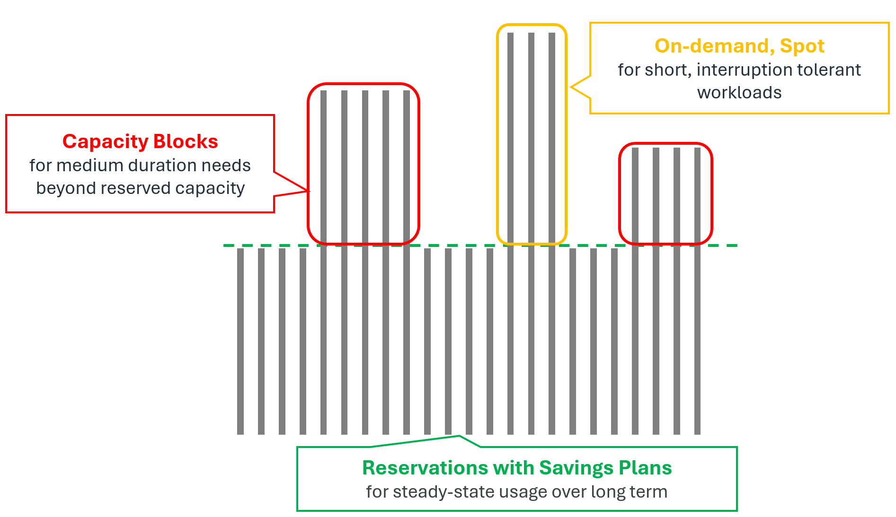

# Securing GPU Capacity on AWS: Purchase Options Comparison and Practical Guide

This is a practical, end-to-end guide for teams securing GPU capacity on AWS. It compares the main purchase options and offers a decision framework for balancing cost, availability, and business value.

## 1. Overview

GPUs are the core resource for AI workloads, yet requirements vary widely from one workload to the next. From pre-training that runs large GPU fleets intensively for months, to interruption-tolerant batch inference, to production inference that must stay up around the clock — how much capacity you need, and how you secure it, depends heavily on your usage pattern, adoption maturity, and optimization goals.
To meet this diversity, AWS offers the industry's broadest instance portfolio and the widest set of purchase options. Choosing — and combining — the options that fit your workload is the key to running infrastructure efficiently, letting you optimize cost and availability together.

---

## 2. Purchase Options

AWS's accelerated computing instances are available through **On-Demand, Spot, On-Demand Capacity Reservations (ODCR), and Capacity Blocks**. Each option offers distinct advantages in cost, flexibility, and capacity assurance.

| Purchase option | Characteristics | Cost | Flexibility | Capacity assurance | Suitable workloads |
| --- | --- | --- | --- | --- | --- |
| **On-Demand** | The default option — use it immediately when needed, with no commitment, and pay only for what you use | Billed by usage time | Start and stop anytime; the highest level of flexibility | No | Unpredictable or short-term workloads; development and prototyping |
| **On-Demand Capacity Reservation (ODCR)** | Reserve and secure capacity in a specific Availability Zone for as long as you want | Standard On-Demand rates apply, billed regardless of actual usage (no upfront or additional fees). Savings Plans can be applied | Flexible end date; create and release freely | Yes (immediate, continuous assurance in a specific AZ) | Always-on production inference and training; business-critical workloads |
| **Capacity Blocks** | An ML-only option to reserve future GPU/Trainium capacity in advance on a prepaid basis | Up to 60% discount vs On-Demand. 100% prepaid (price locked at reservation time) | Specify start date, duration, and instance count in advance; no cancellation or refund | Yes | Short-term workloads within 6 months with a clear duration and usage volume |
| **Spot** | Use EC2's spare capacity at a steep discount, with the possibility of reclamation | Up to 90% discount vs On-Demand (the cheapest) | Interruptions can occur | No (interruptions can occur mid-use) | Interruption-tolerant, flexible, stateless workloads |

Each option is examined in more detail below.

### 2.1 **On-Demand Instances**

On-Demand lets you pay by the hour or second with no long-term commitment and start or stop instances at any time, making it the simplest starting point for GPU workloads. It suits development, prototyping, and unpredictable or short-term workloads. Note, however, that On-Demand offers no capacity assurance: if you need a specific amount of capacity at a specific time, use a reservation-based option (ODCR or Capacity Blocks) instead.

G instances support On-Demand in all regions, while support for P instances varies by instance type and region. For details, see the [Amazon EC2 Instance Types page](https://aws.amazon.com/ec2/instance-types/).

### 2.2 **On-Demand Capacity Reservations (ODCR)**

[ODCR](https://docs.aws.amazon.com/AWSEC2/latest/UserGuide/ec2-capacity-reservations.html) lets you reserve GPU capacity in a specific Availability Zone for as long as you need it. With no fixed end date, ODCR suits workloads that need immediate or long-term capacity assurance — particularly always-on ones such as production inference services, scheduled training jobs with a fixed timeline, and business-critical applications.
Note that while you hold capacity through ODCR, you are billed at On-Demand rates whether or not you use it. Combined with Savings Plans, ODCR can save up to 72% with EC2 Instance Savings Plans and up to 66% with Compute Savings Plans under a 1- or 3-year commitment.
You can reserve G instances yourself through the EC2 console and other tools, but P instances must be secured with the help of your AWS account team.

### 2.3 **EC2 Capacity Blocks for ML**

[Capacity Blocks for ML](https://docs.aws.amazon.com/AWSEC2/latest/UserGuide/ec2-capacity-blocks.html) lets you reserve GPU instances for a specific future date to run short-term ML workloads. Its key advantage is that you can secure GPU capacity at up to a 60% discount versus On-Demand with no year-long commitment. All instances reserved through Capacity Blocks are also provisioned within an Amazon EC2 UltraCluster, ensuring low-latency, high-performance networking.

Reserving a Capacity Block is much like booking a hotel room: just as a hotel booking specifies the date, length of stay, and number of rooms, a Capacity Block specifies the start date, duration, and number of GPU instances you need. You pay in full upfront at reservation time, which guarantees GPU availability on the reserved date.

The main terms are as follows.

- **Reservation window**: capacity can be viewed and reserved from as early as 8 weeks ahead to as late as 30 minutes before the start time.
- **Reservation duration**: from 1 day up to 182 days (in 1-day increments for 1–14 days, and in 7-day increments beyond that).
    - Subject to availability, you can extend a Capacity Block you are already using.
- **Quantity**: up to 64 instances.
- **Supported instances**: P instances and Trainium instances (P4d, P5, P5e, P5en, P6-B200, P6-B300, P6e-GB200, Trn1, Trn2).
- **Payment**: charged in full upfront at reservation time; afterward, no schedule changes, cancellations, or refunds are permitted.

For the full walkthrough — from viewing offerings to reserving and running instances — see the [Capacity Blocks Practical Guide](../capacity-blocks-guide.md).

### 2.4 **Spot Instances**

[Amazon EC2 Spot Instances](https://aws.amazon.com/ec2/spot/) let you use EC2's spare capacity at up to a 90% discount versus On-Demand. Because that capacity can be reclaimed at any time, Spot is best for workloads that are cost-sensitive yet fault-tolerant — batch inference, region-flexible real-time inference, and the like.

Importantly, Spot capacity operates independently of On-Demand capacity, so Spot instances may still be available even when On-Demand capacity is constrained.

Before reclaiming an instance, EC2 provides two signals: a two-minute interruption notice, and a rebalance recommendation sent earlier, on a best-effort basis, as the risk of interruption rises. Use them to save state, drain connections, and migrate to another instance. The [Spot Placement Score](https://docs.aws.amazon.com/AWSEC2/latest/UserGuide/spot-placement-score.html) gives you visibility into Spot capacity availability, and Spot integrates well with Amazon EKS, Karpenter, and EC2 Auto Scaling Capacity Rebalancing to automate interruption handling. Pricing adjusts gradually based on long-term supply and demand (see the [price history](https://docs.aws.amazon.com/AWSEC2/latest/UserGuide/using-spot-instances-history.html)).

!!! note "Optimizing cost by combining purchase options"
    In practice, rather than using a single option, it is more cost-effective to layer multiple options according to your workload's usage pattern and duration.

    | Demand | Option | Use |
    | --- | --- | --- |
    | **Always-on demand** | ODCR + Savings Plans | Long-running, always-on workloads |
    | **Medium-term demand** | Capacity Blocks for ML | Pre-planned demand of 6 months or less that exceeds your long-term reserved capacity |
    | **Short-term / bursty demand** | On-Demand, Spot | Short and unpredictable (On-Demand) or interruption-tolerant (Spot) workloads |

    <figure markdown>
      { width="720" }
    </figure>

---

## 3. Pricing Examples

The table below illustrates how prices differ by purchase option. Figures are for **N. Virginia (us-east-1) as of August 2026** and may change with supply and demand. Because prices also vary by region, **always confirm the latest pricing on the official AWS site.**

| Instance type | GPU | On-Demand | Savings Plans 1-yr | Savings Plans 3-yr | Capacity Blocks | Spot |
| --- | --- | --- | --- | --- | --- | --- |
| **g6e.xlarge** | 1 × L40S | $1.86 | ~$1.41 (−24%) | ~$0.97 (−48%) | Not supported | Real-time price fluctuation |
| **p4d.24xlarge** | 8 × A100 | $21.96 | $13.92 (−37%) | $9.37 (−57%) | $11.8 (−46%) | Real-time price fluctuation |
| **p6-b200.48xlarge** | 8 × B200 | $113.93 | Not supported | $49.22 (−57%) | $98.84 (−13%) | - |

**Official pricing links**

- [Amazon EC2 On-Demand Pricing](https://aws.amazon.com/ec2/pricing/on-demand/)
- [Compute and EC2 Instance Savings Plans](https://aws.amazon.com/savingsplans/compute-pricing/)
- [Amazon EC2 Capacity Blocks for ML pricing](https://aws.amazon.com/ec2/capacityblocks/pricing/)
- [Amazon EC2 Spot Instances Pricing](https://aws.amazon.com/ec2/spot/pricing/)
- [AWS Pricing Calculator](https://calculator.aws/#/)

---

## 4. Decision Tree

The flowchart below helps you narrow down the right purchase option based on your workload's characteristics.

<figure markdown>
  { width="820" }
</figure>

---

## 5. How to Improve Capacity Availability

The more flexibility a team allows across instance type, region, timing, and purchase model, the better the availability and the more cost-efficient the outcome.

| Best practice | Description |
| --- | --- |
| **Reserve early** | Secure capacity for important workloads at least a month ahead using Capacity Blocks or future-dated reservations |
| **Consider multi-region deployment** | Looking beyond a single region greatly improves your chances of securing capacity |
| **Use all Availability Zones** | Capacity often differs across AZs even within the same region |
| **Stay flexible on instance type and size** | Designing to run on multiple families (e.g., P5 and P4d) improves availability |
| **Adopt a flexible purchase model** | Combine ODCR, Capacity Blocks, On-Demand, and Spot to match your workload |
| **Check quotas in advance** | Verify — and raise — Service Quotas ahead of time to avoid deployment failures |

---

## 6. Conclusion

Start by evaluating your workload requirements. Once you are clear on whether interruptions are acceptable, whether you need capacity assurance, how long and when you will use the capacity, and whether you prioritize cost, availability, or flexibility, the decision tree and option details above will point you to the best fit.

AWS offers a range of purchase models for diverse workloads. Some provide immediate availability; others deliver the best cost and assured capacity through advance planning. In most cases, a combination of options works better than any single one.

**Need more help?** To discuss your requirements and design the GPU capacity strategy that fits them best, contact your AWS account team or AWS Support.

---

**Learn more**

- [Capacity Blocks Practical Guide](../capacity-blocks-guide.md) | Step-by-step process from viewing offerings to reserving and running instances in the console |
- [Accelerator Selection Guide](../gpu-selection-guide.md) | A technical-review framework from workload analysis to accelerator selection |
