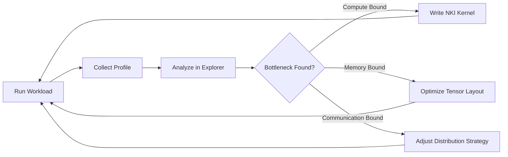

# Profiling & Optimization

Learn how to analyze the performance of workloads running on Neuron devices and optimize compute with custom kernels.

---

-   :material-magnify:{ .lg .middle } **Neuron Explorer**

    ---

    Visually analyze performance bottlenecks using Neuron Profiler and Explorer tools

    [:octicons-arrow-right-24: View Tutorial](neuron-explorer.md)

-   :material-code-braces:{ .lg .middle } **NKI Kernels**

    ---

    Write custom high-performance kernels using the Neuron Kernel Interface (NKI)

    [:octicons-arrow-right-24: View Tutorial](nki-kernels.md)

---

## Optimization Workflow

