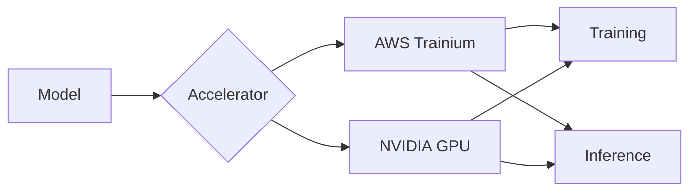

# AI Infra on AWS Guide

**Hands-on tutorials for running large-scale AI/ML workloads on AWS accelerated computing infrastructure**

Learn step-by-step how to optimize inference, training, and profiling workloads using AWS Trainium and GPU instances.

---

-   :material-rocket-launch:{ .lg .middle } **Inference Infrastructure**

    ---

    Serve large language models with high performance on Neuron devices using vLLM, TGI, and more

    [:octicons-arrow-right-24: Explore Inference](inference/index.md)

-   :material-school:{ .lg .middle } **Training Infrastructure**

    ---

    Build distributed training pipelines with Trainium and PyTorch Native approaches

    [:octicons-arrow-right-24: Explore Training](training/index.md)

-   :material-chart-line:{ .lg .middle } **Profiling & Optimization**

    ---

    Analyze performance with Neuron Explorer and optimize compute with custom NKI kernels

    [:octicons-arrow-right-24: Explore Profiling](profiling/index.md)

-   :material-robot:{ .lg .middle } **Agent Infrastructure**

    ---

    Infrastructure for running AI agents efficiently on accelerated computing environments (Coming Soon)

    [:octicons-arrow-right-24: Explore Agents](agents/index.md)

---

## 🎯 Key Features

| Feature | Description |
|---------|-------------|
| **Production-Ready** | Code and configurations ready for real-world deployment |
| **Step-by-Step** | Detailed guides accessible to beginners |
| **Cost-Optimized** | Tips for Spot instances, autoscaling, and more |
| **Bilingual** | Full support for Korean and English |

---

## 🏗️ Supported Infrastructure

---

## 🚀 Quick Start

Set up your environment with the Getting Started guide:

[Explore Tutorials :material-arrow-right:](inference/index.md){ .md-button .md-button--primary }
[GitHub :material-github:](https://github.com/awslabs/accelerated-compute-tutorials){ .md-button }
