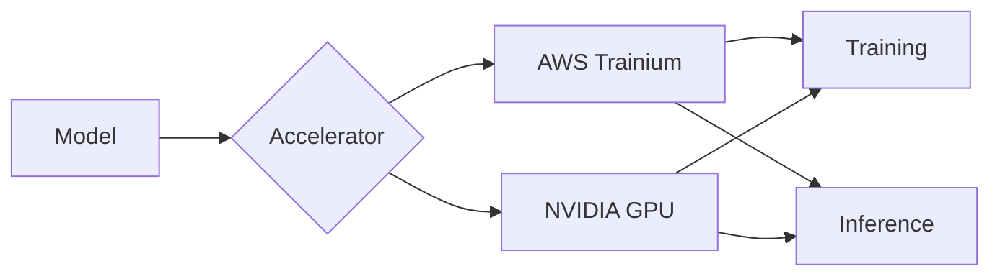

# AI Infra on AWS Guide

**Hands-on tutorials for running large-scale AI/ML workloads on AWS accelerated computing infrastructure**

Practical guidance aligned to our core solution motions — from foundational infrastructure to Trainium, Frugal AI, Hybrid & Sovereign AI, and self-managed agents.

!!! info "Language Notice"
    Some pages are currently available in Korean only. If you'd like to see a page in English, please [open an issue](https://github.com/awslabs/accelerated-compute-tutorials/issues).

## Explore by Motion

-   :material-server-network:{ .lg .middle } **AI Infra**

    ---

    Foundational infrastructure regardless of chip: accelerator selection, EFA networking, FSx/S3 storage, capacity, and NVIDIA GPU instances.

    [:octicons-arrow-right-24: Explore](ai-infra/index.md)

-   :material-chip:{ .lg .middle } **Trainium**

    ---

    AWS-designed AI chips — inference with vLLM Neuron, NKI kernels, profiling, and hands-on learning.

    [:octicons-arrow-right-24: Explore](aws-ai-chip/index.md)

-   :material-scale-balance:{ .lg .middle } **Frugal AI & Domain Intelligence**

    ---

    Model compression, compute optimization, and smaller fine-tuned open-weight models under constrained supply.

    [:octicons-arrow-right-24: Explore](frugal-ai/index.md)

-   :material-earth:{ .lg .middle } **Hybrid & Sovereign AI**

    ---

    Unify on-prem, edge, and other-cloud compute with AWS; in-country, in-VPC self-hosted models and training.

    [:octicons-arrow-right-24: Explore](hybrid-sovereign-ai/index.md)

-   :material-robot:{ .lg .middle } **Self-Managed Agents**

    ---

    Agentic and self-managed AI workloads on EKS/Graviton — OpenClaw, Dynamo, Ray+EFA, and more.

    [:octicons-arrow-right-24: Explore](self-managed-agents/index.md)

-   :material-school:{ .lg .middle } **Training & Events**

    ---

    AWS-led training programs (NFD, NDD) and event schedules.

    [:octicons-arrow-right-24: Explore](events/index.md)

## Key Features

| Feature | Description |
|---------|-------------|
| **Production-Ready** | Code and configurations ready for real-world deployment |
| **Step-by-Step** | Detailed guides accessible to beginners |
| **Cost-Optimized** | Tips for Spot instances, autoscaling, and more |
| **Bilingual** | Full support for Korean and English |

## Supported Infrastructure

## Quick Start

[Explore Tutorials :material-arrow-right:](ai-infra/index.md){ .md-button .md-button--primary }
[GitHub :material-github:](https://github.com/awslabs/accelerated-compute-tutorials){ .md-button }
