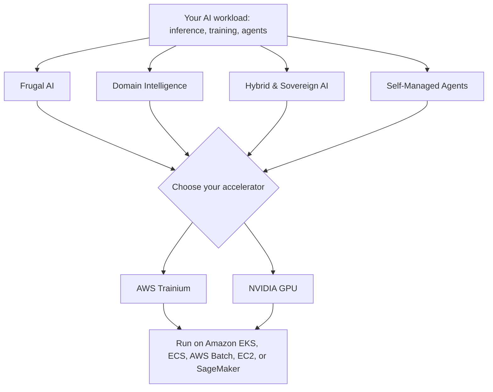

# AI Infra on AWS Guide

**Run your own models, training, and agents on AWS accelerated compute — with guides built and tested in the field.**

Whether you are serving an open-weight model, fine-tuning for your domain, or running autonomous agents, this guide helps you choose the right accelerator, build the infrastructure, and operate it at a cost that makes sense — on AWS Trainium and NVIDIA GPUs.

[Explore Solution Motions :material-arrow-down:](#solution-motions){ .md-button .md-button--primary }
[Start with the Foundations :material-arrow-right:](ai-infra/index.md){ .md-button }

!!! warning "Work in progress"
    This guide is under active development and runs in multiple languages, so some pages may not yet be available in your language. Feedback and translation requests for pages missing in your language are welcome via [GitHub Issues](https://github.com/awslabs/accelerated-compute-tutorials/issues).

## Explore by Solution Motion { #solution-motions }

Five ways teams run self-hosted AI on AWS. Start with the one that matches your goal.

-   :material-scale-balance:{ .lg .middle } **Frugal AI**

    ---

    Do more with the compute you can get. Compress models onto more available instances, optimize serving, and fine-tune smaller open-weight models that meet your quality bar at a fraction of the cost.

    [:octicons-arrow-right-24: Explore](frugal-ai/index.md)

-   :material-bullseye-arrow:{ .lg .middle } **Domain Intelligence**

    ---

    Build industry- and domain-specific models, fine-tuned on your data, that can outperform much larger proprietary models for the tasks you care about — at dramatically lower cost per value.

    [:octicons-arrow-right-24: Explore](domain-intelligence/index.md)

-   :material-earth:{ .lg .middle } **Hybrid & Sovereign AI**

    ---

    Unify on-prem, edge, and other-cloud compute with AWS, and run self-hosted models and training in-country, inside your own VPC, where data sovereignty, regulation, or language requires it.

    [:octicons-arrow-right-24: Explore](hybrid-sovereign-ai/index.md)

-   :material-robot:{ .lg .middle } **Self-Managed Agents**

    ---

    Run agentic workloads on Amazon EKS and Graviton — custom agents, third-party agent platforms, and persistent autonomous agents such as OpenClaw, with NVIDIA Dynamo, Ray + EFA, and more.

    [:octicons-arrow-right-24: Explore](self-managed-agents/index.md)

-   :material-chip:{ .lg .middle } **AWS Trainium**

    ---

    A powerful accelerator option you can choose alongside GPUs. AWS Trainium is built for strong price-performance on both training and inference — with Neuron SDK guides for serving, distributed training, custom NKI kernels, and profiling.

    [:octicons-arrow-right-24: Explore](aws-ai-chip/index.md)

## Why This Guide { #why-this-guide }

| :material-check-decagram: Field-validated | :material-server-security: Self-hosted by design | :material-cash-multiple: Price-performance first | :material-translate: English & Korean |
|---|---|---|---|
| Built and tested hands-on by practitioners — not assumed from spec sheets | Deep guidance for running your own models and agents on compute you control | Spot, Capacity Blocks, quantization, and right-sizing throughout | Landing pages in both languages, with more pages translated over time |

## Foundations { #foundations }

Chip-agnostic building blocks that every solution motion relies on.

-   :material-server-network:{ .lg .middle } **AI Infra**

    ---

    Accelerator selection, EFA networking, FSx/S3 storage, capacity planning, and purchase options.

    [:octicons-arrow-right-24: Explore](ai-infra/index.md)

-   :material-expansion-card:{ .lg .middle } **NVIDIA GPU**

    ---

    P- and G-series instances, architecture mapping, the Blackwell generation, and workload-based instance selection.

    [:octicons-arrow-right-24: Explore](nvidia-gpu/index.md)

-   :material-school:{ .lg .middle } **Training & Events**

    ---

    Hands-on AWS programs — Neuron Foundations (NFD) and Neuron Deep Dive (NDD) — plus upcoming and past events.

    [:octicons-arrow-right-24: Explore](events/index.md)

## Who It's For { #who-its-for }

- **ML and AI engineers** — deploying, fine-tuning, and serving open-weight models on AWS accelerators
- **Solutions and infrastructure architects** — designing GPU and Trainium clusters, networking, and storage
- **Platform, DevOps, and MLOps teams** — operating, scaling, and cost-optimizing AI workloads on Amazon EKS
- **Technical leaders** — weighing accelerator, capacity, and data sovereignty choices

## How It Fits Together { #how-it-fits }

Every guide follows the same path: start from your workload and goal, choose the accelerator that fits, and run it on the AWS compute platform you prefer.

```mermaid
flowchart TD
    W["Your AI workload: inference, training, agents"] --> F["Frugal AI"]
    W --> D["Domain Intelligence"]
    W --> H["Hybrid & Sovereign AI"]
    W --> S["Self-Managed Agents"]
    F --> A{"Choose your accelerator"}
    D --> A
    H --> A
    S --> A
    A --> T["AWS Trainium"]
    A --> G["NVIDIA GPU"]
    T --> R["Run on Amazon EKS, ECS, AWS Batch, EC2, or SageMaker"]
    G --> R
```

## What's New { #whats-new }

!!! note "Amazon EC2 P6-B300 is now available in Seoul"
    P6-B300 instances, powered by NVIDIA Blackwell Ultra (B300) GPUs, are now available in the Seoul Region (ap-northeast-2). Read the [launch details](updates/p6-b300-seoul-launch.md) or browse [all updates](updates/index.md).

## Get Started { #get-started }

1. **New to AI infrastructure on AWS?** Begin with [AI Infra Design](ai-infra/decisions/index.md) to choose your accelerator, Region, and capacity strategy.
2. **Already have a workload in mind?** Jump to the [solution motion](#solution-motions) that matches your goal.
3. **Prefer to learn hands-on?** Join an AWS [training program](events/education/index.md) such as Neuron Foundations or Neuron Deep Dive.

[Explore the Guides :material-arrow-right:](ai-infra/index.md){ .md-button .md-button--primary }
[View on GitHub :material-github:](https://github.com/awslabs/accelerated-compute-tutorials){ .md-button }
