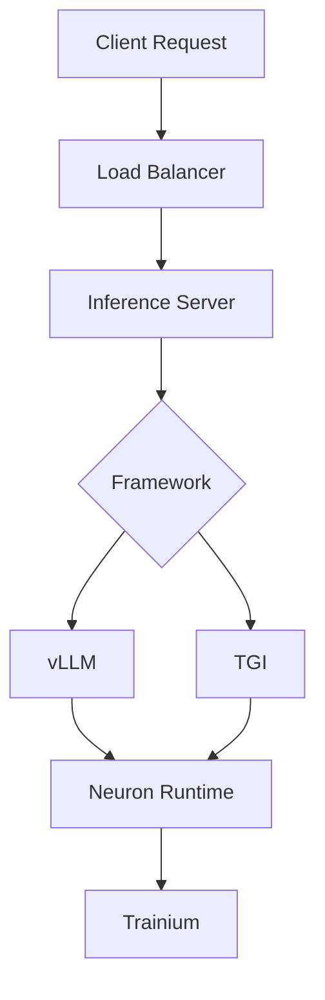

# Inference Infrastructure

Hands-on tutorials for serving large language models (LLMs) with high performance and low cost on AWS Trainium and GPUs.

---

-   :material-lightning-bolt:{ .lg .middle } **vLLM on Neuron**

    ---

    Serve LLMs at high speed on Neuron using the vLLM framework

    [:octicons-arrow-right-24: View Tutorial](vllm-on-neuron.md)

-   :material-server:{ .lg .middle } **TGI on Neuron**

    ---

    Deploy Hugging Face Text Generation Inference on Neuron devices

    [:octicons-arrow-right-24: View Tutorial](tgi-on-neuron.md)

-   :material-call-split:{ .lg .middle } **Disaggregated Inference with NVIDIA Dynamo**

    ---

    Deploy Qwen3-8B on EKS with disaggregated prefill/decode serving using NVIDIA Dynamo and vLLM, connecting phases across GPUs with NIXL over EFA

    [:octicons-arrow-right-24: View Lab Guide](dynamo-disaggregated/index.md)

-   :material-expansion-card:{ .lg .middle } **NVIDIA GPU Operator on Private EKS**

    ---

    Install the NVIDIA GPU Operator on an air-gapped private EKS cluster by mirroring images to ECR

---

## Architecture Overview

---

## Supported Models

| Model Family | Parameters | Recommended Instance | Framework |
|-------------|-----------|---------------------|-----------|
| DBRX | 132B | trn1.32xlarge | vLLM |

!!! info "Model Support"
    Neuron SDK model support is continuously expanding.
    Check the latest supported models at [Neuron Model Hub](https://awsdocs-neuron.readthedocs-hosted.com/en/latest/general/models/inference-models.html).
