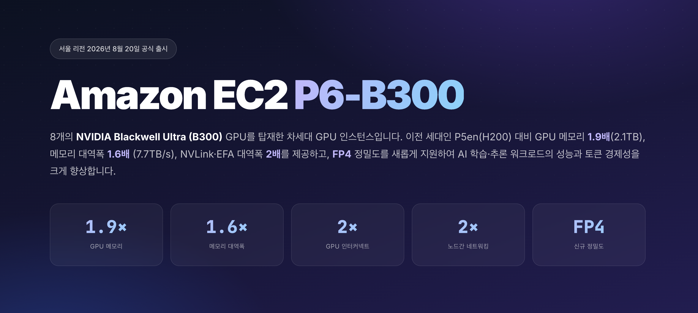
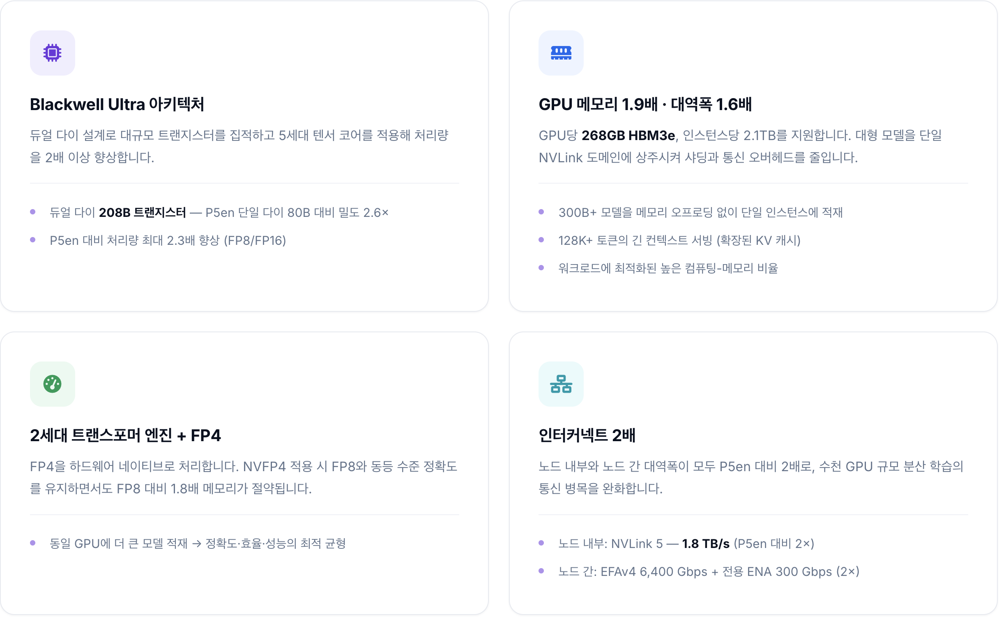

# Amazon EC2 P6-B300 Instances Launch in APJ (Seoul and Hyderabad region)

[Amazon EC2 P6-B300 instances](https://aws.amazon.com/ec2/instance-types/p6/), a next-generation GPU instance powered by eight NVIDIA Blackwell Ultra (B300) GPUs, have officially launched in Seoul region (ap-northeast-2) and Hyderabad region (ap-south-2) in August 2026. Compared with the previous-generation P5en (H200), P6-B300 delivers **1.9× the GPU memory (2.1TB), 1.6× the memory bandwidth (7.7 TB/s), and 2× the NVLink and EFA bandwidth, while adding FP4 precision** — substantially improving the performance and token economics of AI training and inference workloads.
 AWS is the only major CSP to offer a B300 8-GPU configuration, and these APJ regions are among the first anywhere to provide P6-B300 outside US regions. APJ customers can now enjoy the benefits of the latest Blackwell GPUs from in-region data centers, meeting data residency requirements while minimizing latency for local users.

<figure markdown>
  { width="960" }
</figure>

## 1. P6-B300 Key Highlights

<figure markdown>
  { width="960" }
</figure>

---

## 2. Key Specifications — Improvements vs the Previous Generation (P5en)

| Specification | P5en (H200) | P6-B300 (B300) | Improvement |
|------|----------------|----------------|------|
| **Release** | '24.12 | '25.11 | — |
| **GPU** | 8 × NVIDIA H200 | 8 × NVIDIA B300 (Blackwell Ultra) | — |
| **Architecture** | Hopper (single die, 80B) | Blackwell Ultra (dual die, 208B) | 2.6× transistors |
| **GPU memory** | 1,128 GB HBM3e (141GB/GPU) | 2,144 GB HBM3e (268GB/GPU) | **1.9×** |
| **Memory bandwidth** | 4.8 TB/s | 7.7 TB/s | **1.6×** |
| **FP8/FP6** | 16 PFLOPS | 36 PFLOPS | **2.25×** |
| **FP4** | Not supported | 108 PFLOPS (without sparsity) / 144 PFLOPS (with sparsity) | New support |
| **FP16/BF16** | 8 PFLOPS | 18 PFLOPS | **2.25×** |
| **NVLink** | NVLink 4 — 900 GB/s | NVLink 5 — 1,800 GB/s | **2×** |
| **Networking** | 3,200 Gbps (EFAv3) | 6,400 Gbps (EFAv4) + 300 Gbps dedicated ENA | **2× EFA, new dedicated ENA** |
| **CPU** | Intel Sapphire Rapids | Intel Emerald Rapids | New CPU |
| **System memory** | 2 TB | 4 TB | **2×** |
| **Nitro System** | Nitro v5 | Nitro v6 | Latest Nitro |

---

## 3. Ideal Use Cases

-   :material-server-network:{ .lg .middle } __Large-scale inference serving__

    ---

    - Online inference optimization for 70B+ models (DeepSeek, Kimi series, and more)
    - 100K+ tok/s throughput on a single GPU
    - 268GB holds the entire KV cache, serving 128K+ contexts natively
    - **~50% fewer GPUs · 40–60% ↓ latency**

-   :material-chip:{ .lg .middle } __Multi-node large-scale training__

    ---

    - 400B+ parameter models
    - Distributed training across thousands of GPUs with 6,400 Gbps EFAv4 + NVLink 5
    - 2.1TB+ of GPU memory per instance serves a 400B model with ample batch and KV cache
    - **2× communication bandwidth → higher scaling efficiency**

---

## 4. Key Benefits for Training

The P6-B300's larger memory and higher bandwidth can reduce the number of GPUs needed for a given model, which in turn cuts infrastructure complexity — sharding strategy, distributed-training overhead, debugging, and more. FP8-native compute raises throughput 2–4× versus P5en, shortening training time and improving time-to-market.

**Phase 1 — Built-in performance gains**

- **4× higher compute**: the dual-die design and 5th-gen Tensor Cores cut iteration time by ~50% at the same model and batch size.
- **2× GPU-to-GPU bandwidth**: NVLink 5 delivers 1.8 TB/s of bidirectional bandwidth per GPU, relieving the network and storage bottlenecks inherent to tensor and pipeline parallelism.
- **Enhanced AWS infrastructure**: EFAv4 (6,400 Gbps), dedicated ENA (300 Gbps), and Nitro v6 (400 Gbps per NIC with RDMA support) keep data I/O from competing with training communication, minimizing GPU idle time.

**Phase 2 — Gains from additional optimization**

- **GPU savings through memory optimization**: 1.9× memory per GPU (H200 141GB → B300 268GB) lets you train the same model with half the GPUs — for a 70B model, multi-node FSDP can collapse to single-node DDP.
- **FP8/FP4 quantization**: hardware-native MXFP8 holds BF16-equivalent accuracy while delivering 2× throughput. NVFP4's 4× memory efficiency enables larger micro-batches, reducing gradient accumulation and raising throughput.
- **Data-pipeline optimization (nvCOMP)**: a dedicated CPU→GPU hardware compression/decompression offload cuts I/O bottlenecks and checkpoint size by 20–30% each, speeding up experiment iteration and lowering FSx cost.

---

## 5. Key Benefits for Inference

- **1.6× memory bandwidth** (4.8 → 7.7 TB/s): since decode performance scales with memory bandwidth, this lowers time-per-output-token (TPOT) and improves real-time responsiveness.
- **1.9× memory capacity** (H200 141GB → B300 268GB/GPU): ~50% fewer GPUs per model and a lower TP degree remove GPU-to-GPU communication overhead, while a larger KV cache supports more concurrent sessions or longer contexts.
- **NVFP4**: ~4× memory savings versus FP16 and ~1.8× versus FP8, with accuracy on par with FP8 — and up to 50% less communication time in large prefill phases.
- **NVLink 5** (900 → 1,800 GB/s): 2× the bandwidth for Expert Parallel (EP) all-to-all communication in MoE inference, lowering multi-GPU serving latency for large MoE models — and also easing TP AllReduce bottlenecks in dense models.

---

## 6. Why AWS

-   :material-shield-check:{ .lg .middle } __Expertise__

    ---

    - First to offer cloud GPU services, with the largest number of customer references worldwide
    - A dedicated GPU team based in Korea
    - Best practices for AI infrastructure design, operation, and optimization
    - Over 15 years of collaboration with NVIDIA and the deepest joint software optimization

-   :material-speedometer:{ .lg .middle } __Performance__

    ---

    - Nitro System: dedicated hardware and a lightweight hypervisor remove virtualization overhead for bare-metal-class performance
    - 3-tier storage configuration removes I/O bottlenecks and optimizes cost (Instance Store + FSx for Lustre + S3)
    - Preconfigured Deep Learning AMIs/Containers shorten time-to-market and reduce operational burden

-   :material-check-decagram:{ .lg .middle } __Reliability__

    ---

    - 99.99% uptime SLA
    - Nitro security chip installed on the host motherboard, with complete isolation between VMs
    - Lowest total downtime among major APAC clouds (per Frost & Sullivan, less than one-third of competitors)

-   :material-puzzle:{ .lg .middle } __Flexibility & Ecosystem__

    ---

    - The only major CSP to support a B300 8-GPU config (including in the Seoul region)
    - The broadest instance portfolio, so you can choose the optimal chip and size for each workload
    - A range of purchase options: On-Demand, Capacity Blocks, Spot, and more
    - Native integration with 200+ AWS services (S3, FSx, EKS, CloudWatch, and more)
    - Cost optimization through a GPU + Bedrock hybrid
    - Optimized for the NVIDIA stack — DCGM Exporter, MIG, DRA, Run:ai, NIM, and more
    - A rich open-source and partner ecosystem

