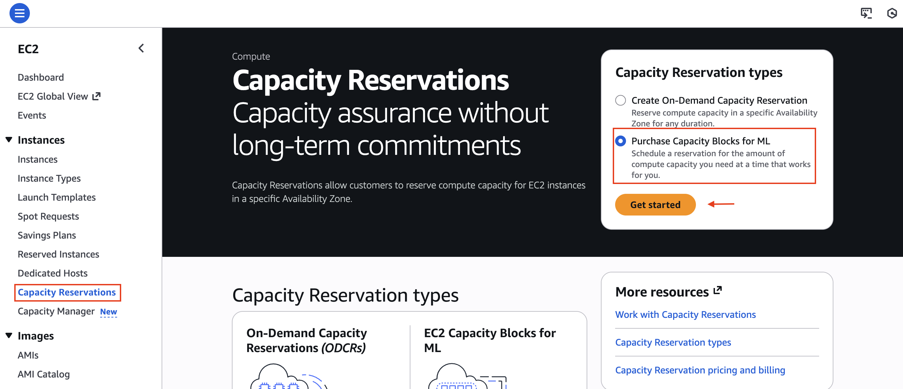
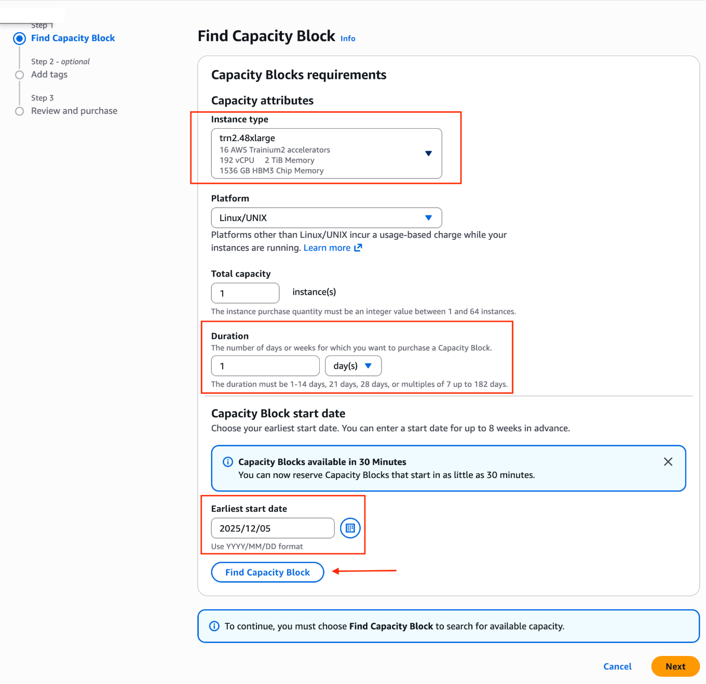
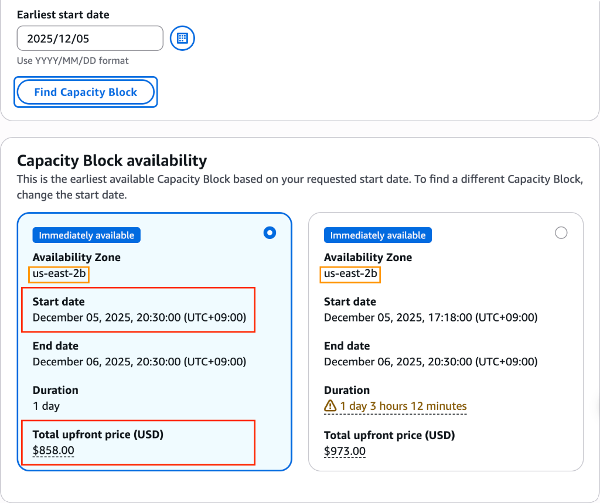
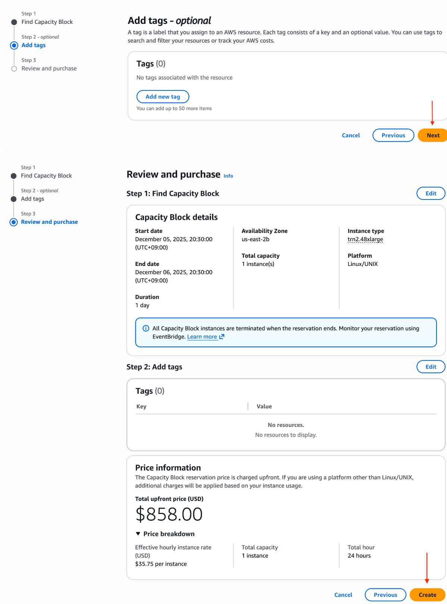
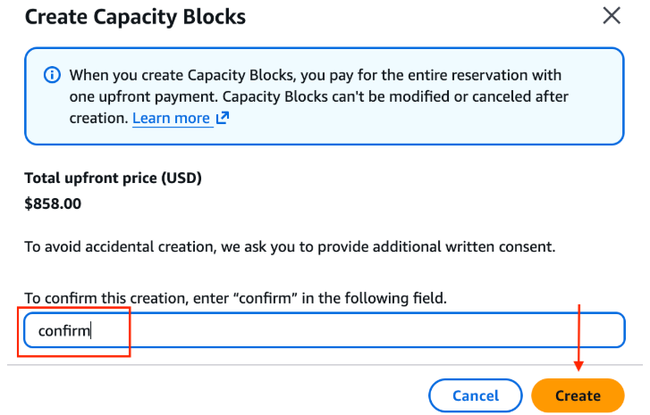
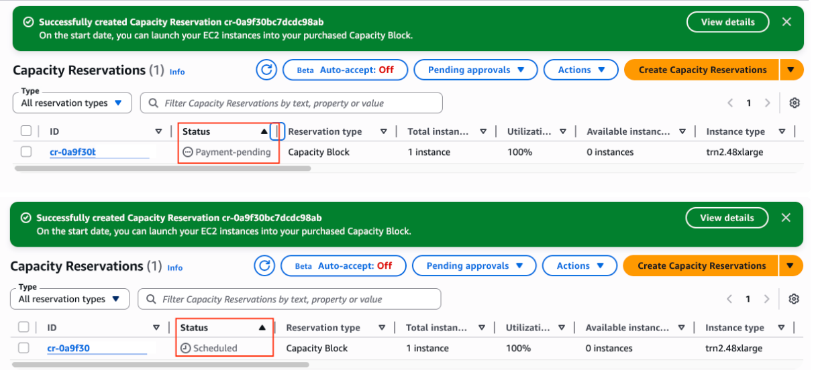
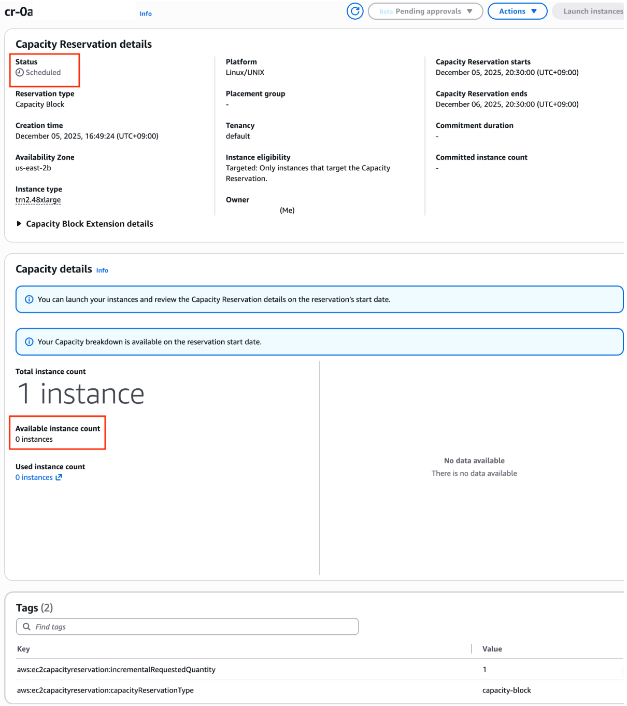
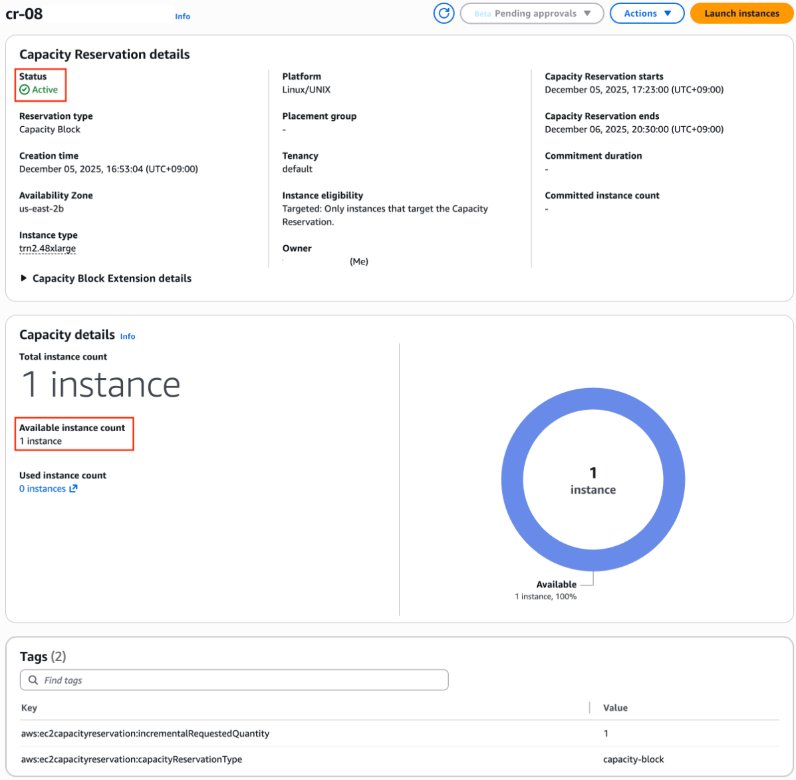

# Capacity Blocks for ML 실전 가이드

본 페이지는 **Capacity Blocks for ML** 사용법을 단계별로 안내합니다. GPU/Trainium 구매 옵션에 대한 상세 설명은 [GPU/Trainium 구매 옵션 비교 페이지](https://awslabs.github.io/accelerated-compute-tutorials/ai-infra/purchase-options/)를 참조하시기 바랍니다.

---

## 🎯 Capacity Blocks 주요 특징

| 항목 | 설명 |
|------|------|
| **예약 가능 시점** | 사용 시작일 최소 30분 전 ~ 최대 8주 전까지 용량 조회 및 예약 |
| **예약 기간** | 최소 1일 ~ 최대 182일 (1~14일은 1일 단위, 14일 이상은 7일 단위).<br>※ 가용 용량이 있는 경우 구매 후 기간 연장 가능 ([기간 연장 가이드](https://docs.aws.amazon.com/AWSEC2/latest/UserGuide/capacity-blocks-extend.html)) |
| **수량** | 최대 64대 인스턴스 |
| **결제** | 예약 시점에 전액 선불 결제. 구매 후 취소 및 변경 불가 (사용 여부와 무관) |
| **지원 인스턴스** | P 인스턴스(P4d, P4de, P5, P5e, P5en, P6-B200, P6-B300, P6e-GB200) </br> 및 Trainium 인스턴스 (Trn1, Trn2) |
| **용량 보장** | 예약 확정 시 100% 보장, EC2 UltraCluster 내 근접 배치 |
| **시작 및 종료 시간** | 리전에 관계 없이 11:30 UTC (한국 시간 오후 8시 30분) 시작, </br> 11:00 UTC부터 종료 (한국 시간 오후 8시) |

---

## 📋 사전 준비

### 1. 서비스 쿼터 확인

Capacity Blocks는 On-Demand 쿼터와 별도입니다. Service Quotas에서 확인:

```
서비스: Amazon EC2
쿼터 이름: Running Capacity Block P Hosts (또는 Trn)
```

!!! warning "쿼터가 0이면 예약 불가"
    신규 계정은 기본값 0일 수 있습니다. 쿼터 증가 요청 먼저 하세요. 필요 시 AWS 어카운트팀 지원을 받으시기 바랍니다.

### 2. 리전 및 가격 확인
Capacity Blocks을 지원하는 인스턴스 및 리전은 아래 표와 같습니다. 가용 리전 및 오퍼링은 수시로 변경되므로 실제 예약 전 [Amazon EC2 Capacity Blocks for ML pricing](https://aws.amazon.com/ec2/capacityblocks/pricing/) 및 EC2 콘솔을 통해 확인하시기 바랍니다. 또한 Capacity Blocks for ML의 가격은 수요·공급 트렌드에 따라 분기 단위로 조정될 수 있습니다. (1/4/7/10월 초)

| 인스턴스 타입 | 지원 리전 ('26년 8월 기준) |
|------|------|
| P4d.24xlarge | N. Virginia, Ohio, Oregon |
| P4de.24xlarge | N. Virginia, Oregon |
| P5.48xlarge | Atlanta Local Zone, N. Virginia, Ohio, Oregon, N. California, Tokyo, Jakarta, Mumbai, Sydney, London, Stockholm, Sao Paulo |
| P5.4xlarge | N. Virginia, Ohio, Oregon, Tokyo, Mumbai, Sydney, London, Sao Paulo |
| P5e.48xlarge | Ohio, N. California, Oregon, Phoenix Local Zone, Jakarta, Mumbai, Tokyo, Sydney, London, Stockholm, Sao Paulo |
| P5en.48xlarge | N. Virginia, Ohio, N. California, Oregon, Jakarta, Mumbai, Seoul, Tokyo, London, Spain, Stockholm |
| p6-b200.48xlarge | N. Virginia, Ohio, Oregon, Mumbai, US-West GovCloud, US-East GovCloud |
| p6-b300.48xlarge | N. Virginia, Oregon, Atlanta Local Zone, US-East GovCloud |
| u-p6e-gb200x72 | Dallas Local Zone |
| u-p6e-gb200x36 | Dallas Local Zone |
| Trn1.32xlarge | N. Virginia, Ohio, Oregon, Mumbai, Melbourne, Sydney, Stockholm |
| Trn2.48xlarge | Ohio |
| Trn2.3xlarge | Melbourne, Sao Paulo |

!!! warning "리전 선택 시 유의사항"
    Capacity Blocks 구매 전, GPU와 함께 이용 예정인 서비스(예: FSx for Lustre)가 해당 리전에서 지원되는지 사전 확인하시기 바랍니다. Capacity Blocks은 구매 후 취소 및 환불이 불가합니다.
    
!!! warning "옵트인 리전 선택 시 활성화"
    Jakarta, Melbourne, Spain 리전은 옵트인 리전이므로 기본적으로 AWS 계정에서 비활성화가 되어 있습니다 (2019년 3월 20일 이후에 시작된 리전들은 모두 옵트인 리전에 해당합니다). 옵트인 리전을 사용하려면 먼저 활성화가 필요합니다. 활성화 방법은 [AWS 리전 에서 활성화 또는 비활성화](https://docs.aws.amazon.com/ko_kr/accounts/latest/reference/manage-acct-regions.html#rande-manage-enable)를 참고하시기 바랍니다.
    
  

### 3. IAM 권한

최소 필요 권한:

```json
{
  "Version": "2012-10-17",
  "Statement": [
    {
      "Effect": "Allow",
      "Action": [
        "ec2:DescribeCapacityBlockOfferings",
        "ec2:PurchaseCapacityBlock",
        "ec2:DescribeCapacityReservations",
        "ec2:CancelCapacityReservation",
        "ec2:RunInstances",
        "ec2:CreateCapacityReservationFleet"
      ],
      "Resource": "*"
    }
  ]
}
```

---

## 🛒 Capacity Block 구매

콘솔의 **EC2 > Capacity Reservations > Purchase Capacity Blocks for ML** 메뉴로 진입합니다.



### Step 1: 인스턴스 및 기간 선택

원하는 인스턴스 타입(`trn2.48xlarge`)과 기간, 시작 날짜를 선택합니다.



### Step 2: 가용 블록 확인 및 선택

가용 날짜 및 가격을 확인합니다. CB는 특정 Availability Zone(AZ)에 고정되어 제공됩니다.



!!! warning "중요"
    여기서 배정받은 AZ (예: `us-east-2b`)를 반드시 기억해야 합니다. 추후 이 AZ에 서브넷을 만들어야 인스턴스를 띄울 수 있습니다.

!!! warning "즉시 시작 옵션"
    Capacity Block은 시작시간이 기본적으로 한국시간 20:30이지만, 조회시점에 바로 가용한 인스턴스가 있다면 즉시 시작하는 옵션을 선택하고 1일 단위가 아닌 추가 시간 및 금액이 표기된 CB를 선택하여 바로 작업을 시작할 수 있습니다.


### Step 3: 구매 확정 (Confirm)

가격과 시간을 최종 확인하고, 텍스트 입력창에 `confirm`을 입력하여 구매를 확정합니다.




---

## 💻 CLI로 예약하기

### 오퍼링 조회

```bash
aws ec2 describe-capacity-block-offerings \
  --instance-type p5en.48xlarge \
  --instance-count 2 \
  --capacity-duration-hours 168 \
  --start-date-range "2026-08-10T00:00:00Z" \
  --end-date-range "2026-08-20T00:00:00Z" \
  --region ap-northeast-2
```

출력 예시:

```json
{
  "CapacityBlockOfferings": [
    {
      "CapacityBlockOfferingId": "cbro-0123456789abcdef0",
      "InstanceType": "p5en.48xlarge",
      "AvailabilityZone": "ap-northeast-2a",
      "InstanceCount": 2,
      "StartDate": "2026-08-11T00:00:00Z",
      "EndDate": "2026-08-18T00:00:00Z",
      "CapacityBlockDurationHours": 168,
      "UpfrontFee": "45000.00",
      "CurrencyCode": "USD"
    }
  ]
}
```

### 구매

```bash
aws ec2 purchase-capacity-block \
  --capacity-block-offering-id cbro-0123456789abcdef0 \
  --instance-platform Linux/UNIX \
  --region ap-northeast-2
```

### 인스턴스 실행

```bash
aws ec2 run-instances \
  --instance-type p5en.48xlarge \
  --capacity-reservation-specification \
    "CapacityReservationTarget={CapacityReservationId=cr-0123456789abcdef0}" \
  --image-id ami-xxxxxxxx \
  --count 2 \
  --region ap-northeast-2
```

---

## 🔍 예약 상태 확인

Capcity Blocks 예약 관련 상태값

| 상태 | 의미 |
|------|------|
| `payment-pending` | 결제 처리 중 |
| `payment-failed` | 결제 실패 (카드/한도 확인) |
| `scheduled` | 예약 확정, 시작 대기 |
| `active` | 현재 사용 가능 |
| `expired` | 기간 만료 |
| `cancelled` | 사용자 취소 |


구매가 완료되면 상태가 `Payment-pending`에서 `Scheduled`로 변경됩니다.



- **Scheduled (예정됨):** 구매는 성공했으나, 아직 시작 시간이 되지 않은 상태입니다.


- **Active (활성):** 예약 시간이 되어 인스턴스를 실행할 수 있는 상태입니다.



---

## 📐 활용 패턴

### 패턴 1: 학습 스프린트

```
[Day 0] 오퍼링 조회 & 예약 (7일)
[Day 1] 인스턴스 Launch → 환경 세팅 (DLAMI, Docker, EFA)
[Day 2-6] 집중 학습 (체크포인트 S3 저장)
[Day 7] 학습 완료 → 인스턴스 종료 (자동 해제)
```

### 패턴 2: 워크숍/데모

```
[2주 전] 1~2일 오퍼링 예약
[당일] 인스턴스 Launch → 핸즈온 진행
[종료] 자동 해제 (추가 비용 없음)
```

### 패턴 3: 반복 예약 자동화

```python
import boto3
from datetime import datetime, timedelta

ec2 = boto3.client('ec2', region_name='ap-northeast-2')

# 매주 월요일 시작 7일 블록 자동 조회 & 구매
response = ec2.describe_capacity_block_offerings(
    InstanceType='trn2.48xlarge',
    InstanceCount=4,
    CapacityDurationHours=168,
    StartDateRange=datetime.utcnow() + timedelta(days=7),
    EndDateRange=datetime.utcnow() + timedelta(days=14),
)

offerings = response['CapacityBlockOfferings']
if offerings:
    best = min(offerings, key=lambda x: float(x['UpfrontFee']))
    ec2.purchase_capacity_block(
        CapacityBlockOfferingId=best['CapacityBlockOfferingId'],
        InstancePlatform='Linux/UNIX',
    )
    print(f"Reserved: {best['StartDate']} ~ {best['EndDate']}")
```


---

## AWS Organization 내 Capacity Blocks 공유
Capacity Blocks for ML을 구매하면 [AWS Resource Access Manager](https://docs.aws.amazon.com/ram/latest/userguide/what-is.html)(AWS RAM)를 사용하여 AWS Organization 내의 다른 계정과 공유할 수 있습니다. AWS RAM을 통해 조직 내 계정 간에 AWS 리소스를 공유할 수 있으며, 공유받은 계정(소비자 계정)은 해당 용량을 사용하여 인스턴스를 실행할 수 있습니다.

소유자 계정이 선불 예약 비용을 부담하고 소유권을 유지하며, 소비자 계정에서 인스턴스를 실행하는 경우 [운영 체제 라이선스 요금](https://aws.amazon.com/ec2/capacityblocks/pricing/) 등의 추가 비용은 소비자 계정이 부담합니다. Capacity Blocks은 동시에 여러 계정에 공유할 수 있으며, 전체 Capacity Block 예약이 선착순으로 공유됩니다.

자세한 내용은 [Sharing Capacity Blocks for ML across your AWS Organization](https://aws.amazon.com/blogs/compute/sharing-capacity-blocks-for-ml-across-your-aws-organization/) 문서를 참고하시기 바랍니다.


---


## 📚 참고 자료

- [Capacity Blocks for ML 공식 문서](https://docs.aws.amazon.com/AWSEC2/latest/UserGuide/ec2-capacity-blocks.html)
- [EC2 Capacity Blocks 요금](https://aws.amazon.com/ec2/pricing/capacity-blocks/)
- [Capacity Blocks FAQ](https://aws.amazon.com/ec2/faqs/#Capacity_Blocks_for_ML)
- [XC 구매 옵션 비교](purchase-options/index.md)

---

## ⚠️ 주의사항

| 항목 | 내용 |
|------|------|
| **취소** | 구매 후 취소 및 변경 불가 (사용 여부와 무관) |
| **미사용** | 인스턴스를 안 띄워도 비용 발생 (선불 완료) |
| **종료** | Capacity Blocks 예약 기간 만료 30분 전부터 인스턴스가 자동 종료되기 시작하므로 데이터 백업 필수 |
| **EBS** | 인스턴스 종료 시 EBS도 함께 삭제될 수 있음 (`DeleteOnTermination` 확인) |
| **시간대** | 모든 시간은 리전에 관계없이 11:30 UTC 기준 (한국 시간 오후 8시 30분) |
| **쿼터** | CB 쿼터 ≠ On-Demand 쿼터 (별도 관리) |