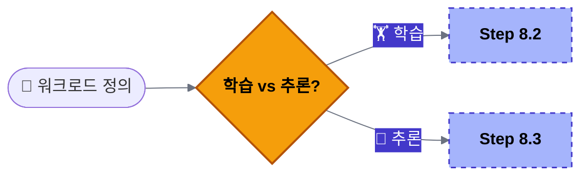
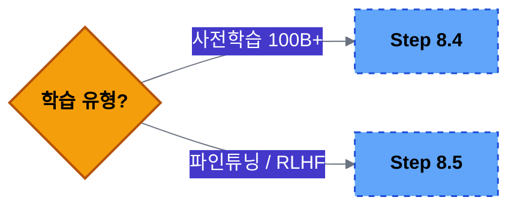
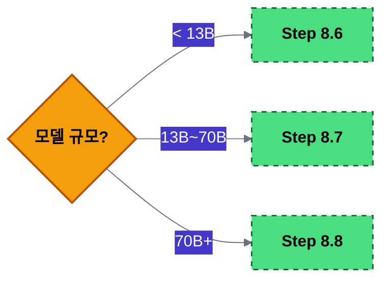
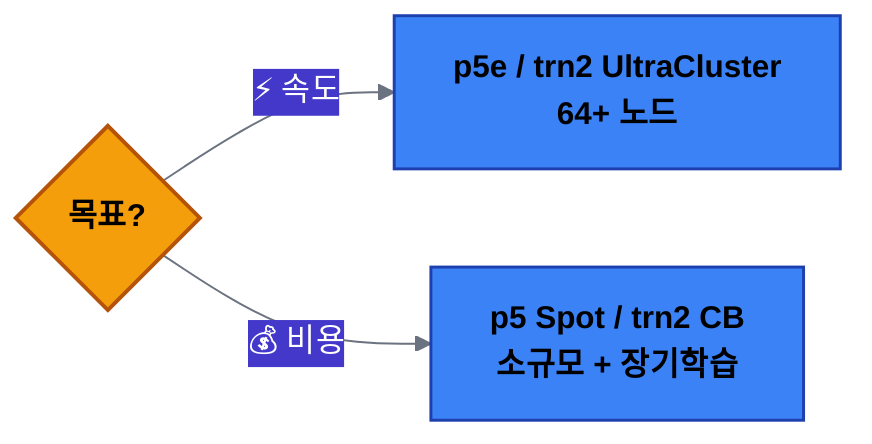
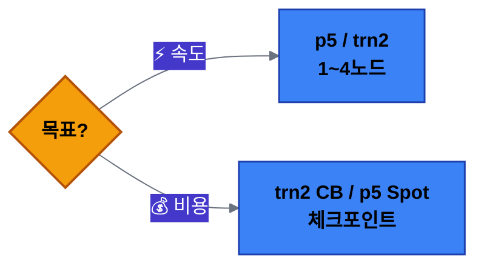
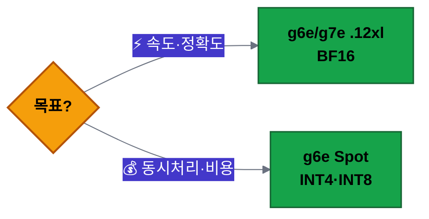
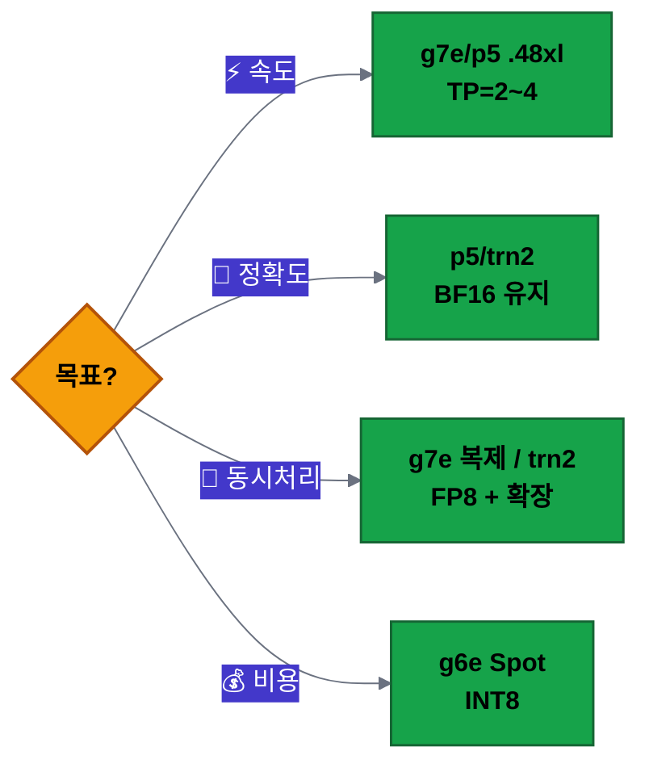
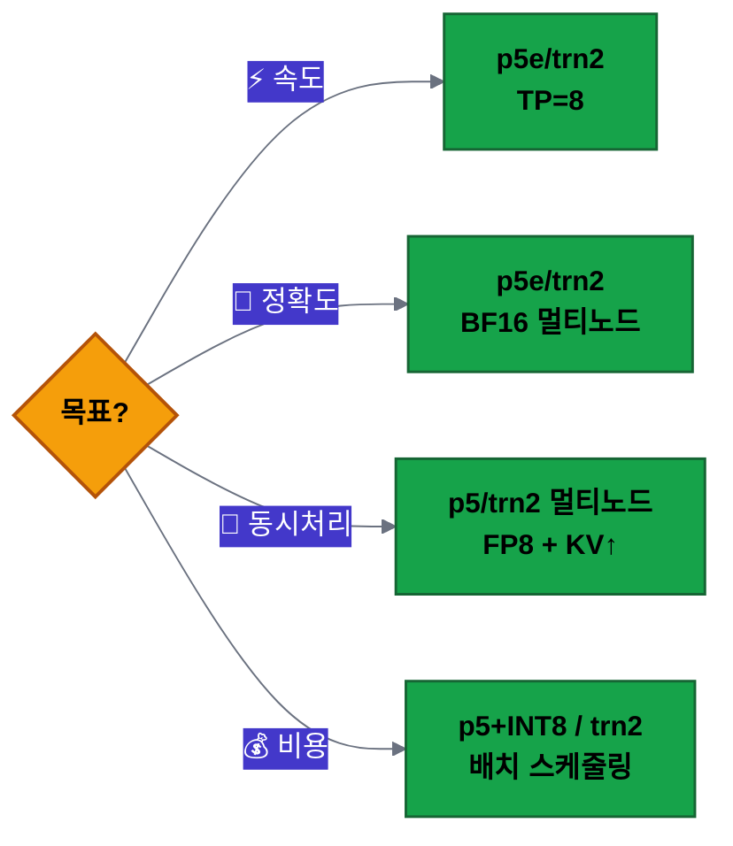
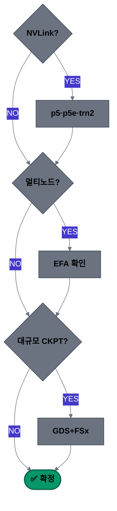

# 최적의 가속기를 선택하기 위한 기술 검토 가이드

모델을 분석하면 하드웨어가 보인다. 이 가이드는 **워크로드 → 모델 분석 → 가속기 매칭** 까지의 기술 검토 프레임워크를 제공합니다.

!!! info "전제"
    이 가이드는 **모델이 이미 결정된 상태** 에서 시작합니다. "어떤 모델을 쓸까?"가 아니라 "이 모델을 어떤 하드웨어에서 돌릴 것인가?"에 집중합니다.

## 1. 워크로드 정의: 학습인가 추론인가

대규모 언어 모델(LLM)의 학습(Training)과 추론(Inference)은 연산 및 메모리 접근 패턴이 완전히 다르기 때문에 학계와 산업계에서는 가속기(Accelerator) 선택 기준을 철저히 분리하여 정립하고 있습니다. [1, 2]

### 학습 vs 추론의 원천적 차이

학계 논문([A Review on Proprietary Accelerators for LLMs](https://arxiv.org/html/2503.09650v1) 등)에서는 두 작업의 워크로드를 다음과 같이 규정합니다. [3, 5]

- **학습 (Compute-Bound / 연산 중심)**: 수천억 개의 파라미터에 대해 정방향(Forward) 및 역방향(Backward) 연산을 모두 수행하며 그라디언트(Gradient)와 옵티마이저 상태를 계속 저장해야 합니다. 대규모 연산 처리 능력(TFLOPS)과 가속기 간 초고속 연결 대역폭이 최우선입니다. [2, 6]
- **추론 (Memory-Bound / 메모리 대역폭 중심)**: 이미 굳어진 가중치(Weights)를 기반으로 한 번에 하나의 토큰을 순차적으로 생성합니다. 특히 이전 토큰 정보를 저장하는 KV 캐시(KV Cache) 때문에 연산 속도보다 메모리 대역폭(Memory Bandwidth)이 성능을 결정짓는 병목이 됩니다. [6, 7]

| 선택 기준 요소 | 학습(Training) | 추론(Inference) |
|---------------|---------------|----------------|
| 핵심 병목 구간 | 컴퓨팅 연산 능력 및 통신 대역폭 | 메모리 대역폭 및 읽기 속도 |
| 주요 하드웨어 지표 | TFLOPS, Interconnect (NVLink 등) | HBM 용량(GB), 메모리 대역폭(GB/s) |
| 주요 정밀도 | FP16, BF16, FP8 (혼합 정밀도) | INT8, INT4, FP4 (양자화 구조) |
| 우선 가치 | 확장성(Scalability) 및 개발 범용성 | 저지연(Low Latency) 및 와트당 가성비 |

### 학습(Training) 세분화

같은 "학습"이라도 규모와 단계에 따라 요구사항이 완전히 다릅니다.

| 유형 | 규모 | 핵심 병목 | 대표 인스턴스 |
|------|------|----------|--------------|
| **사전학습 (Pre-training)** | 수백~수천 GPU, 수 주~수 개월 | 노드 간 통신 (Gradient Sync) | P5, P5e, Trn2 UltraCluster |
| **파인튜닝 (Fine-tuning)** | 1~8 GPU, 수 시간~수 일 | GPU 메모리 (가중치+Optimizer) | P5, P4d, Trn1, G6e |
| **파인튜닝 (LoRA/QLoRA)** | 1 GPU 가능, 수 시간 | 메모리 부담↓ (어댑터만 학습) | G6e, G7e도 가능 |
| **RLHF / Post-Training** | 4~32 GPU | 메모리 + 연산 동시 (다중 모델 로드) | P5, Trn2 |

**핵심 병목 상세:**

- **사전학습**: GPU끼리 gradient를 교환해야 하므로 EFA + NCCL(또는 EFA + Neuron CC) 대역폭이 처리량을 결정
- **파인튜닝 (Full)**: 모델 가중치 + Optimizer State + Gradient가 모두 올라가야 함
- **파인튜닝 (LoRA/QLoRA)**: 어댑터 파라미터만 학습 → 메모리 부담 대폭 감소, 단일 GPU 가능
- **RLHF**: Actor, Critic, Reference, Reward 모델을 동시에 또는 순차적으로 GPU에 올려야 함

### 추론(Inference) 세분화

같은 "추론"이라도 서비스 패턴에 따라 최적 하드웨어가 다릅니다.

| 유형 | 특성 | 핵심 병목 | 대표 인스턴스 |
|------|------|----------|--------------|
| **실시간 서빙** | 사용자 대면, 낮은 레이턴시 | Prefill(compute) + Decode(memory BW) | P5, G6e, G7e |
| **배치 처리** | 대량 문서, 오프라인 | GPU 활용률 (Throughput 극대화) | P5, Trn2 |
| **임베딩/분류** | 작은 모델, 높은 동시성 | 비용 효율 (동시 요청 처리) | G6, G6e |

**핵심 병목 상세:**

- **실시간 서빙**: 두 단계가 서로 다른 병목을 가짐
    - Prefill (프롬프트 처리) → **compute-bound** — 연산 속도가 TTFT를 결정
    - Decode (토큰 생성) → **memory-bandwidth-bound** — HBM 대역폭이 TPOT를 결정
- **배치 처리**: 큰 배치를 넣어 GPU가 놀지 않게 하는 것이 핵심
- **임베딩/분류**: 모델이 작아 GPU 하나로 많은 요청을 처리 가능 → 비용 최적화가 관건

### 하드웨어 요구사항 비교

| 기준 | 학습 (Training) | 추론 (Inference) |
|------|----------------|-----------------|
| 연산량 | 매우 높음 (Forward + Backward) | 중간 (Forward only) |
| 메모리 구성 | 가중치 + Optimizer + Gradient | 가중치 + KV Cache |
| 노드 간 네트워크 | 필수 (Gradient Sync) | 대부분 단일 노드로 충분 |
| 스토리지 I/O | 높음 (체크포인트, 데이터 로딩) | 낮음 (모델 로드 시에만) |
| 실행 시간 | 수 시간~수 개월 (연속) | 밀리초~초 (요청 단위) |
| 비용 구조 | 장기 예약 유리 (ODCR, Savings Plan) | 트래픽 패턴에 따라 On-Demand/Spot 혼용 |

### 의사결정 흐름

```
모델이 결정됐다
    │
    ├── 학습이 필요한가?
    │     ├── 사전학습 (>10B) → 멀티노드 필수 → P5/Trn2 UltraCluster
    │     ├── 파인튜닝 (Full)  → 단일~소수 노드 → P5/P4d/Trn1
    │     ├── 파인튜닝 (LoRA)  → 단일 GPU 가능 → G6e/G7e
    │     └── RLHF/DPO         → 멀티 모델 로드 → P5/Trn2
    │
    └── 추론 서빙인가?
          ├── 실시간 + 대형 모델 (70B+)  → 멀티 GPU TP → P5/G7e
          ├── 실시간 + 중형 모델 (7~13B) → 단일 GPU    → G6e/G7e
          ├── 배치/오프라인              → Throughput   → Trn2 (비용↓)
          └── 임베딩/분류 (소형)         → 비용 우선   → G6
```

!!! tip "실전 판단"
    "학습인지 추론인지"가 아니라 **"학습의 어떤 단계인지"** 또는 **"추론의 어떤 패턴인지"** 까지 구체화하세요. 같은 학습이라도 사전학습과 LoRA 파인튜닝은 필요 GPU 수가 100배 차이 납니다.

!!! note "참고 문헌"
    [1] [A Review on Proprietary Accelerators for LLMs](https://arxiv.org/html/2503.09650v1) (arXiv, 2025)  
    [2] [대규모 언어 모델 가속을 위한 상용 가속기 기술 동향](https://www.kci.go.kr/kciportal/ci/sereArticleSearch/ciSereArtiView.kci?sereArticleSearchBean.artiId=ART003212940) (KCI)  
    [3] [AI Accelerators for Large Language Model Inference](https://arxiv.org/pdf/2506.00008) (arXiv, 2025)  

## 2. 모델 아키텍처별 가속기 선택

모델의 아키텍처는 가속기에 요구하는 자원이 본질적으로 다릅니다. 아래 요약 테이블로 시작해서 세부 가이드를 참고하세요. (아래 모델명은 모두 **예시** 이며, 동일 아키텍처의 다른 모델에도 동일한 기준이 적용됩니다.)

### 아키텍처별 가속기 요구사항 요약

| 아키텍처 | 1순위 병목 | 2순위 병목 | 병렬화 전략 | AWS 인스턴스 (NVIDIA) | AWS 인스턴스 (Neuron) |
|----------|-----------|-----------|------------|---------------------|---------------------|
| **LLM Dense** | 연산력 (TFLOPS) | 노드 내 통신 (NVLink) | Tensor Parallelism | p5.48xl, p5e.48xl, g7e | trn2.48xl |
| **LLM MoE** | 메모리 용량 (GB) | 노드 간 통신 (EFA) | Expert Parallelism | p5e.48xl (대용량 HBM) | trn2.48xl (1.5TB HBM) |
| **Vision FM** | 연산력 + 메모리 대역폭 | 배치 크기 확장성 | Data Parallelism | p5.48xl (학습), g6e/g7e (추론) | trn2.48xl |
| **전통 CV (CNN)** | 연산력 (FP32/TF32) | 메모리 대역폭 | Data Parallelism | g6e (추론), p5.48xl (학습) | trn2.3xl (추론) |
| **Audio/Speech** | 메모리 대역폭 | 레이턴시 | Data Parallelism | g6e, g7e | trn2.3xl (추론) |
| **전통 ML** | CPU/메모리 대역폭 | I/O throughput | Data Parallelism | g6e (소규모) | 해당 없음 (CPU 권장) |

### LLM Dense — 상세

대표 모델 (예시): Llama 3/4, Qwen3-Dense, Gemma 4, GLM-5

Dense 모델은 입력 토큰이 **모든 파라미터(100%)** 를 거칩니다. 연산 밀도가 높고 메모리 접근이 정형화되어 있어 하드웨어 활용률이 가장 높은 구조입니다.

**가속기 선택 핵심:**

| 요구사항 | 설명 |
|----------|------|
| 높은 연산 밀도 | 파라미터 수 = 연산량. TFLOPS가 곧 성능 |
| Tensor Parallelism 효율 | 매 레이어 All-Reduce → 노드 내 NVLink/NVSwitch 대역폭 중요 |
| 정형화된 메모리 접근 | HBM 대역폭 효율 높음. 모델 > HBM 용량이면 TP 분할 필수 |

| 워크로드 | AWS 인스턴스 (NVIDIA) | AWS 인스턴스 (Neuron) |
|----------|---------------------|---------------------|
| 학습 (사전학습/파인튜닝) | p5.48xlarge (H100×8), p5e.48xlarge (H200×8) | trn2.48xlarge |
| 추론 (품질 우선) | p5.48xlarge, g7e.48xlarge | trn2.48xlarge |
| 추론 (비용 우선) | g6e.48xlarge, g7e.xlarge~48xlarge | trn2.3xlarge |

### LLM MoE — 상세

대표 모델 (예시): DeepSeek-V3/R1, Kimi-K2, Qwen3-MoE, Mixtral

MoE는 수백~수천억 파라미터 중 **소수 Expert만 활성화** (토큰당 3~26%)합니다. 연산은 적지만 전체 Expert가 메모리에 상주해야 합니다.

| 모델 | 총 파라미터 | 활성 파라미터 | 활성 비율 |
|------|:-----------:|:-----------:|:---------:|
| DeepSeek-V3 | 671B | 37B | ~5.5% |
| Kimi-K2 | 1T+ | ~32B | ~3% |
| Qwen3-MoE (A22B) | 235B | 22B | ~9% |
| Mixtral 8×7B | 47B | 12B | ~26% |

**가속기 선택 핵심:**

| 요구사항 | 설명 |
|----------|------|
| 극단적 메모리 용량 | 전체 Expert가 HBM에 상주. DeepSeek-V3 BF16 = ~1.3TB |
| Expert Parallelism + 노드 간 통신 | All-to-All 라우팅 → EFA 네트워크 대역폭이 병목 |
| 동적 로드 밸런싱 | Expert 쏠림 대비 → 성숙한 소프트웨어 생태계 필요 |

| 워크로드 | AWS 인스턴스 (NVIDIA) | AWS 인스턴스 (Neuron) |
|----------|---------------------|---------------------|
| 학습 | p5e.48xlarge (H200 141GB×8=1.1TB) 멀티노드 | trn2.48xlarge (1.5TB) 멀티노드 |
| 추론 | p5e.48xlarge 멀티노드, g7e.48xlarge 멀티노드 | trn2.48xlarge |

!!! tip "Dense vs MoE 판단법"
    `config.json`에서 `num_experts` 필드가 있으면 MoE, 없으면 Dense:
    ```json
    {
      "model_type": "deepseek_v3",
      "num_experts": 256,
      "num_experts_per_tok": 8
    }
    ```

### Dense vs MoE 비교

| 비교 항목 | Dense | MoE |
|----------|-------|-----|
| 가속기 1순위 | 연산력 (TFLOPS) | 메모리 용량 (GB) |
| 통신 병목 | 노드 내 (NVLink) | 노드 간 (EFA) |
| 통신 패턴 | All-Reduce | All-to-All |
| 하드웨어 효율 | 매우 높음 (100% 활용) | 상대적 낮음 (메모리 유휴) |
| 동일 품질 대비 Throughput | 기준선 | 2~4× 유리 (활성 연산↓) |

### Vision / CV / Audio / 전통 ML — 요약

| 아키텍처 | 대표 모델 (예시) | 연산 특성 | AWS 인스턴스 (NVIDIA) | AWS 인스턴스 (Neuron) | 한 줄 판단 |
|----------|-----------------|----------|---------------------|---------------------|-----------|
| **Vision FM** | CLIP, DINOv2, SAM, SD3 | 대규모 이미지 배치 × Transformer 연산. VRAM 집약적 | p5.48xl (학습) / g6e, g7e (추론) | trn2.48xl (학습) | HBM 용량 + TFLOPS 균형. 이미지 해상도가 메모리 결정 |
| **전통 CV (CNN)** | ResNet, YOLO, EfficientNet, U-Net | Conv 연산 중심. 모델 크기 상대적 소형 | g6e (추론), p5.48xl (학습) | trn2.3xl (추론) | 단일 GPU 적재 가능. Data Parallelism으로 배치 확장 |
| **Audio/Speech** | Whisper, TTS, Bark | 시퀀셜 디코딩 중심. 모델 소형이나 레이턴시 민감 | g6e, g7e (낮은 레이턴시) | trn2.3xl (비용 효율) | 레이턴시 SLA가 가속기 선택 기준. 대부분 단일 칩 적재 |
| **전통 ML** | XGBoost, TabNet, DLRM | CPU-bound 또는 임베딩 테이블 메모리 집약 | g6e (DLRM 학습) / CPU 인스턴스 | 해당 없음 | GPU 필요 여부부터 판단. XGBoost/LightGBM은 CPU 가성비↑ |

!!! note "Vision/Audio는 왜 LLM과 다른가?"
    - **모델 크기가 상대적으로 작음**: ViT-G도 ~4B 수준 → 단일 GPU에 적재 가능
    - **배치 확장이 핵심**: 학습 시 이미지/오디오를 대량 병렬 처리 → Data Parallelism이 주력
    - **TP 불필요**: 모델이 단일 칩에 올라가므로 GPU 간 통신 병목이 거의 없음
    - 따라서 **GPU 수 = 처리량 목표 / GPU당 throughput** 으로 단순 산정 가능

### 실전 판단 흐름

```
내 모델이 뭐지?
│
├─ LLM (Transformer Decoder)
│   ├─ config.json에 num_experts 있음? → MoE → 메모리 용량 우선 (p5e.48xl / trn2.48xl)
│   └─ 없음 → Dense → 연산력 우선 (p5.48xl / g7e / trn2)
│
├─ Vision/Multimodal (ViT, Diffusion 등)
│   └─ 모델 < 10B → 단일 GPU 적재 가능 → g6e/g7e + Data Parallelism으로 확장
│
├─ CNN (탐지/분류/세그먼테이션)
│   └─ 모델 < 1B → 단일 GPU 충분 → 추론은 trn2.3xl/g6e 가성비
│
├─ Audio (Whisper, TTS)
│   └─ 레이턴시 SLA 확인 → 단일 칩 저지연 우선
│
└─ 전통 ML (XGBoost, 추천)
    └─ GPU 필요한가? → 임베딩 대규모면 GPU, 아니면 CPU
```

!!! note "참고 문헌"
    [1] [Mixture-of-Experts for LLMs: A Survey](https://arxiv.org/abs/2407.21774) (arXiv, 2024)  
    [2] [DeepSeek-V3 Technical Report](https://arxiv.org/abs/2412.19437) (arXiv, 2024)  
    [3] [A Review on Proprietary Accelerators for LLMs](https://arxiv.org/html/2503.09650v1) (arXiv, 2025)  


## 3. 데이터 타입 & 양자화 전략

가속기마다 네이티브로 지원하는 수치 정밀도(FP32, BF16, FP8, INT4 등)가 다릅니다. 모델이 요구하는 데이터 타입을 하드웨어가 네이티브로 처리하지 못하면, 소프트웨어 에뮬레이션으로 인해 **처리량이 절반 이하로 떨어지거나 아예 배포가 불가능** 합니다. 따라서 "어떤 정밀도로 학습/추론할 것인가"를 먼저 결정한 뒤, 해당 데이터 타입을 네이티브 지원하는 인스턴스를 선택하는 것이 가속기 선택의 핵심 축입니다.

### NVIDIA GPU 세대별 데이터 타입 지원

<table>
<thead>
<tr>
  <th>인스턴스</th>
  <th>G5<br><code>A10G</code></th>
  <th>P4d/P4de<br><code>A100</code></th>
  <th>G6e<br><code>L40S</code></th>
  <th>P5/P5e/P5en<br><code>H100/H200</code></th>
  <th>G7e<br><code>RTX PRO 6000</code></th>
  <th>P6<br><code>B200/B300</code></th>
</tr>
<tr>
  <th>아키텍처</th>
  <th colspan="2"><code>Ampere</code></th>
  <th><code>Ada</code></th>
  <th><code>Hopper</code></th>
  <th colspan="2"><code>Blackwell</code></th>
</tr>
</thead>
<tbody>
<tr><td><strong>FP32</strong></td><td>✅</td><td>✅</td><td>✅</td><td>✅</td><td>✅</td><td>✅</td></tr>
<tr><td><strong>TF32</strong></td><td>✅</td><td>✅</td><td>✅</td><td>✅</td><td>✅</td><td>✅</td></tr>
<tr><td><strong>FP16</strong></td><td>✅</td><td>✅</td><td>✅</td><td>✅</td><td>✅</td><td>✅</td></tr>
<tr><td><strong>BF16</strong></td><td>✅</td><td>✅</td><td>✅</td><td>✅</td><td>✅</td><td>✅</td></tr>
<tr><td><strong>INT8</strong></td><td>✅</td><td>✅</td><td>✅</td><td>✅</td><td>✅</td><td>✅</td></tr>
<tr><td><strong>FP8</strong> (E4M3/E5M2)</td><td>❌</td><td>❌</td><td>✅</td><td>✅</td><td>✅</td><td>✅</td></tr>
<tr><td><strong>INT4</strong></td><td>❌</td><td>❌</td><td>✅</td><td>✅</td><td>✅</td><td>✅</td></tr>
<tr><td><strong>FP4</strong> (NVFP4)</td><td>❌</td><td>❌</td><td>❌</td><td>❌</td><td>✅</td><td>✅</td></tr>
<tr><td><strong>MXFP8</strong></td><td>❌</td><td>❌</td><td>❌</td><td>❌</td><td>✅</td><td>✅</td></tr>
<tr><td><strong>Sparsity</strong> (2:4 structured)</td><td>❌</td><td>✅</td><td>✅</td><td>✅</td><td>✅</td><td>✅</td></tr>
</tbody>
</table>

### AWS AI Chip 데이터 타입 지원

<table>
<thead>
<tr>
  <th>인스턴스</th>
  <th>Trn1/Trn1n<br><code>Trainium</code></th>
  <th>Trn2<br><code>Trainium2</code></th>
  <th>Trn3<br><code>Trainium3</code></th>
</tr>
<tr>
  <th>아키텍처</th>
  <th><code>NeuronCore-v2</code></th>
  <th><code>NeuronCore-v3</code></th>
  <th><code>NeuronCore-v4</code></th>
</tr>
</thead>
<tbody>
<tr><td><strong>FP32</strong></td><td>✅</td><td>✅</td><td>✅</td></tr>
<tr><td><strong>TF32</strong></td><td>✅</td><td>✅</td><td>✅</td></tr>
<tr><td><strong>FP16</strong></td><td>✅</td><td>✅</td><td>✅</td></tr>
<tr><td><strong>BF16</strong></td><td>✅</td><td>✅</td><td>✅</td></tr>
<tr><td><strong>FP8</strong></td><td>✅ (cFP8)</td><td>✅</td><td>✅ (MXFP8)</td></tr>
<tr><td><strong>FP4</strong></td><td>❌</td><td>❌</td><td>✅ (MXFP4)</td></tr>
<tr><td><strong>INT8</strong></td><td>✅</td><td>—</td><td>—</td></tr>
<tr><td><strong>Stochastic Rounding</strong></td><td>✅</td><td>✅</td><td>✅</td></tr>
<tr><td><strong>Sparsity</strong> (structured)</td><td>❌</td><td>✅</td><td>✅</td></tr>
</tbody>
</table>

### 데이터 타입 → 하드웨어 의사결정 예시

| 시나리오 | 필요 데이터 타입 | 가능한 하드웨어 | 불가능한 하드웨어 |
|----------|----------------|---------------|----------------|
| FP8 양자화된 70B 추론 | FP8 | P5/P5e/P5en (H100/H200), G6e (L40S), G7e (RTX PRO 6000), Trn2 | P4d/P4de (A100), G5 (A10G) |
| FP4 양자화된 405B 추론 | FP4 (NVFP4/MXFP4) | **P6 (B200/B300), G7e (RTX PRO 6000), Trn3** | P5 이하 전부, Trn1/Trn2 |
| BF16 학습 + Stochastic Rounding | BF16 + SR | Trn1/Trn1n, Trn2, Trn3 | NVIDIA 전체 (SR 미지원) |
| 2:4 Structured Sparsity 추론 | Sparsity | P4d/P4de (A100), P5/P5e/P5en (H100/H200), G7e, P6, Trn2, Trn3 | G5 (A10G), Trn1 |
| INT8 경량 모델 서빙 | INT8 | G5, G6e, P4d/P4de, P5/P5e/P5en, G7e, P6, Trn1 | — |

!!! tip "실전 판단 흐름"
    1. 모델의 학습/추론 정밀도 확인 (모델 카드, config.json의 `torch_dtype`)
    2. 양자화 적용 시 목표 정밀도 결정 (FP8? INT4? FP4?)
    3. 위 매트릭스에서 **해당 데이터 타입을 네이티브 지원하는 하드웨어** 필터링

### 모델의 데이터 타입 확인 방법

가속기를 선택하기 전에, 사용하려는 모델이 **어떤 정밀도로 학습되었는지** 를 먼저 확인해야 합니다.

#### 확인 방법

| 방법 | 위치 | 확인 항목 |
|------|------|----------|
| **config.json** | HuggingFace 모델 레포 루트 | `"torch_dtype": "bfloat16"` |
| **모델 카드 (README)** | HuggingFace Model Card | "Training precision", "dtype" 표기 |
| **파일 확장자/경로** | 체크포인트 파일명 | `-fp8`, `-awq`, `-gptq` 등 접미사 |
| **코드로 확인** | Python | `model.config.torch_dtype` 또는 `model.dtype` |

```python
# 예: HuggingFace 모델의 학습 정밀도 확인
from transformers import AutoConfig
config = AutoConfig.from_pretrained("meta-llama/Llama-3.3-70B-Instruct")
print(config.torch_dtype)  # → torch.bfloat16
```

### 학습 정밀도와 추론 정밀도의 관계

**핵심 질문**: "BF16으로 학습된 모델은 반드시 BF16으로 추론해야 하는가?"

**답: 아니요.** 학습 정밀도보다 **같거나 낮은** 정밀도로 추론할 수 있습니다. 단, 조건이 있습니다.

| 학습 정밀도 | 추론 가능 정밀도 | 조건 |
|:-----------:|:---------------:|------|
| BF16 | **BF16** | 그대로 사용 — 정확도 손실 없음 |
| BF16 | **FP8** | Post-Training Quantization(PTQ) 적용. 정확도 손실 매우 적음 (<0.5%) |
| BF16 | **INT4** (AWQ/GPTQ) | PTQ 필요. 캘리브레이션 데이터 필수. 정확도 손실 ~1-3% |
| BF16 | **FP4** | Blackwell/Trn3 네이티브 지원 필요. 최신 양자화 기법 |
| FP8 | **FP8** | 그대로 사용 |
| FP8 | **INT4** | 추가 양자화 가능하지만 정확도 손실 누적 주의 |

#### 학습과 추론 — 왜 요구사항이 다른가?

| | 학습 (Training) | 추론 (Inference) |
|--|--|--|
| **핵심 요구** | 그라디언트 안정성, 수렴 보장 | 처리량(throughput), 레이턴시 |
| **정밀도 기준** | 높을수록 안정 (BF16 표준) | 품질 허용 범위 내에서 낮을수록 효율적 |
| **일반 선택** | BF16 (Mixed Precision: FP32 master + BF16 compute) | 모델/서비스 요구에 따라 BF16 → FP8 → INT4 선택 |
| **데이터 타입 변경** | 학습 중 변경 어려움 (처음부터 결정) | PTQ로 사후에 자유롭게 낮출 수 있음 |

!!! tip "실전 판단 흐름"
    1. `config.json`에서 모델의 학습 정밀도 확인 (대부분 BF16)
    2. **학습**: 동일 정밀도 유지 → 해당 데이터 타입을 네이티브 지원하는 하드웨어 필요
    3. **추론**: 목표 정밀도 결정 (품질 vs 비용 트레이드오프) → 해당 양자화를 네이티브 지원하는 하드웨어 선택
    4. 네이티브 미지원 시 소프트웨어 에뮬레이션 → 성능 이점 없음 (후보 제외)

## 4. 메모리 사이징 & 용량 산정

### 메모리 구성 공식

```
총 GPU 메모리 = 모델 가중치 + KV Cache + Activation Memory
```

#### 모델 가중치

```
가중치 메모리 = 파라미터 수 × 바이트/파라미터
```

| 정밀도 | 바이트/파라미터 | 70B 모델 기준 |
|--------|---------------|--------------|
| FP32 | 4 bytes | 280 GB |
| FP16 / BF16 | 2 bytes | 140 GB |
| INT8 / FP8 | 1 byte | 70 GB |
| INT4 / NF4 | 0.5 byte | 35 GB |

#### KV Cache (숨겨진 비용)

추론 시 모델 가중치만큼이나 중요한 것이 KV Cache입니다. 토큰을 생성할 때마다 이전 토큰의 Key/Value 텐서를 저장해야 하며, 이는 **동시 요청 수 × 컨텍스트 길이** 에 비례하여 증가합니다.

**KV Cache 공식:**

```
KV Cache (bytes) = 2 × num_layers × num_kv_heads × head_dim × sequence_length × bytes_per_element × batch_size
```

- `2`: Key와 Value 각각 저장
- `num_layers`: Transformer 레이어 수
- `num_kv_heads`: KV Head 수 (GQA 사용 시 Query Head보다 적음)
- `head_dim`: 헤드 차원 (= hidden_size / num_attention_heads)
- `sequence_length`: 최대 컨텍스트 길이
- `bytes_per_element`: 데이터 타입에 따른 바이트 (BF16=2, FP8=1)
- `batch_size`: 동시 처리 요청 수

#### 실전 예시: Llama 3.3 70B의 KV Cache 계산

Llama 3.3 70B 스펙: `num_layers=80`, `num_kv_heads=8` (GQA), `head_dim=128`

```
요청 1건당 KV Cache (BF16, 컨텍스트 4K):
= 2 × 80 × 8 × 128 × 4,096 × 2 bytes
= 1.07 GB / 요청
```

| 컨텍스트 길이 | 동시 요청 1건 | 동시 16건 | 동시 64건 | 동시 128건 |
|:------------:|:-----------:|:---------:|:---------:|:----------:|
| 4K | 1.07 GB | 17.2 GB | 68.7 GB | 137.4 GB |
| 8K | 2.15 GB | 34.4 GB | 137.4 GB | 274.9 GB |
| 32K | 8.59 GB | 137.4 GB | 549.8 GB | 1,099 GB |
| 128K | 34.4 GB | 549.8 GB | 2,199 GB | 4,398 GB |

!!! warning "KV Cache가 가중치보다 커질 수 있습니다"
    Llama 3.3 70B (BF16 가중치 = 140GB) 기준, 컨텍스트 8K × 동시 64건만 되어도 KV Cache(137GB)가 가중치와 맞먹습니다. 롱컨텍스트 + 높은 동시성 = 메모리 폭발의 주범입니다.

#### 총 메모리 산정

```
총 필요 메모리 = 모델 가중치 + KV Cache + Activation/Framework 오버헤드(~5-10%)
```

| 구성 (Llama 3.3 70B, BF16) | 메모리 |
|------|--------|
| 모델 가중치 | 140 GB |
| KV Cache (8K 컨텍스트 × 동시 32건) | ~69 GB |
| Activation + Framework 오버헤드 | ~10 GB |
| **합계** | **~219 GB** |

### 처리량 기반 용량 산정

위에서 산출한 총 메모리를 가속기에 매핑하는 단계입니다.

#### Step 1: 필요 가속기 수 (메모리 기준)

```
최소 가속기 수 = ⌈ 총 필요 메모리 / 가속기당 HBM 용량 ⌉
```

| 가속기 | HBM 용량 | 위 예시(219GB) 기준 최소 수 |
|--------|:--------:|:-------------------------:|
| H100 SXM | 80 GB | ⌈219/80⌉ = **3장** (TP=4 권장) |
| H200 SXM | 141 GB | ⌈219/141⌉ = **2장** (TP=2) |
| B200 SXM | 192 GB | ⌈219/192⌉ = **2장** (TP=2) |
| NeuronCore v3 (trn2.48xl) | 1,536 GB (전체) | **1대** (TP=8~16) |
| NeuronCore v3 (trn2.3xl) | 96 GB | ⌈219/96⌉ = **3대** (멀티노드) |

#### Step 2: 처리량 목표에 따른 스케일 아웃

메모리가 충분해도, 목표 처리량(tokens/sec)을 달성하려면 추가 가속기가 필요할 수 있습니다.

```
필요 인스턴스 수 = ⌈ 목표 처리량 / 인스턴스당 처리량 ⌉ × HA 배수
```

| 항목 | 설명 | 예시 |
|------|------|------|
| 목표 처리량 | 서비스 SLA 기반 (예: 피크 시 초당 5,000 토큰) | 5,000 tok/s |
| 인스턴스당 처리량 | 벤치마크 측정값 (모델, 배치, 양자화에 따라 다름) | ~2,500 tok/s (H100 FP8) |
| HA 배수 | 고가용성 여유 (rolling update, failover) | ×2 |
| **결과** | | ⌈5000/2500⌉ × 2 = **4 인스턴스** |

#### Step 3: 최종 결정 — 메모리 vs 처리량 중 큰 값

```
최종 가속기 수 = max(메모리 기준 수, 처리량 기준 수)
```

!!! tip "실전 체크리스트"
    1. `config.json`에서 `num_layers`, `num_kv_heads`, `head_dim` 확인
    2. 서비스 요구사항 정의: 최대 컨텍스트 길이, 피크 동시 요청 수
    3. KV Cache 공식으로 메모리 산출
    4. 총 메모리 → 최소 가속기 수 결정
    5. 목표 처리량 → 스케일 아웃 수 결정
    6. 둘 중 큰 값 + HA 여유 = 최종 인프라 사이즈


## 5. 성능 지표 해설 — 추론 & 학습

섹션 6의 "워크로드 → 가속기 매칭" 의사결정을 위한 기초 지식입니다. 각 지표가 **무엇을 측정하고, 어떤 하드웨어 자원에 의해 결정되며, 업계에서 어느 수준을 기준으로 삼는지** 정리합니다.

!!! info "P50 / P99 란?"
    **백분위수(Percentile)** — 전체 요청을 레이턴시 순으로 정렬했을 때, 해당 비율까지의 요청이 경험하는 최대 지연 시간.

    - **P50 (= 중위값)**: 전체 요청의 50%가 이 시간 이내에 완료. "평균적인 사용자 경험"
    - **P99**: 전체 요청의 99%가 이 시간 이내에 완료. 나머지 1%만 이보다 느림. "최악의 1% 사용자가 겪는 지연"

    프로덕션에서는 **P99 기준으로 SLA를 설정** 합니다. P50이 좋아도 P99가 나쁘면 1%의 사용자가 수 초 이상 기다리게 되어 서비스 불만으로 직결됩니다.

### 추론 성능 지표

#### TTFT (Time to First Token)

사용자가 요청을 보낸 시점부터 **첫 번째 토큰이 도착** 하기까지의 시간 (ms).

- **물리적 의미**: Prefill 단계 소요 시간. 입력 프롬프트 전체를 한 번에 처리하여 KV Cache를 생성하는 단계
- **결정 자원**: **연산력 (Compute-bound)** — GPU의 TFLOPS가 직접적으로 좌우
- **영향 요인**: 입력 길이(프롬프트 토큰 수), Tensor Parallelism 정도, 배칭 전략 (Chunked Prefill)
- **체감**: 사용자가 "버튼 눌렀는데 응답이 안 와" 느끼는 지점. UX에 가장 직결

| 등급 | P50 기준 | P99 기준 | 적용 시나리오 |
|:----:|:--------:|:--------:|:------------:|
| 우수 | < 200ms | < 500ms | 실시간 챗봇, 코파일럿 |
| 양호 | 200~500ms | 500ms~1s | 일반 대화형 서비스 |
| 허용 | 500ms~2s | 2~5s | 비동기 처리, 배치 |
| 위험 | > 2s | > 5s | 사용자 이탈 임계점 |

!!! warning "P50 vs P99"
    업계 기준: P50이 400ms로 보여도 P99가 4초 이상이면 프로덕션 SLA 위반. 항상 **P99 기준** 으로 목표를 설정하세요. [1]

#### TPOT / ITL (Time per Output Token / Inter-Token Latency)

연속적으로 생성되는 토큰 간의 **간격** (ms/token).

- **물리적 의미**: Decode 단계. 매 토큰 생성 시 KV Cache를 읽어와 다음 토큰을 예측하는 단계
- **결정 자원**: **메모리 대역폭 (Memory-bandwidth-bound)** — HBM 대역폭(GB/s)이 직접 좌우
- **영향 요인**: 모델 크기, KV Cache 크기, 배치 크기 (배치↑ → 개별 TPOT↑), 양자화 수준
- **체감**: 스트리밍 응답 시 "글자가 한 글자씩 뚝뚝 나오는" 느낌 = TPOT이 높은 상태

| 등급 | TPOT (ms) | 체감 속도 | 비고 |
|:----:|:---------:|:---------:|:----:|
| 우수 | < 30ms | 사람 읽기 속도 초과 (~33 tok/s) | 실시간 스트리밍 최적 |
| 양호 | 30~60ms | 자연스러운 스트리밍 (~17 tok/s) | 대부분의 프로덕션 |
| 허용 | 60~100ms | 느리지만 수용 가능 (~10 tok/s) | 롱컨텍스트 대형 모델 |
| 위험 | > 100ms | 사용자 체감 지연 (< 10 tok/s) | UX 저하 명확 |

#### Throughput (처리량)

시스템이 단위 시간당 생성하는 **총 토큰 수** (tokens/sec). 단일 요청이 아닌 전체 시스템 관점.

- **물리적 의미**: 배칭된 다수 요청을 동시에 처리하는 시스템 전체의 생산성
- **결정 자원**: GPU 활용률 × 배칭 효율 × 메모리 여유 (KV Cache 수용 가능한 동시 요청 수)
- **영향 요인**: Continuous Batching, PagedAttention, 메모리 용량, GPU 수
- **핵심**: Throughput↑ = 동시 사용자↑ = 인프라 비용 효율↑

| 규모 | GPU당 처리량 (예시) | 설명 |
|------|:-----------------:|------|
| 고효율 | > 3,000 tok/s | FP8 양자화 + Continuous Batching + 대배치 |
| 일반 | 1,000~3,000 tok/s | BF16/FP16, 일반 배칭 |
| 저효율 | < 1,000 tok/s | 단일 요청 처리, 양자화 없음 |

#### TTFT vs TPOT — 왜 다른 문제인가?

| | TTFT (Prefill) | TPOT (Decode) |
|--|:--------------:|:-------------:|
| 병목 | Compute-bound | Memory-bandwidth-bound |
| 핵심 자원 | TFLOPS | HBM 대역폭 (GB/s) |
| 입력 영향 | 프롬프트 길이에 비례 | 출력 길이와 무관 (토큰당 고정) |
| 최적화 방향 | TP 확장, Chunked Prefill | 양자화, Speculative Decoding |
| 인스턴스 선택 | 고연산 (p5.48xl, trn2.48xl) | 고대역폭 (H200, B200 = 고HBM대역폭) |

!!! tip "Prefill-Decode 분리 (Disaggregated Serving)"
    최근 업계 트렌드: Prefill과 Decode를 서로 다른 인스턴스 풀에서 처리. Prefill은 고연산(p5.48xl), Decode는 고대역폭(p5e.48xl) — 각 단계에 최적화된 하드웨어를 매칭하여 비용 효율↑

### 학습 성능 지표

#### MFU (Model FLOPs Utilization)

학습 시 GPU가 이론적 최대 연산 대비 **실제로 유용한 연산에 사용한 비율** (%).

```
MFU = (모델 학습에 필요한 이론적 FLOPs/sec) / (GPU 하드웨어 Peak TFLOPS)
```

- **의미**: "내 GPU를 얼마나 잘 활용하고 있는가?" — 학습 레시피(병렬화, 배치, 통신)의 효율성을 한 숫자로 표현
- **업계 기준값**:

| MFU 범위 | 평가 | 대표 사례 |
|:--------:|:----:|:---------:|
| 55~75% | 최우수 | 대형 연구소 사전학습 (Google PaLM: 46~57%, Meta Llama 3: ~38~43%) |
| 40~55% | 우수 | 잘 튜닝된 분산 학습 파이프라인 |
| 30~40% | 보통 | 일반적인 파인튜닝, 소규모 클러스터 |
| < 30% | 비효율 | 통신 병목, 파이프라인 버블, 부적절한 배치 크기 |

- **MFU를 떨어뜨리는 요인**: Pipeline 버블(PP 사용 시), 통신 대기(TP/DP All-Reduce), Activation Recomputation, 작은 배치 크기, 비효율적 데이터 로딩
- **MFU를 높이는 방법**: 배치 크기↑, Flash Attention, 오버래핑(통신+연산), NVLink/EFA 고대역폭 활용

!!! note "MFU 해석 주의"
    MFU는 **matmul 연산만** 기준입니다. Attention softmax, LayerNorm, Optimizer step 등은 "유용한 연산"에서 제외. 따라서 100%는 이론적으로 불가능하며, 60%면 매우 잘 하고 있는 것입니다. [2, 3]

#### 통신 효율 (Communication Efficiency)

분산 학습에서 **연산 대비 통신이 차지하는 오버헤드 비율**.

```
통신 효율 = 연산 시간 / (연산 시간 + 통신 대기 시간)
```

| 통신 방식 | 발생 지점 | 결정 자원 | 목표 |
|----------|----------|----------|:----:|
| All-Reduce (TP) | 매 레이어 | NVLink 대역폭 | > 90% |
| All-Reduce (DP) | 매 스텝 (Gradient Sync) | EFA 대역폭 | > 85% |
| All-to-All (EP) | MoE 라우팅 | 노드 간 네트워크 | > 80% |
| P2P Send/Recv (PP) | 파이프라인 스테이지 간 | NVLink/EFA | > 85% |

- **통신 효율이 낮을 때 징후**: GPU Utilization은 높은데 MFU가 낮음 → 통신 대기 중에도 GPU가 idle이 아닌 것처럼 보이지만 실제로는 유용한 연산을 안 하는 상태
- **개선 방향**: Gradient Accumulation (통신 빈도↓), 통신-연산 오버래핑, 네트워크 토폴로지에 맞는 병렬화 전략 선택

### 지표 간 관계 — 전체 그림

```
┌─────────────────────────────────────────────────┐
│                   추론 (Inference)                 │
├─────────────────────────────────────────────────┤
│  사용자 체감         시스템 효율                      │
│  ┌──────┐          ┌───────────┐                │
│  │ TTFT │──────────│ Prefill   │← Compute-bound │
│  └──────┘          │ 연산력    │                 │
│  ┌──────┐          ├───────────┤                │
│  │ TPOT │──────────│ Decode    │← Memory BW     │
│  └──────┘          │ 대역폭    │                 │
│  ┌──────────┐      ├───────────┤                │
│  │Throughput│──────│ 배칭 효율  │← GPU 활용률     │
│  └──────────┘      └───────────┘                │
├─────────────────────────────────────────────────┤
│                   학습 (Training)                  │
├─────────────────────────────────────────────────┤
│  ┌──────┐                                       │
│  │ MFU  │── GPU 연산 효율 (matmul 기준)           │
│  └──────┘                                       │
│  ┌──────────┐                                   │
│  │통신 효율  │── 분산 학습 오버헤드               │
│  └──────────┘                                   │
└─────────────────────────────────────────────────┘
```

!!! note "참고 문헌"
    [1] [LLM Inference SLO Engineering: TTFT, ITL, and P99 Latency Budgets](https://www.spheron.network/blog/llm-inference-slo-ttft-itl-latency-budget-guide-2026/) (Spheron, 2026)  
    [2] [Model FLOPs Utilization — The GPU Efficiency Metric](https://zeroentropy.dev/concepts/mfu/) (ZeroEntropy, 2026)  
    [3] [NVIDIA H100 Benchmarks: What We Learned from Large-Scale GPU Testing](https://coreweave.com/blog/nvidia-h100-gpu-benchmark-results-what-we-learned-from-large-scale-gpu-testing) (CoreWeave, 2026)  
    [4] [LLM Inference Benchmarking: Fundamental Concepts](https://developer.nvidia.com/blog/llm-benchmarking-fundamental-concepts) (NVIDIA, 2025)  

## 6. 워크로드 → 가속기 매칭

섹션 5의 지표를 이해했으면, 이제 **"내 서비스의 최우선 목표에 따라 어떤 지표를 최적화하고, 어떤 인스턴스를 선택하는가?"** 를 결정합니다.

### 서비스 목표 정의

가속기를 선택하기 전, 먼저 워크로드의 **최우선 목표** 를 하나 정하세요. 모든 지표를 동시에 최적화하는 것은 불가능합니다 — 트레이드오프가 존재합니다.

| # | 서비스 목표 | 핵심 질문 | 대표 시나리오 |
|:-:|:----------:|----------|:------------:|
| ① | **응답 속도 (Latency SLA)** | "사용자가 첫 응답을 몇 ms 안에 받아야 하는가?" | 실시간 챗봇, 코파일럿, 음성 AI |
| ② | **정확도 (Quality)** | "양자화/경량화를 하면 품질이 떨어지는데, 어디까지 허용할 수 있는가?" | 의료 판독, 법률 문서 분석, 코드 생성 |
| ③ | **최대 동시 처리 (Concurrency)** | "피크 시간에 동시 N명을 SLA 내로 서빙할 수 있는가?" | B2C 서비스, 고트래픽 API |
| ④ | **비용 효율 (Cost/Token)** | "토큰당 비용을 최소화하려면?" | 배치 처리, 내부 도구, 분류/요약 |
| ⑤ | **학습 속도 (Time-to-Train)** | "모델을 며칠/몇 주 안에 학습 완료해야 하는가?" | 사전학습, 대규모 파인튜닝 |
| ⑥ | **학습 비용 효율 (Cost/MFU)** | "제한된 예산으로 최대 MFU를 뽑으려면?" | 스타트업 파인튜닝, 연구 실험 |

### 목표 → 우선 지표 → 최적화 방향 → 인스턴스 매칭

#### ① 응답 속도 우선 (Latency SLA)

> "P99 TTFT < 500ms, TPOT < 40ms를 보장해야 한다"

| 우선 지표 | 최적화 방향 | 트레이드오프 |
|----------|-----------|:----------:|
| TTFT (P99) | Prefill 연산 속도 극대화 | Throughput↓, 비용↑ |
| TPOT (P99) | Decode 대역폭 극대화 | 배치 크기 제한 |

**하드웨어 전략:**
- 고연산 + 고대역폭 인스턴스: 큰 모델을 FP16/BF16로 유지 (양자화 최소화)
- Tensor Parallelism 확장: TP=2~4로 Prefill 시간 단축
- 배치 크기 제한: 동시 요청 수를 제한하여 개별 레이턴시 보장
- Prefill-Decode 분리: Prefill 전용 풀 (고연산) + Decode 전용 풀 (고대역폭)

| 모델 규모 | AWS 인스턴스 (NVIDIA) | AWS 인스턴스 (Neuron) | 비고 |
|:---------:|:-------------------:|:-------------------:|------|
| < 13B | g6e.12xlarge (1~2 GPU) | trn2.3xlarge | 단일/2 GPU로 저지연 |
| 13B~70B | g7e.48xlarge, p5.48xlarge | trn2.48xlarge | TP=2~4 |
| 70B+ | p5.48xlarge, p5e.48xlarge | trn2.48xlarge | TP=8, 멀티노드 가능 |

#### ② 정확도 우선 (Quality)

> "양자화 없이 원본 정밀도(BF16/FP16)로 서빙해야 한다. 응답 품질이 비즈니스 임계치를 넘어야 한다"

| 우선 지표 | 최적화 방향 | 트레이드오프 |
|----------|-----------|:----------:|
| 모델 품질 유지 | BF16 유지, 큰 모델 선택 | 메모리 사용량↑, 비용↑ |
| TPOT (품질 유지 범위 내) | Speculative Decoding (품질 무손실 가속) | 구현 복잡도↑ |

**하드웨어 전략:**
- **양자화 불가 → 메모리 용량 우선**: BF16 모델 전체를 올릴 수 있는 충분한 HBM
- **큰 모델 = 높은 정확도**: 같은 패밀리에서 70B > 8B 품질 → 대형 모델 수용 가능한 인스턴스
- FP8은 품질 손실 최소 (< 1% 벤치마크 저하)로 비용 절감 가능 — 단, 도메인별 검증 필수

| 모델 규모 | AWS 인스턴스 (NVIDIA) | AWS 인스턴스 (Neuron) | 비고 |
|:---------:|:-------------------:|:-------------------:|------|
| 70B BF16 | p5.48xlarge (640GB) | trn2.48xlarge (1.5TB) | 전체 BF16 적재 |
| 400B+ BF16 | p5e.48xlarge 멀티노드 | trn2.48xlarge 멀티노드 | HBM 1TB+ 필요 |
| 70B FP8 (품질 검증 후) | g7e.48xlarge (768GB) | trn2.48xlarge | FP8 양자화 시 1 노드 가능 |

!!! tip "정확도와 레이턴시를 동시에"
    Speculative Decoding: 작은 Draft 모델로 후보를 빠르게 생성 → 큰 모델이 검증. 품질 손실 0%, 속도 2~3×↑. 단, Draft 모델용 추가 메모리 필요.

#### ③ 최대 동시 처리 우선 (Concurrency)

> "피크 시간 동시 1,000명을 P99 TTFT < 2s로 처리해야 한다"

| 우선 지표 | 최적화 방향 | 트레이드오프 |
|----------|-----------|:----------:|
| Throughput (tok/s) | 배칭 극대화, KV Cache 효율화 | 개별 TPOT↑ |
| 동시 요청 수 | KV Cache 메모리 = 동시 처리 상한 | 메모리 비용↑ |

**하드웨어 전략:**
- **KV Cache가 동시성의 상한 결정** (섹션 4 참고): 가속기 메모리 - 모델 가중치 = KV Cache 여유 → 최대 동시 요청 수
- INT8/FP8 양자화로 모델 크기↓ → KV Cache 여유↑ → 동시성↑
- PagedAttention + Continuous Batching 필수
- 수평 확장: GPU 수 × 단위 GPU Throughput = 총 처리량

| 모델 규모 | AWS 인스턴스 (NVIDIA) | AWS 인스턴스 (Neuron) | 비고 |
|:---------:|:-------------------:|:-------------------:|------|
| 8B INT8 | g6e.48xlarge (다수 복제) | trn2.3xlarge (다수 복제) | 모델 작게 + 복제 스케일 아웃 |
| 70B FP8 | p5.48xlarge, g7e.48xlarge | trn2.48xlarge | KV Cache 여유 극대화 |
| 70B+ 대규모 | p5e.48xlarge 멀티노드 | trn2.48xlarge 멀티노드 | HBM 총량 = 동시성 상한 |

#### ④ 비용 효율 우선 (Cost/Token)

> "토큰당 비용을 최소화해야 한다. 레이턴시 SLA는 느슨하다 (TTFT < 5s 허용)"

| 우선 지표 | 최적화 방향 | 트레이드오프 |
|----------|-----------|:----------:|
| $/1M tokens | 공격적 양자화 (INT4/GPTQ), Spot 인스턴스 | 품질 소폭↓, 레이턴시↑ |
| GPU 활용률 | 대배치 + 높은 GPU Utilization | 개별 레이턴시↑ |

**하드웨어 전략:**
- INT4/AWQ 양자화: 모델 크기 4× 감소 → 저가 GPU에서 서빙 가능
- Spot 인스턴스: 70~90% 할인. 배치 처리/비실시간 워크로드에 적합
- 소형 인스턴스 + 대배치: g6e.xlarge~12xlarge 급에서 배치 크기 극대화
- Neuron (trn2): NVIDIA 대비 $/tok 30~50% 절감 가능 (컴파일 최적화 전제)

| 모델 규모 | AWS 인스턴스 (NVIDIA) | AWS 인스턴스 (Neuron) | 비고 |
|:---------:|:-------------------:|:-------------------:|------|
| 8B INT4 | g6e.xlarge~2xlarge (Spot) | trn2.3xlarge | 최저 비용, 단일 GPU |
| 70B INT4 | g6e.48xlarge (Spot) | trn2.48xlarge | 양자화 필수 |
| 배치 대량 처리 | g6e (Spot) + 배치 스케줄링 | trn2.3xlarge (CB) | 비실시간 파이프라인 |

#### ⑤ 학습 속도 우선 (Time-to-Train)

> "Llama 70B 파인튜닝을 3일 안에, 사전학습을 2주 안에 끝내야 한다"

| 우선 지표 | 최적화 방향 | 트레이드오프 |
|----------|-----------|:----------:|
| MFU (높을수록 좋음) | 통신-연산 오버래핑, Flash Attention | 구성 복잡도↑ |
| 학습 기간 (wall-clock) | GPU 수↑, 네트워크 대역폭↑ | 비용 비례 증가 |

**하드웨어 전략:**
- 최대 연산력 인스턴스 × 최대 노드 수: p5.48xl, p5e.48xl 멀티노드 클러스터
- EFA 고대역폭 (3,200 Gbps): DP/TP 통신 병목 최소화
- Trn2 UltraCluster: 최대 64노드(2,048 NeuronCore) 단일 작업 가능

| 규모 | AWS 인스턴스 (NVIDIA) | AWS 인스턴스 (Neuron) | 비고 |
|:----:|:-------------------:|:-------------------:|------|
| 파인튜닝 (7B~70B) | p5.48xlarge 1~4노드 | trn2.48xlarge 1~4노드 | MFU 40~55% 목표 |
| 사전학습 (70B+) | p5e.48xlarge 16~64노드 | trn2.48xlarge UltraCluster | MFU 35~50% 목표 |
| 사전학습 (400B+) | p5e.48xlarge 64+ 노드 | trn2.48xlarge 64노드 | 최대 규모, 통신 효율 핵심 |

#### ⑥ 학습 비용 효율 우선 (Cost/MFU)

> "예산 $50K 내에서 7B 모델 파인튜닝을 최대한 효율적으로"

| 우선 지표 | 최적화 방향 | 트레이드오프 |
|----------|-----------|:----------:|
| $/GPU-hour × MFU | 가성비 인스턴스 + 높은 MFU | 학습 기간↑ |
| Spot 활용률 | 체크포인트 주기적 저장 + Spot 재시작 | 관리 복잡도↑ |

**하드웨어 전략:**
- Spot 인스턴스 + 체크포인트: 70~90% 할인, 중단 시 재시작
- Neuron trn2: On-Demand 가격도 NVIDIA 대비 30~40% 저렴 (동급 연산력 기준)
- 작은 클러스터로 오래 학습: 4노드 2주 vs 16노드 3.5일 — 비용 유사, Spot 가용성에 따라 결정

| 규모 | AWS 인스턴스 (NVIDIA) | AWS 인스턴스 (Neuron) | 비고 |
|:----:|:-------------------:|:-------------------:|------|
| 파인튜닝 (7B~13B) | p5.48xlarge (Spot) | trn2.48xlarge (On-Demand도 저가) | Spot 최우선 |
| 파인튜닝 (70B) | p5.48xlarge 2~4노드 (Spot) | trn2.48xlarge 2~4노드 | 체크포인트 필수 |

### 목표별 매칭 요약표

| 서비스 목표 | 1순위 지표 | 핵심 하드웨어 자원 | NVIDIA 추천 | Neuron 추천 | 양자화 |
|:----------:|:---------:|:--------------:|:----------:|:----------:|:-----:|
| ① 응답 속도 | TTFT P99 | 연산력 (TFLOPS) | p5.48xl, g7e.48xl | trn2.48xl | FP16/BF16 유지 |
| ② 정확도 | 모델 품질 | 메모리 용량 (BF16 적재) | p5.48xl, p5e.48xl | trn2.48xl | 최소 (FP8까지만) |
| ③ 동시 처리 | Throughput | KV Cache 메모리 여유 | p5.48xl, g7e.48xl | trn2.48xl | FP8/INT8 |
| ④ 비용 효율 | $/1M tokens | 가성비 ($/TFLOPS) | g6e (Spot) | trn2.3xl | INT4/AWQ 적극 |
| ⑤ 학습 속도 | MFU + Wall-clock | 연산력 × 노드 수 × 네트워크 | p5e.48xl 멀티노드 | trn2.48xl UltraCluster | N/A (학습) |
| ⑥ 학습 비용 | $/GPU-hour × MFU | 가성비 인스턴스 | p5.48xl (Spot) | trn2.48xl | N/A (학습) |

### 실전 의사결정 플로우

```
내 서비스의 최우선 목표는?
│
├─ "사용자가 빨리 응답 받아야 해" → ① 응답 속도
│   └─ TTFT P99 목표 설정 → 고연산 인스턴스 + TP 확장 + BF16 유지
│
├─ "틀리면 안 돼 (의료/법률/금융)" → ② 정확도
│   └─ 양자화 최소화 → 대형 모델 BF16 적재 가능한 HBM 용량 확보
│
├─ "피크 때 동시 N명 처리해야 해" → ③ 동시 처리
│   └─ KV Cache 여유 극대화 → INT8 양자화 + 수평 확장
│
├─ "비용이 가장 중요해" → ④ 비용 효율
│   └─ INT4 양자화 + Spot + trn2.3xl/g6e 저가 인스턴스
│
├─ "빨리 학습 끝내야 해" → ⑤ 학습 속도
│   └─ 최대 클러스터 규모 + EFA 고대역폭 + MFU 최적화
│
└─ "예산 한정, 효율적으로 학습" → ⑥ 학습 비용
    └─ Spot + 작은 클러스터 + 체크포인트 전략
```

!!! warning "목표가 2개 이상일 때"
    현실에서는 "응답 속도 + 비용 효율" 같은 복합 목표가 흔합니다. 이 경우:
    1. **1순위 목표의 최소 기준** 설정 (예: P99 TTFT < 1s)
    2. 기준을 만족하는 인스턴스 후보군에서 **2순위 목표 최적화** (예: 후보 중 $/tok 최소)
    3. 벤치마크 검증: 실제 워크로드로 후보 인스턴스 A/B 테스트

## 7. 인프라 기능 요구사항

섹션 6에서 "어떤 인스턴스를 쓸까?"를 정했다면, 이 섹션에서는 **"그 인스턴스가 내 워크로드에 필요한 인프라 기능을 갖추고 있는가?"** 를 검증합니다. 아래 기능 중 하나라도 필수(MUST)라면, 해당 기능을 지원하는 인스턴스군으로 후보가 좁혀집니다.

### 인프라 기능 요약표

| 기능 | 역할 | 필요한 워크로드 | 지원 인스턴스 (NVIDIA) | 지원 인스턴스 (Neuron) |
|------|------|---------------|:--------------------:|:--------------------:|
| **NVLink / NVSwitch** | 노드 내 GPU↔GPU 고대역폭 통신 (900 GB/s) | TP, 대형 모델 분산 | p5.48xl, p5e.48xl | N/A (NeuronLink 자체 구현) |
| **EFA (RDMA)** | 노드 간 저지연·고대역폭 네트워크 (최대 3,200 Gbps) | DP, EP, PP, 멀티노드 학습/추론 | p5, p5e, g7e, g6e | trn2 |
| **GPUDirect RDMA** | GPU↔NIC 직접 통신 (CPU 우회) | NCCL 멀티노드 집합통신 가속 | p5, p5e, g7e | N/A (Neuron CC 자체 처리) |
| **GDS (GPUDirect Storage)** | GPU↔스토리지 직접 DMA (CPU/시스템 메모리 우회) | 대규모 체크포인트 저장/로드, 데이터셋 스트리밍 | p5, p5e (공식 지원) | N/A |
| **UltraCluster** | 물리적 최적 배치 + 풀메시 네트워크 토폴로지 | 대규모 사전학습 (수백~수천 GPU) | p5e UltraCluster | trn2 UltraCluster |
| **MIG (Multi-Instance GPU)** | 단일 GPU를 최대 7개 독립 인스턴스로 분할 | 소형 모델 다중 서빙, GPU 공유 | p5.48xl (A100은 p4d), p5e.48xl | N/A |

### 기능별 상세

#### NVLink / NVSwitch — 노드 내 GPU 통신

- **역할**: Tensor Parallelism (TP)의 All-Reduce를 노드 내에서 처리. PCIe 대비 5~10× 대역폭
- **필수 조건**: 단일 GPU에 모델이 안 올라가서 TP 분할이 필요한 경우
- **판단 기준**: 모델 가중치 (BF16) > 단일 GPU HBM → NVLink 필수

| 인스턴스 | GPU 간 대역폭 | NVSwitch |
|---------|:-----------:|:-------:|
| p5.48xlarge (H100) | 900 GB/s (NVLink 4세대) | ✅ 풀메시 |
| p5e.48xlarge (H200) | 900 GB/s (NVLink 4세대) | ✅ 풀메시 |
| g7e.48xlarge (RTX PRO 6000) | PCIe Gen5 + P2P | ❌ (NVLink 미지원) |
| g6e.48xlarge (L40S) | PCIe Gen4 + P2P | ❌ |

!!! warning "g7e/g6e의 TP 제약"
    NVLink 미지원 인스턴스에서 TP를 사용하면 PCIe 대역폭 병목으로 성능 저하가 큼. TP=2까지는 허용 가능하나, TP=4 이상은 p5/p5e를 권장합니다.

#### EFA (Elastic Fabric Adapter) — 노드 간 RDMA 통신

- **역할**: 멀티노드 분산 학습/추론에서 Gradient Sync (DP), Expert Routing (EP), Pipeline 스테이지 간 (PP) 통신
- **필수 조건**: 2노드 이상 사용하는 모든 분산 워크로드
- **핵심 수치**: 대역폭이 높을수록 통신 효율(섹션 5 참고)↑ → MFU↑

| 인스턴스 | EFA 대역폭 | 적합 규모 |
|---------|:---------:|:--------:|
| p5e.48xlarge | 3,200 Gbps | 대규모 사전학습 (64+ 노드) |
| p5.48xlarge | 3,200 Gbps | 대규모 사전학습 |
| trn2.48xlarge | 2,400 Gbps (EFA v2) | 대규모 사전학습 |
| g7e.48xlarge | 1,600 Gbps | 멀티노드 추론, 중규모 학습 |
| g6e.48xlarge | 600 Gbps | 소규모 멀티노드 |

#### GPUDirect RDMA — GPU↔NIC 직접 통신

- **역할**: NCCL 집합통신 시 데이터가 CPU/시스템 메모리를 거치지 않고 GPU→NIC→네트워크→NIC→GPU로 직접 이동
- **효과**: 멀티노드 All-Reduce 레이턴시 30~50% 감소, CPU 오버헤드 제거
- **필수 조건**: NCCL 기반 멀티노드 학습에서 통신 효율 극대화가 필요할 때
- **지원**: p5, p5e, g7e (EFA + GPUDirect RDMA). g6e는 미지원.

#### GDS (GPUDirect Storage) — GPU↔스토리지 직접 I/O

- **역할**: 체크포인트 저장/로드 시 데이터가 GPU HBM에서 직접 NVMe/FSx로 이동 (CPU bounce buffer 제거)
- **효과**: 체크포인트 I/O 속도 2~5×↑, 학습 중단 시간↓
- **필수 조건**: 대규모 모델 (100B+) 학습에서 빈번한 체크포인트가 필요한 경우
- **지원 현황**: [FSx for Lustre — EFA 및 GDS 사전 조건](https://docs.aws.amazon.com/ko_kr/fsx/latest/LustreGuide/efa-file-systems.html#efa-prerequisites) 문서의 **"GPUDirect Storage(GDS)를 사용하여 파일 시스템 액세스"** 섹션에서 지원 인스턴스 목록을 확인하세요.

!!! tip "GDS + FSx for Lustre"
    대규모 학습 클러스터에서 권장 조합: p5e + FSx for Lustre + GDS. 체크포인트를 GPU에서 Lustre로 직접 쓰면, 1TB 체크포인트 저장이 수십 초 → 수 초로 단축됩니다.

#### UltraCluster — 물리적 최적 배치

- **역할**: 수백~수천 GPU를 **물리적으로 인접 배치** + **풀메시 EFA 토폴로지** 로 구성. 네트워크 hop 최소화
- **효과**: 대규모 학습에서 통신 레이턴시 일관성 보장, 성능 분산(jitter) 최소화
- **필수 조건**: 64+ 노드 사전학습, 통신 효율 > 90% 목표
- **가용 옵션**: p5e UltraCluster, trn2 UltraCluster (리전별 가용성 확인 필요)

#### MIG (Multi-Instance GPU) — GPU 분할

- **역할**: 단일 H100/A100을 최대 7개 독립 인스턴스로 분할. 각 인스턴스는 전용 메모리 + 전용 연산 보장
- **필수 조건**: 소형 모델 여러 개를 한 GPU에서 격리 서빙, 개발/테스트 환경 공유
- **주의**: RTX PRO 6000 (g7e), L40S (g6e)는 MIG 미지원 — 데이터센터 GPU (H100/A100) 전용 기능

### 워크로드별 필수 기능 체크리스트

| 워크로드 | NVLink | EFA | GPUDirect RDMA | GDS | UltraCluster |
|----------|:------:|:---:|:--------------:|:---:|:------------:|
| 대규모 사전학습 (100B+) | ✅ 필수 | ✅ 필수 | ✅ 필수 | ✅ 권장 | ✅ 권장 |
| 중규모 파인튜닝 (7B~70B) | ✅ 필수 | ✅ (멀티노드 시) | ✅ 권장 | ⬜ 선택 | ⬜ 불필요 |
| 대형 모델 추론 (70B+) | ✅ 필수 | ✅ (멀티노드 시) | ✅ 권장 | ⬜ 불필요 | ⬜ 불필요 |
| 중형 모델 추론 (8B~70B) | ⬜ 선택 | ⬜ 선택 | ⬜ 선택 | ⬜ 불필요 | ⬜ 불필요 |
| 소형 모델 다중 서빙 | ⬜ 불필요 | ⬜ 불필요 | ⬜ 불필요 | ⬜ 불필요 | ⬜ 불필요 |

### 실전 필터링 흐름

```
내 워크로드에 필요한 인프라 기능은?
│
├─ 모델이 단일 GPU에 안 올라감?
│   └─ YES → NVLink 필수 → p5 / p5e (또는 Neuron trn2)
│
├─ 2노드 이상 사용?
│   └─ YES → EFA 필수 → 대역폭 확인 (3,200 Gbps: p5/p5e, 2,400: trn2, 1,600: g7e)
│
├─ 체크포인트가 크고 빈번? (100B+ 학습)
│   └─ YES → GDS 권장 → p5 / p5e + FSx for Lustre
│
├─ 64+ 노드 대규모 학습?
│   └─ YES → UltraCluster 권장 → p5e / trn2 UltraCluster
│
└─ 한 GPU에 소형 모델 여러 개 격리?
    └─ YES → MIG → p5 (H100) / p4d (A100)
```

## 8. 의사결정 플로우차트

이 가이드 전체를 **단계별 의사결정 플로우** 로 구성했습니다. 각 단계에서 미니 플로우차트로 현재 위치를 확인하고, 카드에서 세부 선택지를 살펴본 뒤 다음 단계로 이동하세요.

!!! abstract "사용법"
    위에서 아래로, 질문에 답하며 따라가면 최종 인스턴스 후보군에 도달합니다.

### 8.1 워크로드 유형 선택 {#step-1}



<div class="grid cards" markdown>

-   :material-school:{ .lg .middle } **학습 (Training)**

    ---

    사전학습 · 파인튜닝 · RLHF / Post-Training

    [:octicons-arrow-right-24: Step 8.2 →](#step-2a)

-   :material-lightning-bolt:{ .lg .middle } **추론 (Inference)**

    ---

    실시간 서빙 · 배치 처리 · 임베딩

    [:octicons-arrow-right-24: Step 8.3 →](#step-2b)

</div>

### 8.2 학습 — 유형 선택 {#step-2a}



<div class="grid cards" markdown>

-   :material-server-network:{ .lg .middle } **사전학습 (100B+)**

    ---

    수백 GPU, 수 주~수 개월. 노드 간 Gradient Sync 병목.

    [:octicons-arrow-right-24: Step 8.4 →](#step-3a1)

-   :material-tune:{ .lg .middle } **파인튜닝 / Post-Training / RLHF**

    ---

    1~8 GPU, 수 시간~수 일. GPU 메모리 병목.

    [:octicons-arrow-right-24: Step 8.5 →](#step-3a2)

</div>

### 8.3 추론 — 모델 규모 선택 {#step-2b}



<div class="grid cards" markdown>

-   :material-chip:{ .lg .middle } **소형 (< 13B)**

    ---

    단일 GPU 적재 가능. 비용 최적화가 관건.

    [:octicons-arrow-right-24: Step 8.6 →](#step-3b1)

-   :material-memory:{ .lg .middle } **중형 (13B~70B)**

    ---

    TP=2~4 또는 단일 대용량 GPU. 균형 잡힌 선택 필요.

    [:octicons-arrow-right-24: Step 8.7 →](#step-3b2)

-   :material-server-network:{ .lg .middle } **대형 (70B+)**

    ---

    멀티 GPU / 멀티노드 필수. TP=8+ 구성.

    [:octicons-arrow-right-24: Step 8.8 →](#step-3b3)

</div>

### 8.4 사전학습 — 목표 선택 {#step-3a1}



<div class="grid cards" markdown>

-   :material-speedometer:{ .lg .middle } **⚡ 속도 (Time-to-Train)**

    ---

    | 항목 | 권장 |
    |:-----|:-----|
    | 인스턴스 | **p5e.48xl** / **trn2.48xl** UltraCluster |
    | 규모 | 64+ 노드 |
    | 네트워크 | EFA 3200Gbps |
    | 구매옵션 | p5e: On-Demand/Reserved, trn2: Capacity Blocks |

-   :material-currency-usd:{ .lg .middle } **💰 비용 효율**

    ---

    | 항목 | 권장 |
    |:-----|:-----|
    | 인스턴스 | **p5.48xl Spot** / **trn2.48xl CB** |
    | 전략 | 작은 클러스터 + 오래 학습 |
    | 필수 | 체크포인트 전략 (Spot 중단 대비) |

</div>

→ [Step 8.9 인프라 검증으로](#step-4)

### 8.5 파인튜닝/RLHF — 목표 선택 {#step-3a2}



<div class="grid cards" markdown>

-   :material-speedometer:{ .lg .middle } **⚡ 속도**

    ---

    | 항목 | 권장 |
    |:-----|:-----|
    | 인스턴스 | **p5.48xl** / **trn2.48xl** |
    | 규모 | 1~4 노드 |
    | 정밀도 | BF16 |
    | 구매옵션 | p5: On-Demand, trn2: Capacity Blocks |

-   :material-currency-usd:{ .lg .middle } **💰 비용 효율**

    ---

    | 항목 | 권장 |
    |:-----|:-----|
    | 인스턴스 | **trn2.48xl CB** / **p5.48xl Spot** |
    | 필수 | 체크포인트 전략 |
    | 고려 | LoRA/QLoRA로 메모리 절약 |

</div>

→ [Step 8.9 인프라 검증으로](#step-4)

### 8.6 소형 모델 추론 — 목표 선택 {#step-3b1}



<div class="grid cards" markdown>

-   :material-speedometer:{ .lg .middle } **⚡ 응답 속도 / 정확도**

    ---

    | 항목 | 권장 |
    |:-----|:-----|
    | 인스턴스 | **g6e.12xl** / **g7e.12xl** |
    | 정밀도 | BF16 유지 |
    | 특징 | 단일 GPU, 낮은 지연시간 |

-   :material-currency-usd:{ .lg .middle } **💰 동시 처리 / 비용**

    ---

    | 항목 | 권장 |
    |:-----|:-----|
    | 인스턴스 | **g6e.xlarge~4xl Spot** |
    | 정밀도 | INT4 / INT8 양자화 |
    | 전략 | 수평 확장 (복제본 증설) |

</div>

→ [Step 8.9 인프라 검증으로](#step-4)

### 8.7 중형 모델 추론 — 목표 선택 {#step-3b2}



<div class="grid cards" markdown>

-   :material-speedometer:{ .lg .middle } **⚡ 응답 속도**

    ---

    **g7e.48xl / p5.48xl / trn2.48xl**
    
    TP=2~4, BF16

-   :material-shield-check:{ .lg .middle } **🎯 정확도**

    ---

    **p5.48xl / trn2.48xl**
    
    BF16 유지, 양자화 최소

-   :material-account-group:{ .lg .middle } **👥 동시 처리**

    ---

    **g7e.48xl 복제 / trn2.48xl**
    
    FP8 + 수평 확장

-   :material-currency-usd:{ .lg .middle } **💰 비용 효율**

    ---

    **g6e.48xl Spot**
    
    INT8 양자화

</div>

→ [Step 8.9 인프라 검증으로](#step-4)

### 8.8 대형 모델 추론 — 목표 선택 {#step-3b3}



<div class="grid cards" markdown>

-   :material-speedometer:{ .lg .middle } **⚡ 응답 속도**

    ---

    **p5e.48xl / trn2.48xl**
    
    TP=8, BF16

-   :material-shield-check:{ .lg .middle } **🎯 정확도**

    ---

    **p5e.48xl / trn2.48xl**
    
    BF16 풀모델, 멀티노드

-   :material-account-group:{ .lg .middle } **👥 동시 처리**

    ---

    **p5.48xl / trn2.48xl 멀티노드**
    
    FP8 + KV Cache 극대화

-   :material-currency-usd:{ .lg .middle } **💰 비용 효율**

    ---

    **p5.48xl + INT8 / trn2.48xl**
    
    배치 스케줄링

</div>

→ [Step 8.9 인프라 검증으로](#step-4)

### 8.9 인프라 기능 검증 {#step-4}



#### Check 1 — NVLink 필요 여부

| 조건 | 결과 |
|:-----|:-----|
| 모델 > 단일 GPU HBM | g6e/g7e 제외 → **p5/p5e/trn2만** |
| 모델 ≤ 단일 GPU HBM | 제한 없음 → Check 2로 |

#### Check 2 — 멀티노드 EFA 대역폭

| 인스턴스 | EFA 대역폭 |
|:---------|:-----------:|
| p5 / p5e | 3,200 Gbps |
| trn2 | 2,400 Gbps |
| g7e | 1,600 Gbps |
| g6e | 100 Gbps |

#### Check 3 — 대규모 체크포인트 (GDS)

| 조건 | 권장 구성 |
|:-----|:----------|
| 100B+ 학습 | **p5/p5e + FSx Lustre** (GDS 지원) |
| 그 외 | 기본 EBS / FSx 충분 |

!!! tip "목표가 2개인 경우"
    1순위 목표로 후보군을 좁히고 → 2순위 목표로 후보 내에서 최적화.
    예: "응답 속도 우선 + 비용도 신경" → 레이턴시 SLA 만족하는 후보 중 $/tok 최소 선택.

!!! warning "벤치마크 없이 결정하지 마세요"
    이 플로우차트는 **후보군을 3개 이내로 좁히는 도구** 입니다. 최종 결정은 반드시 실제 워크로드로 A/B 벤치마크 후 내려야 합니다.


## 9. 추가 고려사항

가속기를 선택했다면, 실제 약정·구축 전에 아래 항목도 함께 검토하세요.

- **구매 옵션 결정** — On-Demand, Capacity Blocks, Spot, ODCR 중 워크로드 패턴에 맞는 방식 선택 → [가속기 구매 옵션 가이드](purchase-options/index.md)
- **리전 선택** — 가속기별 리전 가용성, 약정 기간(1년/3년), 데이터 소버린티, 사용자 대비 네트워크 레이턴시 고려 → [Self-hosted LLM 고려사항](self-hosted-llm-considerations.md)
- **모델 메모리 산정** — 가중치 + KV Cache + Activation 총합이 선택한 인스턴스 VRAM 내에 들어오는지 확인 (이 가이드 [섹션 3](#3-메모리-요구량-산정) 참고)
- **인프라 Deep Dive** — EFA, NVLink, GPUDirect Storage 등 멀티노드·스토리지 구성에 대해 자세히 알아보기 → [EFA 네트워킹 가이드](efa-networking.md)
- **벤치마크 & PoC** — 실 트래픽 패턴으로 검증 후 최종 확정 → [벤치마크 & PoC 방법론](benchmark-poc.md)

*Author: Suji Lee · GTM Specialist SA, APJ AI Infrastructure*
