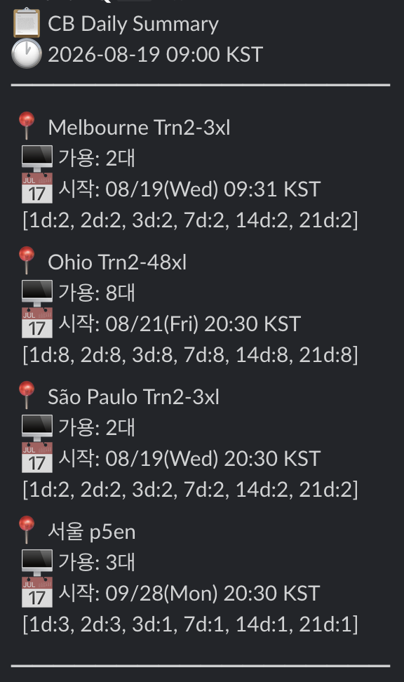

# CB/OD 가용량 모니터링 시스템 구축

AWS GPU 인스턴스(P5, P5en, P6-B300, Trn2 등)의 Capacity Block(CB) 가용량을 자동으로 모니터링하고, 가용 슬롯이 발생했을 때 즉시 알림을 받을 수 있는 서버리스 시스템 구축 가이드입니다.


## 1. 공식 AWS API

### Capacity Blocks 조회 API

`DescribeCapacityBlockOfferings` — CB 가용 슬롯을 조회하는 **공식 API** 입니다.

| 항목 | 내용 |
| --- | --- |
| **용도** | 특정 인스턴스 타입/리전/기간에서 예약 가능한 CB 오퍼링 조회 |
| **비용** | 무료 (API 호출 비용 없음) |
| **제약** | 한 번에 하나의 InstanceCount/Duration 조합만 조회 가능 |
| **문서** | [API Reference](https://docs.aws.amazon.com/AWSEC2/latest/APIReference/API_DescribeCapacityBlockOfferings.html) |

**주요 파라미터:**

| 파라미터 | 필수 | 설명 |
| --- | --- | --- |
| `InstanceType` | ✅ | 인스턴스 타입 (예: `p5en.48xlarge`) |
| `CapacityDurationHours` | ✅ | 예약 기간 — 1일 단위(24~336h) 또는 7일 단위(168~4368h) |
| `InstanceCount` | ❌ | 동시 예약 수량 (기본 1, 최대 64) |
| `StartDateRange` | ❌ | 시작일 필터 (이 날짜 이후 오퍼링만 반환) |

**응답 예시:**

```json
{
  "CapacityBlockOfferings": [
    {
      "CapacityBlockOfferingId": "cbr-offering-0abc123...",
      "InstanceType": "p5en.48xlarge",
      "AvailabilityZone": "ap-northeast-2a",
      "InstanceCount": 1,
      "StartDate": "2026-07-02T11:30:00+00:00",
      "EndDate": "2026-07-03T11:30:00+00:00",
      "CapacityBlockDurationHours": 24,
      "UpfrontFee": "998.69"
    }
  ]
}
```

**CLI 예시:**

```bash
aws ec2 describe-capacity-block-offerings \
  --instance-type p5en.48xlarge \
  --instance-count 1 \
  --capacity-duration-hours 168 \
  --region ap-northeast-2
```

!!! warning "정확한 가용 수량은 직접 알 수 없음"
    API는 "이 조건으로 예약 가능한 오퍼링이 있는가?"만 답합니다. 정확한 가용 수량을 알려면 **Binary Search** 방식으로 InstanceCount를 올려가며 probe해야 합니다.

---

### On-Demand 가용성 추정 API

`GetSpotPlacementScores` — On-Demand 인스턴스의 가용성을 **간접적으로 추정** 할 수 있는 공식 API입니다.

| 항목 | 내용 |
| --- | --- |
| **용도** | 특정 인스턴스/리전의 Spot 확보 가능성 점수 (1~10) |
| **비용** | 무료 |
| **OD와의 관계** | Spot과 OD는 물리 풀을 공유하므로, Spot 점수가 높으면 OD도 잡힐 가능성이 높음 <br>(상관관계, 보장 아님) |
| **문서** | [API Reference](https://docs.aws.amazon.com/AWSEC2/latest/APIReference/API_GetSpotPlacementScores.html) |

**주요 파라미터:**

| 파라미터 | 설명 |
| --- | --- |
| `InstanceTypes` | 인스턴스 타입 리스트 (최소 3개 필요) |
| `TargetCapacity` | 확보하려는 수량 |
| `RegionNames` | 조회할 리전 리스트 (최대 10개) |

**CLI 예시:**

```bash
aws ec2 get-spot-placement-scores \
  --instance-types p5en.48xlarge p5.48xlarge p4d.24xlarge \
  --target-capacity 1 \
  --region-names ap-northeast-2 us-east-1 us-west-2
```

**응답 해석:**

| 점수 | 의미 |
| --- | --- |
| 9~10 | 거의 확실히 확보 가능 |
| 6~8 | 높은 확률 |
| 3~5 | 불확실 |
| 1~2 | 거의 불가능 |

!!! note "GPU 인스턴스에서의 한계"
    GPU 인스턴스(p5, p5en 등)는 풀이 작아서 항상 1~2점 → 변별력 낮음. OD 가용 수량을 직접 확인하는 공식 API는 **존재하지 않습니다**.


## 2. 모니터링 시스템 아키텍처

### 아키텍처 다이어그램


### 핵심 로직: Binary Search Probe

"가용 인스턴스가 정확히 몇 대인가?"를 알아내기 위해 `InstanceCount`를 이진 탐색합니다.

```python
def binary_search_max(ec2_client, instance_type, duration_hours):
    lo, hi, best = 1, 64, 0
    now = datetime.now(timezone.utc)
    while lo <= hi:
        mid = (lo + hi) // 2
        resp = ec2_client.describe_capacity_block_offerings(
            InstanceType=instance_type,
            InstanceCount=mid,
            CapacityDurationHours=duration_hours,
            StartDateRange=now,
        )
        if resp.get('CapacityBlockOfferings', []):
            best = mid
            lo = mid + 1
        else:
            hi = mid - 1
    return best
```

- **탐색 범위**: 1~64 (CB API 최대)
- **API 호출**: 최대 6회로 정확한 값 도출
- **병렬 처리**: 여러 리전/기간을 ThreadPoolExecutor로 동시 probe

---

### 알림 전략

| 모드 | 주기 | 조건 | 내용 |
| --- | --- | --- | --- |
| **Urgent** | 4시간마다 | 시작일 7일 이내 슬롯 있을 때만 | 간단 요약 (인스턴스 수 + 시작일) |
| **Daily Summary** | 매일 09:00 | 항상 | 전체 기간별 가용 수량 상세 |

**Daily Summary 알림 예시:**




## 3. 비용

| 구성 요소 | 월 비용 |
| --- | --- |
| Lambda (~180회/월, 각 ~3분) | **~$0** |
| EventBridge Rules (2개) | **$0** |
| SNS Publish | **$0** |
| AWS Chatbot | **$0** |
| **합계** | **~$0/월** |

!!! tip "실질 비용 제로"
    모든 구성 요소가 Free Tier 범위 내입니다. Lambda 메모리 128MB, 실행 시간 3분 이내면 월 100만 회 무료 호출에 충분히 포함됩니다.


## 4. 환경변수 TARGETS 설정

Lambda 환경변수로 모니터링 대상을 관리합니다. 재배포 없이 타겟 추가/삭제가 가능합니다.

```json
[
  {
    "instance_type": "p5en.48xlarge",
    "region": "ap-northeast-2",
    "durations": [24, 168, 336]
  },
  {
    "instance_type": "trn2.48xlarge",
    "region": "us-east-1",
    "durations": [168, 336, 672]
  }
]
```

| 필드 | 설명 |
| --- | --- |
| `instance_type` | 모니터링할 인스턴스 타입 |
| `region` | 대상 리전 |
| `durations` | 조회할 예약 기간(시간) 리스트 |


## 5. 부가: CB 자동 연장 관리

CB 만료 전 자동 연장이 필요한 경우 AWS Solutions Library 활용:

| 항목 | 내용 |
| --- | --- |
| **GitHub** | [guidance-for-automated-management-of-aws-capacity-blocks](https://github.com/aws-solutions-library-samples/guidance-for-automated-management-of-aws-capacity-blocks) |
| **기능** | CB 만료 감지 → 자동 연장 → 승인 워크플로우 → API 관리 |
| **비용** | ~$7.40/월 |
| **배포** | AWS CDK |

!!! tip "모니터링 + 연장 조합"
    - 모니터링(본 시스템) = "새 CB 가용량 발견 시 알림"
    - 연장 관리 = "기존 CB 만료 전 자동 연장"
    - 두 시스템 병행 → CB 라이프사이클 전체 자동화


## 6. 제약사항

| 항목 | 내용 |
| --- | --- |
| OD 가용량 | 직접 API 없음. SPS(점수)만 간접 추정 |
| Per-customer limit | 인스턴스/리전별 고객당 동시 예약 수량 제한 존재 |
| API Rate Limit | Binary search는 기간당 6회라 문제 없음 |
| 지원 기간 | 리전/인스턴스별 지원 기간 다름 (미지원 시 InvalidParameterValue) |


## 관련 가이드

| 가이드 | 내용 |
| --- | --- |
| [Capacity Blocks 실전 가이드](../capacity-blocks-guide.md) | CB 예약/결제/콘솔 사용법 단계별 안내 |
| [GPU/Trainium 구매 옵션 비교](../purchase-options/index.md) | OD, RI, SP, CB, Spot 옵션 비교 |


## 참고 링크

| 자료 | URL |
| --- | --- |
| DescribeCapacityBlockOfferings | [API Reference](https://docs.aws.amazon.com/AWSEC2/latest/APIReference/API_DescribeCapacityBlockOfferings.html) |
| GetSpotPlacementScores | [API Reference](https://docs.aws.amazon.com/AWSEC2/latest/APIReference/API_GetSpotPlacementScores.html) |
| PurchaseCapacityBlock | [API Reference](https://docs.aws.amazon.com/AWSEC2/latest/APIReference/API_PurchaseCapacityBlock.html) |
| Capacity Blocks 사용자 가이드 | [User Guide](https://docs.aws.amazon.com/AWSEC2/latest/UserGuide/capacity-blocks-purchase.html) |
| Spot Placement Score 가이드 | [User Guide](https://docs.aws.amazon.com/AWSEC2/latest/UserGuide/spot-placement-score.html) |
| AWS Solutions: CB 자동 관리 | [GitHub](https://github.com/aws-solutions-library-samples/guidance-for-automated-management-of-aws-capacity-blocks) |
| Spot Placement Score Tracker | [GitHub](https://github.com/aws-solutions-library-samples/guidance-for-ec2-spot-placement-score-tracker) |

---

*Author: Suji Lee · Accelerated Compute GTM SSA, AWS Korea*
