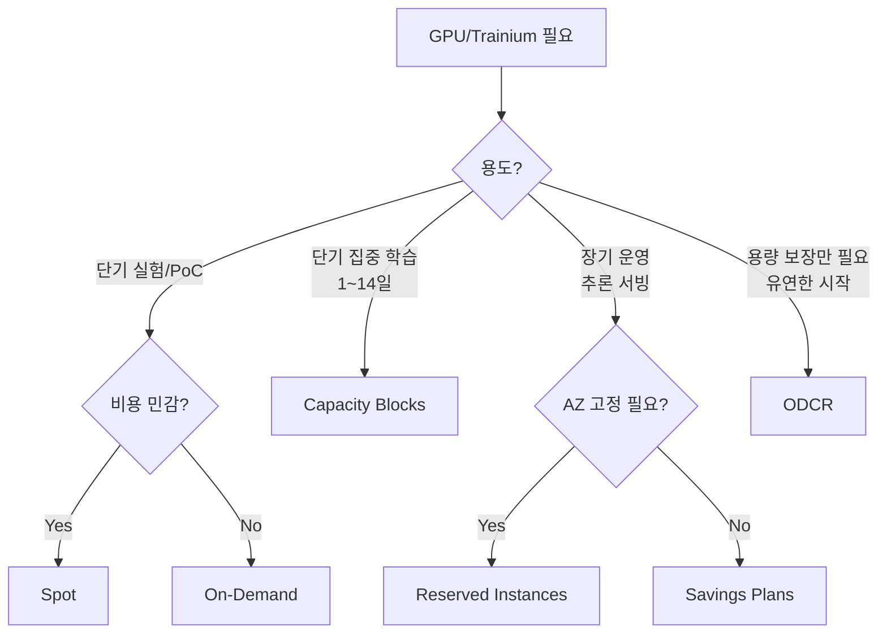

# XC 구매 옵션

GPU/Trainium 인스턴스를 확보할 때 어떤 구매 방식을 선택할지 결정하기 위한 가이드입니다.

## 🎯 한눈에 보기

| 구매 옵션 | 약정 | 할인율 | 적합한 워크로드 |
|-----------|------|--------|----------------|
| **On-Demand** | 없음 | 기준가 | PoC, 단기 실험, 가변 워크로드 |
| **Spot** | 없음 | 최대 90% | 내결함성 학습, 체크포인트 가능 작업 |
| **Capacity Blocks** | 1~14일 예약 | 예약 보장 | 단기 집중 학습, 데모, 워크숍 |
| **Savings Plans** | 1~3년 | 최대 72% | 장기 지속 추론 서빙, 상시 학습 |
| **Reserved Instances** | 1~3년 | 최대 72% | 특정 AZ 고정, 장기 운영 |
| **On-Demand Capacity Reservations (ODCR)** | 없음 (용량만 예약) | 할인 없음 | 용량 보장 필요, 언제든 시작 |

## 📊 의사결정 플로우차트

## 🔑 옵션별 상세

### On-Demand

- **특징**: 약정 없이 초 단위 과금, 즉시 시작/종료
- **장점**: 최대 유연성, 진입 장벽 없음
- **단점**: 가장 비싼 단가, 용량 보장 없음
- **적합**: PoC, 프로토타이핑, 불규칙 워크로드

### Spot Instances

- **특징**: 미사용 EC2 용량을 할인된 가격으로 사용
- **장점**: 최대 90% 할인
- **단점**: 2분 전 중단 알림, 용량 회수 가능
- **적합**: 체크포인트/재시작 가능한 학습, 배치 추론
- **팁**: Managed Spot Training (SageMaker), 자체 체크포인트 로직 필수

### Capacity Blocks

- **특징**: 특정 기간(1~14일) GPU/Trainium 클러스터 예약
- **장점**: 확정된 일정에 용량 보장, 선불 결제로 예산 확정
- **단점**: 예약 시점에 가용 블록이 있어야 함
- **적합**: 학습 스프린트, 워크숍, 데모, 벤치마크
- **지원 인스턴스**: p5.48xlarge, p5e.48xlarge, trn1.32xlarge, trn2.48xlarge 등

### Savings Plans (Compute / ML)

- **특징**: 1년 또는 3년 시간당 사용량 약정
- **장점**: 리전/인스턴스 패밀리 유연, 최대 72% 할인
- **단점**: 약정 기간 중 해지 불가
- **적합**: 추론 서빙 (24/7 운영), 상시 학습 파이프라인

### Reserved Instances

- **특징**: 특정 인스턴스 타입 + AZ 조합으로 1~3년 예약
- **장점**: 용량 예약 + 할인 동시, AZ 고정
- **단점**: 유연성 최저, 변경 제한적
- **적합**: 인스턴스 타입/AZ가 확정된 장기 운영

### On-Demand Capacity Reservations (ODCR)

- **특징**: 특정 AZ에 On-Demand 용량을 예약 (할인 없음)
- **장점**: 필요할 때 확실히 시작 가능, 약정 없이 취소 가능
- **단점**: On-Demand 가격 그대로 과금 (사용하지 않아도)
- **적합**: 미션 크리티컬 워크로드, DR, 가용성 최우선
- **팁**: Savings Plans / RI와 결합하면 할인 + 용량 보장 동시 달성

## 💡 조합 전략

| 시나리오 | 추천 조합 |
|---------|----------|
| 추론 서빙 + 트래픽 버스트 | Savings Plans (베이스) + On-Demand (스파이크) |
| 대규모 학습 (2주 집중) | Capacity Blocks |
| 상시 학습 + 실험 | Savings Plans (상시) + Spot (실험) |
| 가용성 보장 + 비용 최적화 | ODCR + Savings Plans |

## 📚 참고 자료

- [EC2 요금](https://aws.amazon.com/ec2/pricing/)
- [Capacity Blocks for ML](https://docs.aws.amazon.com/AWSEC2/latest/UserGuide/ec2-capacity-blocks.html)
- [Savings Plans](https://aws.amazon.com/savingsplans/)
- [EC2 Capacity Reservations](https://docs.aws.amazon.com/AWSEC2/latest/UserGuide/ec2-capacity-reservations.html)
