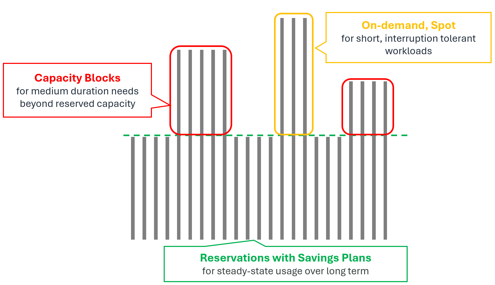
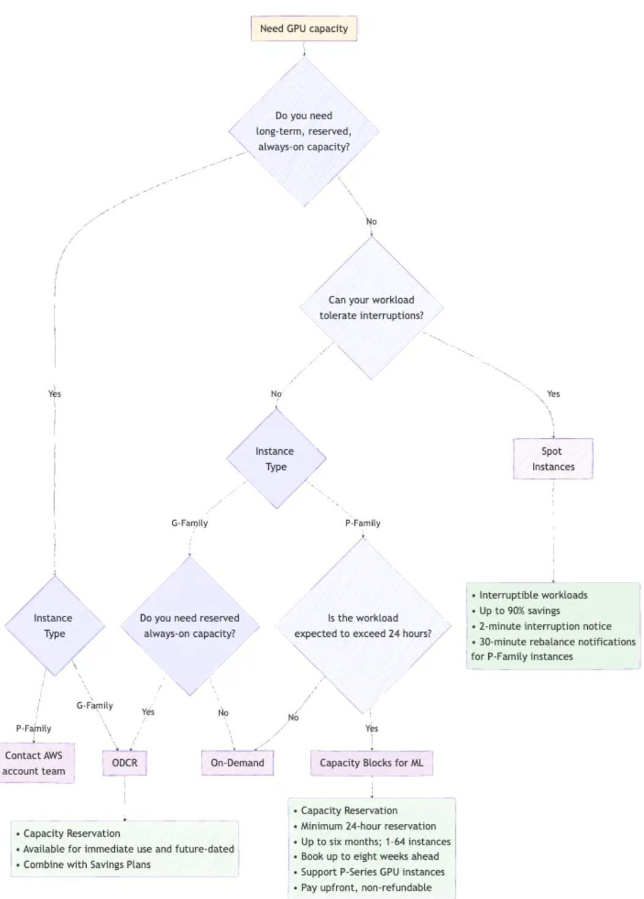

# AWS에서 GPU 용량 확보하기: 구매 옵션 비교 및 실전 가이드

본 문서는 AWS에서 GPU 용량을 확보하려는 팀을 위한 실용적이고 종합적인 안내서입니다. 주요 구매 옵션을 비교하고 의사결정 프레임워크를 적용해 비용·가용성·비즈니스 가치를 균형 있게 최적화하는 방법을 다룹니다.

## 1. 개요

GPU는 AI 워크로드의 핵심 자원이지만, 그 요구사항은 워크로드마다 크게 다릅니다. 대규모 GPU가 수개월간 집중적으로 필요한 사전 학습, 중단을 허용하는 배치 추론, 24시간 상시 가동이 필수인 프로덕션 추론까지 — 사용 패턴·도입 성숙도·최적화 목표에 따라 필요한 용량의 규모와 확보 방식이 크게 달라집니다.
AWS는 이러한 다양성에 대응할 수 있도록 업계에서 가장 폭넓은 인스턴스 포트폴리오와 구매 옵션을 제공합니다. 워크로드 특성에 맞는 옵션을 선택하고 조합하는 것이 곧 효율적인 인프라 운영의 핵심이며, 이를 통해 비용과 가용성을 동시에 최적화할 수 있습니다.

---

## 2. 구매 옵션

AWS의 가속 컴퓨팅 인스턴스는 **On-Demand, Spot, On-Demand Capacity Reservations (ODCR), Capacity Blocks** 를 통해 이용할 수 있으며, 각 옵션은 비용·유연성·용량 보장 측면에서 서로 다른 이점을 제공합니다.

| 구매 옵션 | 특징 | 비용 | 유연성 | 용량 보장 여부 | 적합 워크로드 |
| --- | --- | --- | --- | --- | --- |
| **On-Demand** | 약정 없이 필요할 때 즉시 사용하고 사용한 만큼만 지불하는 기본 옵션 | 사용 시간 단위 지불 | 언제든 시작·종료 가능, 최고 수준의 유연성 | No | 예측 불가능하거나 단기적인 워크로드, 개발·프로토타이핑 |
| **On-Demand Capacity Reservation (ODCR)** | 특정 가용 영역에서 원하는 기간 동안 용량을 예약해 확보하는 옵션 | 표준 On-Demand 요금이 적용되며, 실제 사용 여부와 관계없이 과금 (선불·추가 요금 없음). Savings Plans 적용 가능 | 종료일 유동적, 생성·해제 자유로움 | Yes (특정 AZ에서 즉시·상시 확보) | 상시 가동형 프로덕션 추론·학습, 비즈니스 크리티컬 워크로드 |
| **Capacity Blocks** | 미래 날짜의 GPU/Trainium 용량을 선결제로 사전 예약하는 ML 전용 옵션 | On-Demand 대비 최대 60% 할인 가격 적용. 100% 선결제 (예약 시점 시세 고정) | 시작일·사용 기간·인스턴스 수량을 사전 지정, 취소·환불 불가 | Yes | 기간과 사용량이 명확한 6개월 이내의 단기 워크로드 |
| **Spot** | EC2의 예비 용량을 대폭 할인된 가격으로 사용하되 회수될 수 있는 옵션 | On-Demand 대비 최대 90% 할인 (가장 저렴) | 중단 발생 가능 | No (사용 도중 Interuption 발생 가능) | 중단을 허용할 수 있는 유연·상태 비저장 워크로드 |

아래에서 각 구매 옵션을 좀 더 자세히 살펴봅니다.

### 2.1 **On-Demand 인스턴스**

장기 약정 없이 시간 또는 초 단위로 비용을 지불하고 언제든 인스턴스를 시작·종료할 수 있어 GPU 워크로드를 시작하기에 가장 간단한 출발점입니다. 개발, 프로토타이핑, 예측 불가능하거나 단기적인 워크로드에 적합합니다. 단, On-Demand는 용량 보장을 제공하지 않습니다. 원하는 시점에 원하는 용량을 확보해야 한다면 예약형 옵션(ODCR, Capacity Blocks) 이용을 권장합니다.

AWS G 인스턴스는 모든 리전에서 On-Demand를 지원하며, P 인스턴스는 인스턴스 타입·리전에 따라 지원 여부가 다릅니다. 자세한 내용은 [Amazon EC2 인스턴스 타입 페이지](https://aws.amazon.com/ec2/instance-types/)를 참고하세요.

### 2.2 **On-Demand Capacity Reservations (ODCR)**

[ODCR](https://docs.aws.amazon.com/AWSEC2/latest/UserGuide/ec2-capacity-reservations.html)을 사용하면 특정 가용 영역에서 원하는 기간 동안 GPU 용량을 예약할 수 있습니다. ODCR은 종료일이 정해져 있지 않고 즉시 또는 장기 용량 보장이 필요한 워크로드에 적합합니다. 프로덕션 추론 서비스, 특정 타이밍이 있는 예약 학습 작업, 비즈니스 크리티컬 애플리케이션 등 상시 가동형 워크로드에 특히 유용합니다.
참고로 ODCR로 용량을 확보하고 있는 기간 중에는 실제 사용 여부와 관계없이 On-Demand 요금 기준으로 비용이 과금됩니다. ODCR은 Savings Plans와 결합하면 1년·3년 약정으로 EC2 Instance Savings Plans 기준 최대 72%, Compute Savings Plans 기준 최대 66%까지 절감할 수 있습니다.
AWS G 인스턴스는 고객이 EC2 콘솔 등을 통해 직접 예약할 수 있지만, P 인스턴스는 AWS 어카운트팀의 지원을 통해 확보해야 합니다.

### 2.3 **EC2 Capacity Blocks for ML**

[Capacity Blocks for ML](https://docs.aws.amazon.com/AWSEC2/latest/UserGuide/ec2-capacity-blocks.html)는 미래 특정 날짜에 GPU 인스턴스를 사전 예약하여 단기 ML 워크로드를 실행할 수 있는 구매 옵션입니다. 1년 이상의 장기 약정이 없이도 On-demand 대비 최대 60% 할인된 가격으로 GPU 용량 확보가 가능하다는 것이 큰 장점입니다. 또한 Capacity Blocks을 통해 예약한 GPU 인스턴스는 모두 Amazon EC2 UltraCluster 내에 구성되어 저지연·고성능 네트워크가 보장됩니다.

Capacity Blocks for ML은 예약 방식은 호텔 객실 예약과 유사합니다. 호텔 예약 시 객실 예약 날짜와 기간, 수량을 지정해 예약하는 것처럼, Capacity Blocks도 GPU 인스턴스 필요 날짜와 기간, 인스턴스 수를 지정하여 예약을 진행합니다. 예약 시점에 100% 선결제가 이루어지며 이를 통해 예약 날짜에 GPU 가용성을 보장받을 수 있습니다.

Capacity Blocks의 주요 사용 조건은 아래와 같습니다.

- **예약 가능 시점**: 사용 시작일 최소 30분 전부터 최대 8주 전까지 용량 조회 및 예약 가능
- **예약 기간**: 최소 1일 ~ 최대 182일 (1~14일은 1일 단위, 14일 이상은 7일 단위로 예약 가능)
    - 가용 용량이 있는 경우 기존에 사용 중인 Capacity Blocks의 기간을 연장 가능
- **수량**: 최대 64대 인스턴스
- **지원 인스턴스**: P 인스턴스 및 Trainium 인스턴스 (P4d, P5, P5e, P5en, P6-B200, P6-B300, P6e-GB200, Trn1, Trn2)
- **결제**: 예약 시점에 전액 선불 결제되며 예약 후에는 일정 변경·취소·환불 불가

Capacity Blocks 오퍼링 조회부터 예약·인스턴스 실행까지의 단계별 절차는 [Capacity Blocks 실전 가이드](../capacity-blocks-guide.md)를 참고하시기 바랍니다.

### 2.4 **Spot 인스턴스**

[Amazon EC2 Spot Instances](https://aws.amazon.com/ec2/spot/)는 EC2의 예비 용량을 On-Demand 대비 최대 90% 할인된 가격으로 사용하는 옵션입니다. 용량 회수 시 중단될 수 있어, 비용에 민감하면서도 내결함성을 갖춘 워크로드(배치 추론, 리전 유연성이 있는 실시간 추론 등)에 매우 매력적입니다.

중요한 점은 Spot 용량이 On-Demand 용량과 독립적으로 운영된다는 것입니다. 따라서 On-Demand 용량이 제약될 때에도 Spot 인스턴스는 사용 가능한 경우가 있습니다.

회수 전 EC2는 두 가지 신호를 제공합니다. 중단 2분 전의 중단 알림(interruption notice)과, 중단 위험이 높아지면 그보다 먼저 best-effort로 전송되는 재조정 권장(rebalance recommendation) 신호입니다. 이를 활용해 상태를 저장하고 연결을 정리한 뒤 다른 인스턴스로 옮길 수 있습니다. [Spot Placement Score](https://docs.aws.amazon.com/AWSEC2/latest/UserGuide/spot-placement-score.html)는 Spot 용량 가용성에 대한 가시성을 제공하며, Spot은 Amazon EKS, Karpenter, EC2 Auto Scaling Capacity Rebalancing과 잘 통합되어 중단 처리를 자동화할 수 있습니다. 요금은 장기 공급·수요에 따라 점진적으로 변동됩니다([가격 히스토리](https://docs.aws.amazon.com/AWSEC2/latest/UserGuide/using-spot-instances-history.html)).

!!! note "구매 옵션 조합으로 비용 최적화"
    실전에서는 한 가지 옵션만 쓰기보다 워크로드의 사용 패턴과 기간에 따라 여러 옵션을 계층적으로 조합하는 것이 비용 절감에 유리합니다.

    | 수요 | 옵션 | 용도 |
    | --- | --- | --- |
    | **상시 이용 수요** | ODCR + Savings Plans | 장기·상시 가동되는 워크로드 |
    | **중단기 수요** | Capacity Blocks for ML | 장기 예약 용량을 넘어서는 6개월 이하의 사전 계획된 수요 |
    | **단기·버스트 수요** | On-Demand, Spot | 짧고 예측 불가능하거나 (OD) 중단을 허용할 수 있는 (Spot) 워크로드 |

    <figure markdown>
      { width="720" }
    </figure>

---

## 3. 가격 예시

다음 표는 구매 옵션별 가격 차이를 보여주는 예시입니다. **2026년 8월 기준 N. Virginia(us-east-1)** 가격이며, 공급·수요에 따라 가격은 변동될 수 있습니다. 리전별로 가격이 상이하므로 **AWS 공식 홈페이지를 통해 항상 최신 가격을 확인하세요.**

| 인스턴스 타입 | GPU | On-Demand | Savings Plans 1년 | Savings Plans 3년 | Capacity Blocks | Spot |
| --- | --- | --- | --- | --- | --- | --- |
| **g6e.xlarge** | 1 × L40S | $1.86 | ~$1.41 (−24%) | ~$0.97 (−48%) | 미지원 | 가격 실시간 변동 |
| **p4d.24xlarge** | 8 × A100 | $21.96 | $13.92 (-37%) | $9.37 (-57%) | $11.8 (−46%) | 가격 실시간 변동 |
| **p6-b200.48xlarge** | 8 × B200 | $113.93 | 미지원 | $49.22 (-57%) | $98.84 (−13%) | - |

**가격 확인용 공식 링크**

- [Amazon EC2 On-Demand Pricing](https://aws.amazon.com/ec2/pricing/on-demand/)
- [Compute and EC2 Instance Savings Plans](https://aws.amazon.com/savingsplans/compute-pricing/)
- [Amazon EC2 Capacity Blocks for ML pricing](https://aws.amazon.com/ec2/capacityblocks/pricing/)
- [Amazon EC2 Spot Instances Pricing](https://aws.amazon.com/ec2/spot/pricing/)
- [AWS Pricing Calculator](https://calculator.aws/#/)

---

## 4. 의사결정 트리

아래 흐름은 워크로드 특성에 따라 적합한 구매 옵션을 좁혀 나가는 데 도움이 됩니다.

<figure markdown>
  { width="820" }
</figure>

---

## 5. 용량 가용성 향상 방법

인스턴스 유형, 리전, 사용 시점, 구매 모델에 걸쳐 유연성을 극대화하는 팀일수록 더 나은 가용성과 더 비용 효율적인 결과를 얻습니다.

| 모범 사례 | 설명 |
| --- | --- |
| **일찍 예약하기** | 중요한 워크로드는 Capacity Blocks 또는 미래 날짜 예약으로 사용 시작 최소 1개월 전에 미리 용량 확보 |
| **멀티 리전 배포 고려하기** | 단일 리전을 넘어 확장하면 용량 확보 가능성이 크게 상승 |
| **모든 가용 영역 사용하기** | 동일 리전 내에서도 AZ 간 용량이 다른 경우가 많음 |
| **인스턴스 유형·크기에 유연하게** | 여러 패밀리(예: P5와 P4d)를 지원하도록 설계하면 가용성 개선 |
| **유연한 구매 모델 채택** | ODCR·Capacity Blocks·On-Demand·Spot을 워크로드에 맞게 조합 |
| **할당량 사전 확인** | 배포 실패를 방지하기 위해 서비스 한도(Service Quotas)를 사전에 확인·증설 |

---

## 6. 결론

가장 먼저 워크로드 요구사항을 평가하는 것에서 출발하세요. 중단 허용 여부, 용량 보장 필요성, 사용 기간과 시점, 그리고 비용·가용성·유연성 중 무엇을 우선할지가 명확해지면, 위의 의사결정 트리와 구매 옵션 정보가 요구사항에 가장 잘 맞는 선택지를 찾는 데 도움이 됩니다.

AWS는 다양한 워크로드에 맞춘 여러 구매 모델을 제공합니다. 일부는 즉각적인 가용성을, 다른 일부는 사전 계획과 전략적 조달을 통해 최적의 비용과 확실한 용량을 제공합니다. 대부분의 경우 단일 옵션보다 여러 옵션의 조합이 최선의 결과를 만들어 냅니다.

**추가 도움이 필요하신가요?** 요구사항을 논의하고 필요에 가장 적합한 GPU 용량 확보 전략을 함께 설계하려면 AWS 계정 팀 또는 AWS Support에 문의하세요.

---

**더 알아보기**

- [Capacity Blocks 실전 가이드](../capacity-blocks-guide.md) | 콘솔에서 오퍼링 조회·예약·인스턴스 실행까지 단계별 절차 |
- [가속기 선택 가이드](../gpu-selection-guide.md) | 워크로드 분석부터 가속기 선택까지 기술 검토 프레임워크 |

---

*Author: Martina Bae · Tech Business Developer, AWS WWSO GTM Specialists-APJ*
