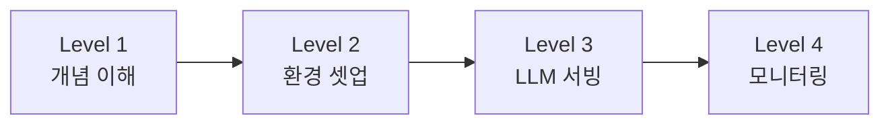

# 학습경로

AWS Neuron SDK를 처음 접하는 엔지니어를 위한 단계별 학습 가이드입니다.  
공식 문서 기반으로 구성되어 있으며, 기초 개념부터 실전 서빙까지 순서대로 진행할 수 있습니다.

## :material-map-marker-path: 추천 학습 순서

## :material-book-open-variant: Level 1 — 개념 이해

> Neuron SDK가 무엇인지, Trainium 하드웨어 구조와 전체 아키텍처를 파악합니다.

| # | 주제 | 링크 | 예상 시간 |
|---|------|------|:---------:|
| 1 | **Neuron SDK 전체 소개** | [:octicons-link-external-16: AWS Neuron Documentation](https://awsdocs-neuron.readthedocs-hosted.com/en/latest/){target=_blank} | 10분 |
| 2 | **Trainium2 하드웨어 아키텍처** — NeuronCore-v3, LNC, 메모리 계층 | [:octicons-link-external-16: Trainium2 Architecture](https://awsdocs-neuron.readthedocs-hosted.com/en/latest/general/arch/neuron-hardware/trainium2.html){target=_blank} | 15분 |
| 3 | **NeuronCore-v3 아키텍처** — Tensor/Vector/Scalar/GPSIMD 엔진 | [:octicons-link-external-16: NeuronCore-v3](https://awsdocs-neuron.readthedocs-hosted.com/en/latest/general/arch/neuron-hardware/neuron-core-v3.html){target=_blank} | 15분 |
| 4 | **EC2 인스턴스 아키텍처** — Trn1/Trn2 토폴로지, NeuronLink | [:octicons-link-external-16: Neuron Architecture Guides](https://awsdocs-neuron.readthedocs-hosted.com/en/latest/general/arch/index.html){target=_blank} | 15분 |

!!! tip "GPU 경험이 있다면"
    CUDA/NVIDIA GPU 경험이 있는 분은 Trainium과 GPU의 차이점 관점에서 읽으면 이해가 빠릅니다.  
    핵심 차이: CUDA Core 대신 NeuronCore, HBM 대신 소프트웨어 관리형 SRAM + HBM 계층 구조.

## :material-rocket-launch: Level 2 — 환경 셋업 & 첫 실행

> DLAMI를 사용해 Neuron 환경에 접속하고, 첫 번째 모델을 학습시킵니다.

| # | 주제 | 링크 | 예상 시간 |
|---|------|------|:---------:|
| 5 | **Quick Start 가이드** — Training / Inference / Serving 경로 선택 | [:octicons-link-external-16: Get Started](https://awsdocs-neuron.readthedocs-hosted.com/en/latest/general/quick-start/index.html){target=_blank} | 5분 |
| 6 | **Training Quick Start** — Trainium에서 첫 모델 학습 | [:octicons-link-external-16: Train a Model on Trainium](https://awsdocs-neuron.readthedocs-hosted.com/en/latest/general/quick-start/training-quickstart.html){target=_blank} | 30분 |
| 7 | **PyTorch NeuronX 개발자 가이드** — torch-neuronx 기본, XLA 동작 방식 | [:octicons-link-external-16: PyTorch NeuronX Programming Guide](https://awsdocs-neuron.readthedocs-hosted.com/en/latest/frameworks/torch/torch-neuronx/programming-guide/training/pytorch-neuron-programming-guide.html){target=_blank} | 20분 |

!!! note "사전 요구사항"
    - AWS 계정 (EC2 접근 권한 포함)
    - 기본적인 PyTorch 사용 경험
    - SSH로 EC2 인스턴스에 접속할 수 있는 환경

## :material-server: Level 3 — vLLM 서빙

> LLM을 Neuron에서 서빙하는 전체 흐름을 익힙니다.

| # | 주제 | 링크 | 예상 시간 |
|---|------|------|:---------:|
| 8 | **vLLM on Neuron 개요** — 아키텍처, NxD Inference 연동 구조 | [:octicons-link-external-16: vLLM on Neuron](https://awsdocs-neuron.readthedocs-hosted.com/en/latest/libraries/nxd-inference/vllm/index.html){target=_blank} | 10분 |
| 9 | **Online Serving Quick Start** — OpenAI-compatible API 서버 실행 | [:octicons-link-external-16: Online Serving](https://awsdocs-neuron.readthedocs-hosted.com/en/latest/libraries/nxd-inference/vllm/quickstart-vllm-online-serving.html){target=_blank} | 15분 |
| 10 | **Offline Inference** — 배치 추론 워크플로 | [:octicons-link-external-16: Offline Serving](https://awsdocs-neuron.readthedocs-hosted.com/en/latest/libraries/nxd-inference/vllm/quickstart-vllm-offline-serving.html){target=_blank} | 10분 |

## :material-chart-line: Level 4 — 모니터링 & 운영 도구

> `neuron-top`, `neuron-monitor` 등 운영에 필수적인 도구 사용법을 익힙니다.

| # | 주제 | 링크 | 예상 시간 |
|---|------|------|:---------:|
| 11 | **Neuron Top** — 실시간 NeuronCore/메모리 사용량 확인 | [:octicons-link-external-16: Neuron Top User Guide](https://awsdocs-neuron.readthedocs-hosted.com/en/latest/tools/neuron-sys-tools/neuron-top-user-guide.html){target=_blank} | 10분 |
| 12 | **Neuron Monitor** — JSON 메트릭 수집, Prometheus/Grafana 연동 | [:octicons-link-external-16: Neuron Monitor User Guide](https://awsdocs-neuron.readthedocs-hosted.com/en/latest/tools/neuron-sys-tools/neuron-monitor-user-guide.html){target=_blank} | 10분 |
| 13 | **EKS 모니터링** — Neuron Monitor DaemonSet 배포 | [:octicons-link-external-16: Deploy Neuron Monitor DaemonSet](https://awsdocs-neuron.readthedocs-hosted.com/en/latest/deploy/infrastructure/monitoring.html){target=_blank} | 10분 |
| 14 | **실습: neuron-monitor + Prometheus + Grafana** | [:octicons-link-external-16: Tutorial: Monitoring with MNIST](https://awsdocs-neuron.readthedocs-hosted.com/en/latest/tools/tutorials/tutorial-neuron-monitor-mnist.html){target=_blank} | 30분 |

!!! tip "nvidia-smi에 익숙하다면"
    `neuron-top`은 NVIDIA GPU의 `nvidia-smi`에 대응하는 도구입니다.  
    NeuronCore 활용률, 메모리, 로드된 모델 정보를 실시간으로 확인할 수 있습니다.

## :material-link-variant: 추가 참고 자료

| 자료 | 링크 |
|------|------|
| AWS Neuron SDK GitHub | [:octicons-link-external-16: aws-neuron/aws-neuron-sdk](https://github.com/aws-neuron/aws-neuron-sdk){target=_blank} |
| Neuron Samples (예제 코드) | [:octicons-link-external-16: aws-neuron/aws-neuron-samples](https://github.com/aws-neuron/aws-neuron-samples){target=_blank} |
| AWS Trainium Getting Started (공식) | [:octicons-link-external-16: aws.amazon.com/trainium/getting-started](https://aws.amazon.com/ai/machine-learning/trainium/getting-started){target=_blank} |
| Neuron DLAMI 가이드 | [:octicons-link-external-16: DLAMI User Guide](https://awsdocs-neuron.readthedocs-hosted.com/en/latest/dlami/index.html){target=_blank} |

!!! warning "버전 참고"
    모든 링크는 Neuron SDK **latest** 버전 기준입니다. 특정 버전의 문서가 필요한 경우 URL에서 `latest`를 원하는 버전(예: `v2.30.0`)으로 변경하세요.
