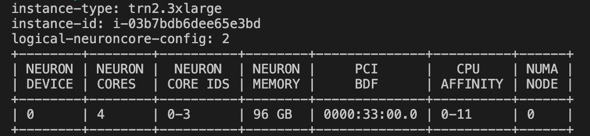
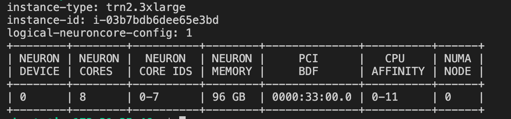
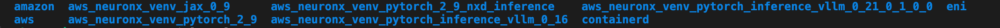
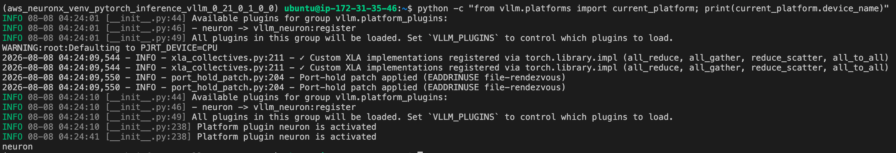
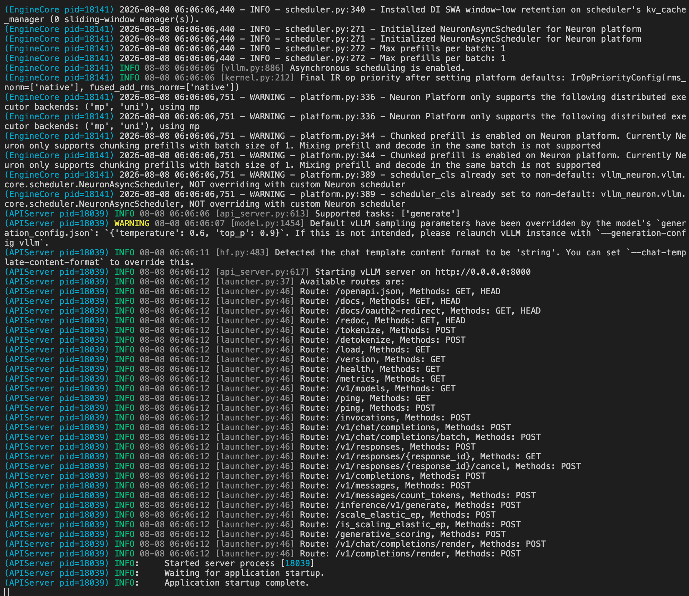

# NDD Day 1 Lab — vLLM 배포 · 모니터링 · 벤치마크

## 🎯 실습 목표

| # | 목표 | 완료 기준 |
| --- | --- | --- |
| 1 | Neuron 인스턴스에 vLLM 서버를 배포하고 API 호출 성공 | curl/Python으로 응답 수신 |
| 2 | neuron-top으로 NeuronCore 활용률/메모리 실시간 관찰 | 부하 중 활용률 변화 확인 |
| 3 | Neuron Explorer로 프로파일 캡처 & UI에서 타임라인 열기 | Prefill/Decode 구간 식별 |
| 4 | `vllm bench serve`로 성능 벤치마크 + 파라미터 튜닝으로 트레이드오프 수치 체감 | 벤치마크 비교표 완성 |
| 5 | `lm_eval`로 정확도 벤치마크 실행 | GSM8K acc 점수 확인 |

> ⏱️ **총 소요**: ~80분 (Lab 0: 5분 + Lab 1: 25분 + Lab 2: 25분 + Lab 3: 25분)

## 실습 환경

| 항목 | 값 |
| --- | --- |
| 인스턴스 | trn2.3xlarge (Trainium2 × 1 chip, 8 NeuronCores, HBM 96GB) |
| AMI | Deep Learning AMI Neuron (Ubuntu 24.04) — Neuron SDK 2.31+ |
| vLLM | vLLM 0_21_0_1_0_0 (Public Beta) |
| 모델 | meta-llama/Llama-3.2-1B-Instruct |
| TP | 4 (논리 4코어, LNC=2 기본) |

!!!tip "왜 trn2.3xlarge + Llama-3.2-1B?"
    가장 작은 Trainium2 인스턴스 + 가장 가벼운 LLM 조합으로, **컴파일 2~3분 내 완료** → 실습 시간 대부분을 "이해"에 투자할 수 있습니다.


## Lab 0-A: EC2 인스턴스 생성 (참고)

> 이미 인스턴스가 준비된 경우 이 섹션은 건너뜁니다.

```bash
# SSM 파라미터로 최신 Neuron DLAMI AMI ID 조회
aws ssm get-parameter \
  --region ap-southeast-4 \
  --name /aws/service/neuron/dlami/multi-framework/ubuntu-24.04/latest/image_id \
  --query "Parameter.Value" \
  --output text

# 특정 리전의 OS 버전별 전체 DLAMI 조회
aws ec2 describe-images \
  --region ap-southeast-4 \
  --owners amazon \
  --filters "Name=name,Values=*Neuron*Ubuntu 24.04*" \
  --query 'Images | sort_by(@, &CreationDate) | [].{Name:Name, ID:ImageId, Date:CreationDate}' \
  --output table
```


## Lab 0: 환경 확인 (5분)


### 1. Neuron 디바이스 확인
```bash

neuron-ls
```
> 기대결과: 4 NeuronCores (trn2.3xlarge: 물리 8코어, LNC=2 기본 → 논리 4코어)



#### LNC(Logical NeuronCore) 확인 — "왜 TP=4인가?"

* trn2.3xlarge는 물리적으로 **8개 NeuronCore** 를 가지고 있지만, 기본 설정(LNC=2)에서는 2개씩 묶어 **논리 4코어** 로 동작합니다.

* LNC(Logical NeuronCore) 모드를 변경하면 TP 구성이 달라집니다:

```bash
# LNC=1로 변경 (물리코어 8개 그대로 노출 → 논리 8코어)
export NEURON_LOGICAL_NC_CONFIG=1
neuron-ls
# → 논리 8코어 (코어당 12GB) → TP=8 가능
```




```bash
# 다시 LNC=2로 복원 (이후 실습에서 TP=4 사용을 위해 필수)
export NEURON_LOGICAL_NC_CONFIG=2
neuron-ls
# → 논리 4코어 (코어당 24GB) → TP=4

```

!!! tip "기본 LNC 설정 LNC=2 권장"
    코어당 HBM이 24GB로 늘어나 더 큰 KV-cache를 수용할 수 있고, 코어 간 통신도 줄어듭니다. 1B 모델에서는 차이가 작지만 큰 모델에서는 LNC=2가 유리합니다.

### 2. 설치 환경 확인
* DLAMI 로 instance 를 시작하면 아래와 같은 미리 설치된 런타임 라이브러리들을 확인 할 수 있습니다.
```bash
ls -al /opt
```



### 2. vLLM Neuron venv 활성화
* 오늘 실험에서 사용될 vllm 버전은 현재 퍼블릭 베타 진행 중인 vLLM Neuron Plugin 버전으로 아래 가상환경을 활성화 합니다.
```bash
source /opt/aws_neuronx_venv_pytorch_inference_vllm_0_21_0_1_0_0/bin/activate
```

### 3. 버전 확인
* 가상환경에서 vllm 버전과 neuronx-cc 버전을 확인합니다. 

```bash
pip show vllm | grep Version
pip show neuronx-cc | grep Version
```

### 4. Neuron 플랫폼 인식 확인
```bash
python -c "from vllm.platforms import current_platform; print(current_platform.device_name)"
# 기대 출력: neuron
# ⚠️ 'cuda' 또는 에러 → venv 미활성화 또는 vllm-neuron 미설치
```



✅ **Lab0 체크포인트**: neuron-ls에서 4 NeuronCores 표시 + vLLM 버전 확인 완료


## Lab 1: vLLM 서버 배포 & API 호출 (25분)

!!! tip "목표"
    "Neuron 위에서 LLM을 띄운다"는 것이 실제로 무엇을 의미하는지 체감. 컴파일 → 캐시 → 서빙 흐름을 눈으로 확인합니다.


### 1-1. 환경 변수 설정 & HuggingFace 로그인

```bash
# EFA affinity 비활성화 (trn2.3xlarge에는 EFA 디바이스가 없으므로 필수)
export NEURON_SKIP_EFA_AFFINITY=1

# 지속 적용
echo 'export NEURON_SKIP_EFA_AFFINITY=1' >> ~/.bashrc
source ~/.bashrc

# 컴파일 캐시 설정 (기본 위치)
export VLLM_CACHE_ROOT=~/.cache/vllm

# Neuron Persistent Cache
export NEURON_COMPILE_CACHE_URL="$VLLM_CACHE_ROOT/neuron/compile_cache"
```
> VLLM_CACHE_ROOT=~/.cache/vllm → 생략해도 전혀 무방합니다.

> NEURON_COMPILE_CACHE_URL → 아래 경우에만 명시 설정이 필요합니다:

> * /var/tmp는 재부팅이나 OS 임시파일 정리 시 삭제될 수 있음 → 컴파일 캐시가 날아가면 다음 기동 시 재컴파일 (수십 분 소요)
> * EKS/컨테이너 환경에서 PVC에 캐시를 영속화해야 할 때
> * 여러 캐시 경로를 한 곳에서 통합 관리하고 싶을 때

* 각 변수의 기본값

| 변수 | 기본값 |
| --- | --- |
| VLLM_CACHE_ROOT | ~/.cache/vllm |
| NEURON_COMPILE_CACHE_URL | /var/tmp/neuron-compile-cache |


* 허깅페이스 로그인
```bash
# HuggingFace 모델 다운로드를 위한 인증
huggingface-cli login
# 프롬프트에 HuggingFace Access Token 입력 or 브라우저 통한 로그인
```

### 1-2. vLLM 서버 시작

```bash
NEURON_SKIP_EFA_AFFINITY=1 vllm serve meta-llama/Llama-3.2-1B-Instruct \
    --tensor-parallel-size 4 \
    --max-model-len 4096 \
    --max-num-seqs 4 \
    --max-num-batched-tokens 4096 \
    --no-enable-prefix-caching \
    --additional-config '{
      "neuron_config": {
        "num_batched_tokens_buckets": [4096],
        "num_seqs_buckets": [4]
      }
    }'

```

> ⏱️ **첫 실행**: 컴파일 ~2-3분 소요 (NEFF 생성). 이후 실행은 캐시 히트로 수십 초 내 시작.



### 1-3. 파라미터 설명

| 파라미터 | 값 | 의미 |
| --- | --- | --- |
| `--tensor-parallel-size` | 4 | 모델을 4개 NeuronCore에 분산 |
| `--max-model-len` | 4096 | 최대 시퀀스 길이 (KV-cache 크기 결정) |
| `--max-num-seqs` | 4 | 동시 처리 최대 요청 수 |
| `--max-num-batched-tokens` | 4096 | 한 iteration에 처리할 최대 토큰 수 |
| `num_batched_tokens_buckets` | [4096] | Neuron 컴파일 버킷 (정적 그래프 크기) |
| `num_seqs_buckets` | [4] | 배치 크기 버킷 |
| `--no-enable-prefix-caching` | - | APC 비활성화 (단순 실습용) |


!!! tip "APC(Automatic Prefix Caching) 자동 프리픽스 캐싱"
    동일한 시스템 프롬프트나 공통 prefix를 가진 요청이 반복될 때, 이미 계산한 KV cache를 재사용해서 중복 prefill 연산을 건너뛰는 최적화 기법.

### 1-4. API 호출 테스트 (새 터미널)
* 새로운 터미널을 오픈하여 vllm 가상환경을 동일하게 활성화 하고 추론 테스트를 수행 합니다. 


> CURL Test

```bash
# curl 테스트
curl http://localhost:8000/v1/chat/completions \
  -H "Content-Type: application/json" \
  -d '{
    "model": "meta-llama/Llama-3.2-1B-Instruct",
    "messages": [{"role": "user", "content": "Hello! What is AWS neuron chip and trainium instance?"}],
    "max_tokens": 100
  }'

```

> Python SDK 테스트

```python
# Python SDK 테스트
from openai import OpenAI
client = OpenAI(base_url="http://localhost:8000/v1", api_key="dummy")

response = client.chat.completions.create(
    model="meta-llama/Llama-3.2-1B-Instruct",
    messages=[{"role": "user", "content": "Explain what AWS Trainium is in 2 sentences."}],
    max_tokens=100
)
print(response.choices[0].message.content)

```

✅ **체크포인트**: 서버 정상 응답 수신 (200 OK + 생성된 텍스트)

---

### 📂 NEFF 컴파일 캐시 확인

서버가 처음 시작될 때 Neuron Compiler가 모델 그래프를 NEFF(Neuron Executable File Format)로 컴파일합니다. 이후 동일 설정으로 재시작하면 캐시에서 로드되어 빠르게 시작됩니다.

```bash
# 컴파일 캐시 위치 확인
ls ~/.cache/vllm/neuron/compile_cache/
# <hash>/   → 각 컴파일된 그래프 (NEFF + HLO + 메타데이터)
# nki/      → NKI 커널 캐시

# NEFF 파일 확인 (해시 폴더 안)
ls ~/.cache/vllm/neuron/compile_cache/*/
# graph_<hash>.neff   ← 컴파일된 실행 바이너리
# graph.hlo           ← HLO IR (컴파일러 입력)

# 캐시 전체 크기 확인
du -sh ~/.cache/vllm/neuron/compile_cache/

```

!!! tip "캐시 무효화 조건"
    `--tensor-parallel-size`, `--max-num-seqs`, `num_batched_tokens_buckets`, 모델 변경, 또는 Neuron SDK 버전 업그레이드 시 재컴파일됩니다.


!!! warning "캐시 저장 팁"
    NVMe 로컬 스토리지(`/local`)를 활용하면 컴파일 캐시 + 모델 다운로드 속도에 유리합니다.


!!! note "vLLM Neuron 소스 코드 탐색"
    캐시 로직이 궁금하다면:
    ```
    /opt/aws_neuronx_venv_pytorch_inference_vllm_0_21_0_1_0_0/lib/python3.12/site-packages/vllm_neuron/
    ├── model/       → 모델 구현 (llama3.py 등)
    ├── nki/         → NKI 커널
    ├── compile/     → 컴파일 로직
    
    ```


## Lab 1-B: 오프라인 배치 추론 (참고)

서버 없이 직접 모델을 로드하여 배치 추론을 실행합니다.<br> 아래 파이썬 코드를 작성하여저장 후 실행 합니다. 
반드시 기존에 실행하던 vllm 서버를 종료 후 실행 해주세요

```python
# offline_inference.py
from vllm import LLM, SamplingParams

llm = LLM(
    model="meta-llama/Llama-3.2-1B-Instruct",
    tensor_parallel_size=4,
    max_num_seqs=4,
    max_model_len=4096,
    max_num_batched_tokens=4096,
    additional_config={
        "neuron_config": {
            "num_batched_tokens_buckets": [4096],
            "num_seqs_buckets": [4]
        }
    },
)

prompts = [
    "Hello, my name is",
    "The capital of Korea is",
    "The future of AI is",
]

sampling_params = SamplingParams(max_tokens=100, temperature=0.7)
outputs = llm.generate(prompts, sampling_params)

for output in outputs:
    print(f"Prompt: {output.prompt!r}")
    print(f"Generated: {output.outputs[0].text!r}\n")

```


```bash
# 실행
python offline_inference.py

```


> 온라인 서빙(`vllm serve`)과 동일한 컴파일/캐시 과정을 거칩니다. 서버 오버헤드 없이 빠르게 모델 동작을 확인할 때 사용합니다.


## Lab 2: 퍼포먼스 벤치마킹 & 정확도 검증 (25분)

!!! tip "목표"
    `vllm bench serve`로 성능을 정량 측정하고, 파라미터 변경에 따른 Throughput↔Latency 트레이드오프를 수치로 체감. 추가로 `lm_eval`로 모델 정확도 벤치마크 실행. **배우는 것**: 공식 벤치마크 CLI 사용법, 서빙 SLA 설계 사고방식, Bucket 추가의 비용, 정확도 검증 기초.


### 2-1. 퍼포먼스 벤치마킹 — `vllm bench serve`

!!! note
    `vllm bench serve`: vLLM 공식 벤치마크 CLI입니다. 서버에 합성 트래픽을 전송하고 TTFT, TPOT, Throughput 등 핵심 지표를 자동 측정합니다. Speculative Decoding 서버에서는 Draft Acceptance Rate까지 리포트합니다.


벤치마크 데이터셋 준비

```bash
# Sonnet 벤치마크 데이터셋 다운로드 (vLLM 공식 벤치마크 입력)
wget -O sonnet.txt \
    https://raw.githubusercontent.com/vllm-project/vllm/main/benchmarks/sonnet.txt

```

### 2-2. Config A — Latency 우선 (프로파일링 옵션 제거 후 서버 재시작)

```bash
NEURON_SKIP_EFA_AFFINITY=1 vllm serve meta-llama/Llama-3.2-1B-Instruct \
    --tensor-parallel-size 4 \
    --max-model-len 4096 \
    --max-num-seqs 4 \
    --max-num-batched-tokens 4096 \
    --no-enable-prefix-caching \
    --additional-config '{
      "neuron_config": {
        "num_batched_tokens_buckets": [4096],
        "num_seqs_buckets": [4]
      }
    }'
```

```bash
# Config A 벤치마크 실행 (vllm bench serve)
vllm bench serve \
    --base-url http://localhost:8000 \
    --model meta-llama/Llama-3.2-1B-Instruct \
    --dataset-name sonnet \
    --dataset-path ./sonnet.txt \
    --sonnet-input-len 128 \
    --sonnet-output-len 128 \
    --sonnet-prefix-len 64 \
    --num-prompts 30 \
    --max-concurrency 4 \
    --save-result \
    --result-filename config_a.json
```


> 📝 결과에서 **TTFT (avg), TPOT (avg), Throughput (tok/s)** 기록

### 2-3. Config B — Throughput 우선 (서버 재시작)

```bash
# 서버 중지 (Ctrl+C) 후 재시작
NEURON_SKIP_EFA_AFFINITY=1 vllm serve meta-llama/Llama-3.2-1B-Instruct \
    --tensor-parallel-size 4 \
    --max-model-len 4096 \
    --max-num-seqs 16 \
    --max-num-batched-tokens 4096 \
    --no-enable-prefix-caching \
    --additional-config '{
      "neuron_config": {
        "num_batched_tokens_buckets": [4096],
        "num_seqs_buckets": [4, 8, 16]
      }
    }'
```

> --max-num-seqs 16동시에 큐에 올릴 수 있는 최대 시퀀스 수를 4 → 16으로 늘림.

> * 이전: 한 번에 최대 4개 요청만 처리
> * 이번: 한 번에 최대 16개 요청을 처리
> * 더 많은 요청을 한 번에 배치로 묶을수록 NeuronCore 가동률(utilization)이 높아져 단위 시간당 처리 토큰 수(throughput)가 증가합니다. 대신 각 요청은 다른 요청들과 함께 처리되므로 개별 레이턴시(TTFT, ITL)는 증가합니다.


> num_seqs_buckets: [4, 8, 16]Neuron은 정적 그래프를 컴파일하기 때문에, 배치 크기마다 별도의 NEFF(컴파일된 그래프)를 미리 만들어 둬야 합니다.

> * 이전 [4] → 배치 크기가 항상 4로 고정. 요청이 1개여도 4개 배치로 패딩해서 실행
> * 이번 [4, 8, 16] → 실제 요청 수에 따라 가장 가까운 버킷으로 실행 (예: 6개 요청 → 8 버킷 사용)
> * 버킷을 추가할수록 컴파일 시간과 메모리는 증가하지만, 요청이 몰릴 때 더 큰 배치를 효율적으로 처리할 수 있어 쓰루풋이 좋아집니다.


!!! warning "Bucket 추가 = 재컴파일"
    `num_seqs_buckets`를 [4] → [4, 8, 16]으로 바꾸면 각 버킷에 대해 별도 NEFF를 컴파일합니다. 컴파일 시간이 ~3배 증가합니다.


```bash
# Config B 벤치마크 실행 (concurrency를 서버 max_num_seqs에 맞춰 16으로!)
vllm bench serve \
    --base-url http://localhost:8000 \
    --model meta-llama/Llama-3.2-1B-Instruct \
    --dataset-name sonnet \
    --dataset-path ./sonnet.txt \
    --sonnet-input-len 128 \
    --sonnet-output-len 128 \
    --sonnet-prefix-len 64 \
    --num-prompts 30 \
    --max-concurrency 16 \
    --save-result \
    --result-filename config_b.json
```

### 2-4. 결과 비교 (자동화 스크립트)

```python
# compare_benchmarks.py — 두 Config 결과를 정량 비교
import json

a = json.load(open("config_a.json"))
b = json.load(open("config_b.json"))

print(f"{'Metric':<25s} {'Config A (seqs=4)':>18s} {'Config B (seqs=16)':>18s}")
print("-" * 65)
for k in ("output_throughput", "median_tpot_ms", "median_ttft_ms"):
    print(f"{k:<25s} {a[k]:>18.2f} {b[k]:>18.2f}")

speedup = b['output_throughput'] / a['output_throughput']
print(f"\nConfig B throughput vs A: {speedup:.2f}x")

```


| 지표 | Config A (seqs=4) | Config B (seqs=16) | 변화 |
| --- | --- | --- | --- |
| TTFT (avg) | ~69 ms | ~154 ms | +124% ↑ (배칭 경합) |
| TPOT (avg) | ~7.8 ms | ~16.8 ms | +115% ↑ (batch 내 공유) |
| output_throughput | ~456 tok/s | ~731 tok/s | **+60% ↑** (동시 처리 증가) |
| 컴파일 시간 | ~2분 | ~6분 |  |
| Bucket 수 | 1 | 3 |  |

!!! tip "핵심"
    Config B는 Throughput **+60%** (더 많은 요청 동시 처리)이지만, 개별 사용자 체감 TTFT/TPOT는 **2배 이상 증가**합니다. `--max-concurrency`를 서버의 `max_num_seqs`와 맞춰야 실제 차이가 드러납니다 (둘 다 4로 놓으면 동일한 결과가 나옴!).


### 2-5. 실전 적용 사고

| 시나리오 | 권장 설정 | 이유 |
| --- | --- | --- |
| 챗봇 (실시간 대화) | seqs=4~8, bucket 최소 | Latency 우선 — 사용자 체감 TTFT < 500ms |
| 배치 처리 (문서 요약) | seqs=16~32, bucket 다수 | Throughput 우선 — 비용 효율 |
| API 서비스 (SLA 있음) | seqs=8~12, 중간 | TTFT P95 < 1s + 적정 처리량 |

!!! tip "핵심 교훈"
    Neuron에서는 Bucket이 고정 크기 NEFF를 만들기 때문에, 버킷 설계가 곧 SLA 설계입니다. GPU처럼 동적으로 배치를 키우는 것이 아니라, **미리 어떤 부하 패턴을 지원할지 결정**해야 합니다.


✅ **체크포인트**: `compare_benchmarks.py` 실행하여 두 Config의 수치 비교 확인 + 트레이드오프 이해

---

### 2-6. 정확도 벤치마킹 — `lm_eval`

!!! note
    `lm_eval`: Eleuther AI의 Language Model Evaluation Harness입니다. vLLM 서버를 백엔드로 연결하여 GSM8K, MMLU 등 표준 태스크에서 모델 정확도를 측정합니다. 양자화·TP 변경 후 정확도 검증에 필수.


```bash
# 사용 가능한 태스크 목록 확인
lm_eval --tasks list
# 주요 태스크: gsm8k, mmlu, hellaswag, arc_easy, arc_challenge, winogrande, boolq, piqa
# ⚠️ Neuron 백엔드 logprobs 기반 태스크(mmlu, arc 등)가 제한적입니다.
#    generative 방식인 gsm8k, hellaswag 등을 권장합니다.

```

```bash
# lm_eval 설치 (venv에 이미 있으면 건너뛰기)
pip install lm-eval --quiet

```

```bash
# Config A 서버가 실행 중인 상태에서 정확도 벤치마크
lm_eval --model local-completions \
    --model_args model=meta-llama/Llama-3.2-1B-Instruct,base_url=http://localhost:8000/v1/completions,num_concurrent=4,tokenized_requests=False \
    --tasks gsm8k \
    --batch_size auto \
    --output_path ./accuracy_results/ \
    --log_samples

```


!!! tip "해석 가이드"
    | 지표 | 의미 | 기준 |
    | --- | --- | --- |
    | `acc` / `acc_norm` | 정답률 | HuggingFace 공개 리더보드 대비 ±2% 이내 |
    | `exact_match` | 완벽 일치 | GSM8K에서 ~33-36% (1B 모델 기준) |


**기대 결과 (Llama-3.2-1B-Instruct, GSM8K 5-shot, trn2.3xlarge)**:

|Tasks|Version|     Filter     |n-shot|  Metric   |   |Value |   |Stderr|
|-----|------:|----------------|-----:|-----------|---|-----:|---|-----:|
|gsm8k|      3|flexible-extract|     5|exact_match|↑  |0.3419|±  |0.0131|
|     |       |strict-match    |     5|exact_match|↑  |0.3404|±  |0.0131|


!!! tip "핵심 포인트"
    1B 모델이라 절대 점수는 낮지만, 중요한 것은 **GPU 레퍼런스와 동일한 점수** (Meta 공식 ~33-36%)가 나왔다는 것 — Neuron 컴파일이 모델 정확도에 영향을 주지 않음을 검증한 것입니다.

    ⏱️ **소요 시간**: 1,319 문제 × 5-shot ≈ 4분 (~5.35 it/s)


!!! warning "1B 모델 참고"
    Llama-3.2-1B는 소형 모델이라 GSM8K 점수가 높지 않습니다. 여기서는 **정확도 벤치마크 워크플로우를 익히는 것** 이 목적입니다. 실전에서는 70B+ 모델에서 양자화(FP8 KV, MXFP4) 전후 비교에 활용합니다.


!!! tip "실전 활용 시나리오"
    - 양자화 적용 전후 정확도 비교 (BF16 → FP8 KV cache)
    - TP 변경에 따른 수치 정밀도 확인
    - 모델 온보딩 시 HuggingFace 리더보드 대비 정확도 검증
    - 새 Neuron SDK 버전 업그레이드 후 회귀 테스트


✅ **체크포인트** : `lm_eval` 실행 완료 + 결과 파일에서 `acc` 점수 확인


## Lab 3: 모니터링 & 프로파일링 (25분)

!!! tip "목표"
    neuron-top으로 실시간 상태를 보고, Neuron Explorer로 Prefill/Decode 구간을 구분 **배우는 것** : NeuronCore 활용률 의미, KV-cache 메모리 변화, 프로파일 타임라인 읽기


### 3-1. neuron-top 실시간 관찰 (터미널 2)

```bash
neuron-top

```

관찰 포인트:

| 항목 | 의미 |
| --- | --- |
| NeuronCore utilization (%) | 코어가 실제 연산 중인 비율 |
| vCPU Utilization | CPU 사용량 |
| Device Used Memory (MB) | HBM 사용량 — 모델 로드 후 ~고정, 요청 중 KV-cache로 증가 |


### 3-2. 부하 생성 & 변화 관찰 (터미널 3)

```bash
# 단일 요청으로 변화 관찰
curl -s http://localhost:8000/v1/chat/completions \
  -H "Content-Type: application/json" \
  -d '{
    "model": "meta-llama/Llama-3.2-1B-Instruct",
    "messages": [{"role": "user", "content": "Write a detailed essay about cloud computing architecture, including IaaS, PaaS, and SaaS layers."}],
    "max_tokens": 512
  }'

```
neuron-top에서 관찰:

- **요청 전** : NeuronCore utilization ~0%, Memory 고정 (모델 weights만)
- **Prefill 순간** : utilization 스파이크 (짧고 높음)
- **Decode 중** : utilization 중간 레벨 유지 (반복적 패턴)
- **완료 후** : utilization 0%로 복귀, Memory에서 KV-cache 해제


✅ **체크포인트** : neuron-top에서 요청 처리 중 활용률 변화 패턴 확인 완료


### 3-3. vLLM Neuron 프로파일 캡처

!!! tip
    vLLM Neuron Plugin은 **HTTP 엔드포인트 방식** 으로 프로파일을 캡처합니다. 서버를 재시작하지 않고, 실행 중인 서버에서 원하는 구간만 정확히 캡처할 수 있습니다. 📖 [공식 문서: How to profile vLLM Neuron workloads](https://awsdocs-neuron.readthedocs-hosted.com/en/latest/vllm-neuron/docs/guides/how-to-profile-workloads.html)


**Step0: 프로파일을 위한 환경변수 설정**
```
# Operator Table + HLO stats를 위해 (컴파일 시 NEFF에 메타데이터 삽입)
export XLA_IR_DEBUG=1
export XLA_HLO_DEBUG=1

# NKI 소스코드 매핑이 필요하면 (선택)
export NEURON_FRAMEWORK_DEBUG=1

# DMA 상세 데이터를 위해 (런타임 캡처 시) -> overflow 발생 가능성 있어 해제
unset NEURON_RT_ENABLE_DGE_NOTIFICATIONS

**Step 1: 프로파일링 활성화 상태로 서버 시작**
```

```bash
# 기존 서버 종료 후, --profiler-config 추가하여 재시작
NEURON_SKIP_EFA_AFFINITY=1 vllm serve meta-llama/Llama-3.2-1B-Instruct \
    --tensor-parallel-size 4 \
    --max-model-len 4096 \
    --max-num-seqs 4 \
    --max-num-batched-tokens 4096 \
    --no-enable-prefix-caching \
    --profiler-config '{"profiler": "cuda"}' \
    --additional-config '{
      "neuron_config": {
        "num_batched_tokens_buckets": [4096],
        "num_seqs_buckets": [4]
      },
      "neuron_profiler": {
        "activities": ["all"],
        "neuron_cores": [0, 1, 2, 3],
        "output_dir": "/home/ubuntu/neuron-profiles"
      }
    }'
```

!!! warning "핵심"
    `--profiler-config '{"profiler": "cuda"}'` 가 있어야 `/start_profile`, `/stop_profile` HTTP 엔드포인트가 마운트됩니다. 이 플래그 없이 시작하면 프로파일 API가 동작하지 않습니다.


> `neuron_profiler` 설정 레퍼런스

| 필드 | 타입 | 기본값 | 설명 |
| --- | --- | --- | --- |
| `activities` | list[str] | `["device_profile", "system_profile"]` | 캡처할 프로파일 유형 |
| `neuron_cores` | list[int] | null | null (rank 0만) |
| `output_dir` | str | `~/neuron-profiles` | 출력 디렉토리 |
| `sys_trace_max_events_per_nc` | int | null | null (NRT 기본값) |

> `activities`** 유효 값**: `"system_profile"`, `"device_profile"`, `"host_memory"`, `"cpu_util"`, `"all"`

**Step 1-고급 Iteration 제어 — 웜업 건너뛰기(실제 실습 활용 커멘트)**

```bash
# delay_iterations: N번의 forward pass를 건너뛴 후 캡처 시작
# max_iterations: N번의 forward pass 후 자동 종료
# → 웜업(컴파일/캐시) 구간을 깨끗하게 건너뛸 수 있음
NEURON_SKIP_EFA_AFFINITY=1 vllm serve meta-llama/Llama-3.2-1B-Instruct \
    --tensor-parallel-size 4 \
    --max-model-len 4096 \
    --max-num-seqs 4 \
    --max-num-batched-tokens 4096 \
    --no-enable-prefix-caching \
    --profiler-config '{"profiler": "cuda", "delay_iterations": 0, "max_iterations": 5}' \
    --additional-config '{
      "neuron_config": {
        "num_batched_tokens_buckets": [4096],
        "num_seqs_buckets": [4]
      },
      "neuron_profiler": {
        "activities": ["all"],
        "neuron_cores": [0, 1, 2, 3],
        "output_dir": "/home/ubuntu/neuron-profiles"
      }
    }'
```


| 설정 | 동작 |
| --- | --- |
| `delay_iterations` | /start_profile 후 N번의 execute_model을 건너뛴 뒤 실제 캡처 시작 |
| `max_iterations` | 캡처 시작 후 N번의 execute_model 후 자동으로 /stop_profile |

!!! tip
    하나의 iteration = 하나의 `execute_model` 호출 (하나의 batched forward pass)


**Step 2: 프로파일 시작 (터미널 2)**

서버가 Ready 상태가 된 후:

```bash
# 프로파일 캡처 시작
curl -X POST http://localhost:8000/start_profile

```

**Step 3: 요청 전송**

```bash
# 프로파일링 중에 요청 1개 전송 (깨끗한 단일 Prefill→Decode 패턴 캡처)
curl -s http://localhost:8000/v1/chat/completions \
  -H "Content-Type: application/json" \
  -d '{
    "model": "meta-llama/Llama-3.2-1B-Instruct",
    "messages": [{"role": "user", "content": "Write a detailed step-by-step guide on how to make chocolate cake from scratch. Include all ingredients and measurements."}],
    "max_tokens": 64
  }'

```

!!! tip "1개의 리퀘스트만 수행하는 이유"
    프로파일 분석 목적은 "하나의 요청이 Prefill→Decode로 어떻게 흘러가는지" 엔진별로 추적하는 것입니다. 여러 요청을 겹치면 타임라인이 복잡해져 교육 분석이 어렵습니다.

* all 을 activity 로 설정하는 경우 명령어 실행 시간이지연될수록 프로파일 데이터가 증가하므로 아래와같이 명령어를 한번에 실행하여 순차적 실행 후 바로 종료 되도록 합니다. 

```bash
curl -X POST http://localhost:8000/start_profile \
&& curl -s http://localhost:8000/v1/chat/completions \
  -H "Content-Type: application/json" \
  -d '{
    "model": "meta-llama/Llama-3.2-1B-Instruct",
    "messages": [{"role": "user", "content": "Write a detailed step-by-step guide on how to make chocolate cake from scratch. Include all ingredients and measurements."}],
    "max_tokens": 5
  }' \
&& curl -X POST http://localhost:8000/stop_profile
```


**Step 4: 프로파일 종료**

```bash
# 프로파일 캡처 중단 → 파일 플러시
curl -X POST http://localhost:8000/stop_profile

```


**Step 5: 출력 확인**

```bash
ls ~/neuron-profiles/
# 정상이면 i-<instance>_pid_<pid>/ 디렉토리와 neffs/ 폴더가 보입니다

```

Profile Output Structure

```
~/neuron-profiles/
├── i-<instance_id>_pid_<pid>/
│   └── <timestamp>/
│       ├── profile_nc_0_session_0.ntff    # Device Profile (NTFF)
│       ├── ntrace.pb                      # System trace
│       ├── trace_info.pb                  # Trace metadata
│       ├── cpu_util.pb                    # CPU utilization (activities에 포함 시)
│       └── host_mem.pb                    # Host memory (activities에 포함 시)
└── neffs/
    ├── graph_<hash1>.neff                 # 컴파일된 NEFF (compile cache에서 자동 복사)
    └── graph_<hash2>.neff

```

* 폴더가 정상적으로 생성되고 2차적으로 캡쳐가 잘 수행됐는지 서버 시작전에 체크 합니다. 
* 다음과 같은 요약 데이터가 보인다면 정상적으로 프로파일이 가능한 상태입니다.
```
neuron-explorer view -d neuron-profiles --output-format summary-text

s_2b34ee2866d9218f6a487d2535f8008b7e887e99
    total_duration_ns    1786270865722793417
    message_count:
        Cpu_Util_Message_Count          0
        Host_Mem_Usage_Message_Count    0
        Trace_Events_Message_Count      9634
    event_type_count:
        kbl_exec_post                         20
        nrta_execute_schedule                 20
        nrt_tensor_free                       4800
        cc_exec_barrier                       20
        notification_consume_errors           40
        nrt_tensor_write                      280
        kbl_exec_wait                         20
        exec_consume_gpsimd_stdio             40
        nrt_dma_mem_alloc                     982
        nrt_tensor_allocate                   340
        dmem_buf_copyin                       1082
        kbl_exec_pre                          20
        nrt_profile_add_node_info             20
        exec_consume_cc_core_notifications    20
        nrt_dma_mem_dealloc                   460
        nrt_model_submit                      20
        cc_running                            720
        nc_exec_running                       40
        nrt_tensor_read                       305
        dmem_buf_copyout                      385
n_7792fe1daf87c456c04c96497296393233c1c7b1
    activate_instruction_count                        5220
    throttle_activity_0_avg_util_limit_nc4_percent    1
    adjusted_hardware_flops                           161563672576
    hardware_dynamic_dma_size_percent                 0.041778316085653945
    throttle_gpio_1_active_time_nc4_percent           0.005344930435136431
    throttle_active_nc5_time_ns                       22297550

```

| 파일 | 설명 |
| --- | --- |
| `.ntff` | Neuron Trace File Format — NeuronCore별 하드웨어 실행 트레이스 |
| `.neff` (neffs/ 내) | Neuron Executable File Format — Explorer가 Device Profile을 렌더링하는데 필수 |
| `ntrace.pb` | System 레벨 런타임 이벤트 (API 호출, 모델 로드, 실행) |
| `trace_info.pb` | System 트레이스 메타데이터 |
| `cpu_util.pb` | CPU 사용률 (activities에 `"cpu_util"` 또는 `"all"` 포함 시) |
| `host_mem.pb` | 호스트 메모리 (activities에 `"host_memory"` 또는 `"all"` 포함 시) |


> ℹ️ **NEFF 자동 복사** : vLLM Neuron은 `/stop_profile` 시 compile cache에서 NEFF를 `neffs/` 폴더로 자동 복사합니다. 만약 없으면 `VLLM_CACHE_ROOT` 경로(`$VLLM_CACHE_ROOT/neuron/compile_cache`)를 확인하세요.

!!! warning "캡처 실패 트러블슈팅"
    | 증상 | 원인 | 해결 |
    | --- | --- | --- |
    | 프로파일 출력 없음 | `--profiler-config` 미설정 | 서버 시작 시 플래그 확인 |
    | System trace 비어있거나 잘림 | 링 버퍼 오버플로 | `sys_trace_max_events_per_nc` 값 증가 |
    | Explorer에서 Device Profile 렌더 안됨 | NEFF 파일 누락 | `neffs/` 폴더 확인, compile cache 경로 확인 |
    | 프로파일에 활동 없음 | start/stop 사이에 요청 미전송 | 부하 전송 후 stop 호출 |


✅ **체크포인트** : `ls ~/neuron-profiles/` 에서 `i-*_pid_*/` 디렉토리 + `neffs/` 폴더 확인


### 3-4. Neuron Explorer UI 열기

SSH 터널 설정 (로컬 머신에서 실행)

```bash
ssh -i ~/key.pem -L 3001:localhost:3001 -L 3002:localhost:3002 ubuntu@<ip> -fN

```

> ℹ️ 포트 3001 = Web UI, 포트 3002 = API Backend. **두 포트 모두 터널링 필수** — 하나만 열면 페이지는 로드되지만 데이터가 표시되지 않습니다.

Explorer 서버 실행 (EC2에서)

```bash
neuron-explorer view -v 2 -d /home/ubuntu/neuron-profiles --display-name "lab1-vllm-profile"
# → "View a list of profiles at http://localhost:3001/"
# → ctrl-c to exit
```

!!! warning
    `--display-name`** 은 필수입니다.** 빠뜨리면 `FATA[0000] Missing --display-name` 에러 발생.


**브라우저** → `http://localhost:3001`


경로 레벨 — 어디까지 줘야 하나?

최상위 `neuron-profiles/` 디렉토리를 줍니다. Explorer가 하위 PID 폴더 + `neffs/` 를 자동 스캔합니다.

```
neuron-explorer view -v 2 -d ~/neuron-profiles
                         ^^^^^^^^^^^^^^^^^^
                         이 레벨 (PID 폴더의 상위)

```

Neuron Explorer UI 구조

| 뷰 | 내용 | 보는 것 |
| --- | --- | --- |
| **System Profile** | 호스트 측 Runtime API 호출 타임라인 | nrt_execute, tensor_write/read, 모델 로드 |
| **Device Profile** | NeuronCore 내부 엔진별 실행 타임라인 | Tensor/Vector/Scalar/DMA Engine busy/idle |

**VS Code 확장의 data-path 경로**

```bash
/home/ubuntu/.vscode-server/data/User/globalStorage/amazonwebservices.neuron-explorer/data
```

**CLI 기본 경로:**

```bash
/home/ubuntu/.local/share/neuron-explorer
```

### 실패한 프로파일 삭제 (초기화)

```bash
# VS Code 확장 쪽
rm -rf /home/ubuntu/.vscode-server/data/User/globalStorage/amazonwebservices.neuron-explorer/data/*

# CLI 쪽
rm -rf /home/ubuntu/.local/share/neuron-explorer/*
```

### 2-5. 프로파일 분석

Step 1: System Profile — "언제 뭘 했나"

System Profile은 **호스트에서 본 타임라인** 입니다. `nrt_execute` 이벤트가 핵심:

| 이벤트 | 의미 |
| --- | --- |
| `nrt_execute` (길고 1개) | **Prefill** — 입력 토큰 전체를 한번에 처리 |
| `nrt_execute` (짧고 반복) | **Decode** — 토큰 1개씩 생성 |
| `nrt_tensor_write` | 호스트→디바이스 텐서 전송 |
| `nrt_tensor_read` | 디바이스→호스트 텐서 읽기 |
| `nrt_load_collectives` | AllReduce 등 collective op 로드 |

> 🔍 **찾는 법** : Perfetto에서 `nrt_execute` 클릭 → Arguments 패널 → `model_name` 필드에서 `context_encoding_model`(=Prefill) 또는 `token_generation_model`(=Decode) 확인

Step 2: Device Profile — "코어 안에서 뭐가 바쁘고 뭐가 쉬었나"

Neuron Explorer UI에서 Device Profile을 열면 **엔진별 타임라인** 이 보입니다:

| 엔진 | 역할 | 정상 상태 |
| --- | --- | --- |
| **Tensor Engine** | 행렬곱 (GEMM) | Prefill 중 계속 바쁨 |
| **Vector Engine** | Activation, Norm | 짧은 burst |
| **Scalar Engine** | 제어 흐름 | 거의 안 보임 |
| **DMA Engine** | HBM↔SBUF 데이터 이동 | Decode 중 계속 바쁨 |

Step 3: 병목 판단 체크리스트

| 증상 | 프로파일에서 보이는 것 | 의미 | 조치 |
| --- | --- | --- | --- |
| TTFT 높음 | Prefill 구간에서 TensorE에 gap(빈 공간) | DMA가 데이터를 제때 못 올림 | NKI tiling 최적화 |
| TPOT 높음 | Decode 구간에서 DMA 후 idle 구간 | AllReduce 대기 또는 batch 부족 | batch↑ |
| 전체 느림 | `nrt_execute` 사이에 긴 gap | 호스트 스케줄링 오버헤드 | Bucket 단순화 |

!!! tip "핵심 인사이트"
    Prefill = Compute-bound (TensorE가 쉬면 비정상), Decode = Memory-bound (DMA가 쉬면 비정상). Session 3에서 배운 Roofline을 실제 프로파일에서 확인하는 것.


✅ **체크포인트** : Explorer에서 Prefill→Decode 전환 패턴 식별 + 엔진별 busy/idle 구간 확인 완료


## 마무리 (5분)

### 오늘 실습에서 확인한 것

| # | 확인 사항 | ✅ |
| --- | --- | --- |
| 1 | vLLM + Neuron으로 LLM 서버 배포 성공 |  |
| 2 | neuron-top에서 NeuronCore 활용률/메모리 변화 관찰 |  |
| 3 | Neuron Explorer에서 프로파일 캡처 & 타임라인 열기 |  |
| 4 | Prefill(길고 1개) vs Decode(짧고 반복) 패턴 식별 |  |
| 5 | `vllm bench serve`로 Config A/B 성능 정량 비교 완료 |  |
| 6 | `lm_eval`로 정확도 벤치마크 워크플로우 실행 |  |


## 참조: 정확도 심화 검증 (Day 3 실습에서 활용)

!!! tip
    Day 1에서는 `lm_eval`로 E2E 정확도를 확인했습니다. Day 3에서는 CPU 모드 디버깅, 3-Way 텐서 비교, Module-level 단위 테스트 등 심화 정확도 디버깅을 다룹니다.


```python
# Greedy decode로 결정론적 출력 비교
from vllm import LLM, SamplingParams

llm = LLM(
    model="meta-llama/Llama-3.2-1B-Instruct",
    tensor_parallel_size=4,
    max_num_seqs=4,
    max_model_len=4096,
    max_num_batched_tokens=4096,
    additional_config={
        "neuron_config": {
            "num_batched_tokens_buckets": [4096],
            "num_seqs_buckets": [4]
        }
    },
)

prompts = ["The capital of France is"]
params = SamplingParams(temperature=0, max_tokens=50)  # greedy
output = llm.generate(prompts, params)
print(output[0].outputs[0].text)
# 여러 번 실행해도 동일 출력 → 결정론적 검증 가능

```


---

*Author: Suji Lee · GTM XC Specialist SA, APJ AI Infrastructure*
