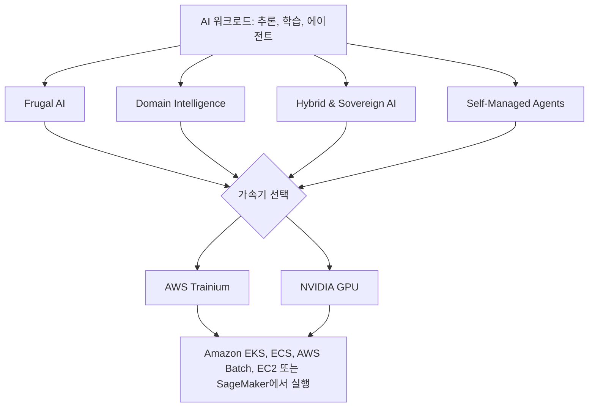

# AI Infra on AWS Guide

**현장에서 직접 구축하고 검증한 가이드로, AWS 가속 컴퓨팅에서 여러분의 모델과 학습, 에이전트를 직접 운영하세요.**

오픈웨이트 모델 서빙, 도메인 특화 파인튜닝, 자율 에이전트 운영 등 어떤 워크로드든 — 이 가이드는 AWS Trainium과 NVIDIA GPU에서 적합한 가속기를 선택하고, 인프라를 구축하고, 합리적인 비용으로 운영할 수 있도록 돕습니다.

[솔루션 모션 살펴보기 :material-arrow-down:](#solution-motions){ .md-button .md-button--primary }
[기반 영역부터 시작하기 :material-arrow-right:](ai-infra/index.md){ .md-button }

!!! warning "작업 진행 중"
    이 가이드는 여러 언어로 운영되고 있어, 일부 페이지는 아직 해당 언어로 제공되지 않을 수 있습니다. 피드백, 그리고 해당 언어에 없는 페이지에 대한 번역 요청을 [GitHub Issues](https://github.com/awslabs/accelerated-compute-tutorials/issues)로 환영합니다.

## 솔루션 모션별 살펴보기 { #solution-motions }

AWS에서 셀프 호스팅 AI를 운영하는 다섯 가지 방법입니다. 목표에 맞는 것부터 시작하세요.

-   :material-scale-balance:{ .lg .middle } **Frugal AI**

    ---

    확보 가능한 컴퓨트로 더 많은 것을 해내세요. 더 쉽게 확보할 수 있는 인스턴스로 모델을 압축하고, 서빙을 최적화하고, 원하는 품질 기준을 훨씬 낮은 비용으로 충족하는 소형 오픈웨이트 모델을 파인튜닝합니다.

    [:octicons-arrow-right-24: 살펴보기](frugal-ai/index.md)

-   :material-bullseye-arrow:{ .lg .middle } **Domain Intelligence**

    ---

    고객 데이터로 파인튜닝한 산업·도메인 특화 모델을 구축하세요. 중요한 태스크에서 훨씬 큰 독점 모델보다 뛰어난 성능을 내면서도 가치 대비 비용은 크게 낮춥니다.

    [:octicons-arrow-right-24: 살펴보기](domain-intelligence/index.md)

-   :material-earth:{ .lg .middle } **Hybrid & Sovereign AI**

    ---

    온프레미스·엣지·타 클라우드 컴퓨트를 AWS와 통합하고, 데이터 주권·규제·언어 요건이 있는 경우 국내(in-country), 자체 VPC 안에서 셀프 호스팅 모델과 학습을 운영합니다.

    [:octicons-arrow-right-24: 살펴보기](hybrid-sovereign-ai/index.md)

-   :material-robot:{ .lg .middle } **Self-Managed Agents**

    ---

    Amazon EKS와 Graviton에서 에이전트 워크로드를 운영합니다 — 커스텀 에이전트, 서드파티 에이전트 플랫폼, OpenClaw 같은 상시 실행 자율 에이전트를 NVIDIA Dynamo, Ray + EFA 등과 함께.

    [:octicons-arrow-right-24: 살펴보기](self-managed-agents/index.md)

-   :material-chip:{ .lg .middle } **AWS Trainium**

    ---

    GPU와 함께 선택할 수 있는 강력한 가속기 옵션입니다. AWS Trainium은 학습과 추론 모두에서 뛰어난 가격 대비 성능을 내도록 설계되었으며, 서빙, 분산 학습, 커스텀 NKI 커널, 프로파일링을 위한 Neuron SDK 가이드를 제공합니다.

    [:octicons-arrow-right-24: 살펴보기](aws-ai-chip/index.md)

## 이 가이드의 특징 { #why-this-guide }

| :material-check-decagram: 현장 검증 | :material-server-security: 셀프 호스팅 중심 | :material-cash-multiple: 가격 대비 성능 우선 | :material-translate: 영어 & 한국어 |
|---|---|---|---|
| 스펙 시트 가정이 아닌, 실무자가 직접 구축하고 테스트 | 직접 제어하는 컴퓨트에서 자체 모델과 에이전트를 운영하기 위한 심층 가이드 | Spot, Capacity Blocks, 양자화, 라이트사이징을 전반에 반영 | 랜딩 페이지는 두 언어로 제공되며, 더 많은 페이지를 순차적으로 번역 |

## 기반 영역 { #foundations }

모든 솔루션 모션의 바탕이 되는, 칩 종류와 무관한 구성 요소입니다.

-   :material-server-network:{ .lg .middle } **AI Infra**

    ---

    가속기 선택, EFA 네트워킹, FSx/S3 스토리지, 용량 계획, 구매 옵션.

    [:octicons-arrow-right-24: 살펴보기](ai-infra/index.md)

-   :material-expansion-card:{ .lg .middle } **NVIDIA GPU**

    ---

    P·G 계열 인스턴스, 아키텍처 매핑, Blackwell 세대, 워크로드 기반 인스턴스 선택.

    [:octicons-arrow-right-24: 살펴보기](nvidia-gpu/index.md)

-   :material-school:{ .lg .middle } **교육 및 행사**

    ---

    AWS 핸즈온 프로그램인 Neuron Foundations (NFD), Neuron Deep Dive (NDD)와 예정된 행사 및 지난 행사.

    [:octicons-arrow-right-24: 살펴보기](events/index.md)

## 대상 독자 { #who-its-for }

- **ML·AI 엔지니어** — AWS 가속기에서 오픈웨이트 모델을 배포, 파인튜닝, 서빙하는 분
- **솔루션·인프라 아키텍트** — GPU 및 Trainium 클러스터, 네트워킹, 스토리지를 설계하는 분
- **플랫폼·DevOps·MLOps 팀** — Amazon EKS에서 AI 워크로드를 운영, 확장, 비용 최적화하는 분
- **기술 리더** — 가속기, 용량, 데이터 주권 관련 선택지를 검토하는 분

## 전체 구성 { #how-it-fits }

모든 가이드는 같은 흐름을 따릅니다: 워크로드와 목표에서 출발해, 적합한 가속기를 선택하고, 원하는 AWS 컴퓨트 플랫폼에서 실행합니다.

## 최신소식 { #whats-new }

!!! note "Amazon EC2 P6-B300 서울 리전 출시"
    NVIDIA Blackwell Ultra (B300) GPU 기반 P6-B300 인스턴스를 이제 서울 리전(ap-northeast-2)에서 사용할 수 있습니다. [출시 상세 내용](updates/p6-b300-seoul-launch.md)을 읽어보거나 [전체 소식](updates/index.md)을 확인하세요.

## 시작하기 { #get-started }

1. **AWS AI 인프라가 처음이신가요?** [AI 인프라 설계](ai-infra/decisions/index.md)부터 시작해 가속기, 리전, 용량 전략을 정하세요.
2. **이미 생각해 둔 워크로드가 있으신가요?** 목표에 맞는 [솔루션 모션](#solution-motions)으로 바로 이동하세요.
3. **직접 실습하며 배우고 싶으신가요?** Neuron Foundations, Neuron Deep Dive 같은 AWS [교육 프로그램](events/education/index.md)에 참여하세요.

[가이드 살펴보기 :material-arrow-right:](ai-infra/index.md){ .md-button .md-button--primary }
[GitHub에서 보기 :material-github:](https://github.com/awslabs/accelerated-compute-tutorials){ .md-button }
