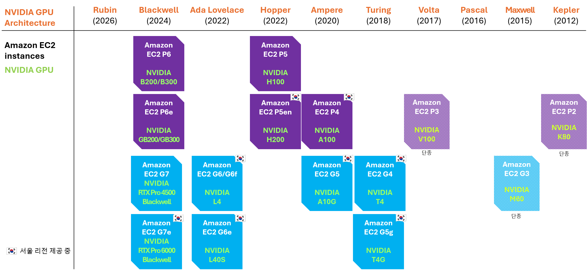

# NVIDIA GPU 인스턴스

본 문서는 AWS가 제공하는 NVIDIA GPU 기반 EC2 인스턴스에 대해 소개합니다. P 계열과 G 계열의 구분, NVIDIA GPU 아키텍처 맵핑, 인스턴스 사양, 사용 사례 및 특장점 등을 다루어 워크로드 특성에 맞는 인스턴스를 선정하는 데 도움을 줍니다.

---

## 1. P 계열 인스턴스 vs G 계열 인스턴스

AWS의 NVIDIA GPU 인스턴스는 크게 두 계열로 나뉩니다.

-   :material-server-network:{ .lg .middle } __P 계열: AI 학습·대규모 추론용 고성능 GPU__

    ---

    - 대용량·고대역폭 메모리(HBM) 탑재
    - 일반적으로 GPU 8개 단위로 인스턴스 구성
    - 분산 학습을 위해 다수의 GPU·노드를 고속 네트워크로 연결해 클러스터로 운영
    - GPU-GPU, 노드-노드 간 고속 통신 탑재
    - EC2 UltraClusters로 수만 대까지 scale-out 가능
    - 서울 리전에서 P4d, P5en 인스턴스 제공 중

-   :material-expansion-card:{ .lg .middle } __G 계열: 비용 효율적 추론 및 그래픽용 GPU__

    ---

    - GDDR 메모리 탑재
    - GPU 1~8개 단위로 구성해 다양한 사이징 옵션 제공
    - 단일 GPU·노드에서의 성능 및 비용 최적화
    - 서울 리전에서 G4dn, G5, G5g, G6, G6e, G7e 제공 중

---

## 2. Amazon EC2 인스턴스 ↔ NVIDIA GPU 맵핑

AWS는 클라우드 최초로 GPU 인스턴스를 제공하기 시작한 이래로 NVIDIA의 최신 GPU 로드맵과 함께 포트폴리오를 지속적으로 확장해 왔습니다. NVIDIA GPU 아키텍처 세대별로 대응하는 Amazon EC2 인스턴스는 다음과 같습니다.

<figure markdown>
  { width="960" }
</figure>

---

## 3. Blackwell 아키텍처 기반 최신 인스턴스

AWS의 Blackwell 아키텍처 기반 인스턴스는 워크로드 규모와 성격에 따라 네 가지로 제공됩니다.

-   :material-server:{ .lg .middle } __[P6-B200/B300](#31-p6-b200b300)__

    ---

    서버 스케일 주력 학습·추론

-   :material-server-network:{ .lg .middle } __[P6e-GB200/GB300 (UltraServer)](#32-p6e-gb200gb300-ultraserver)__

    ---

    랙 스케일 프론티어 모델

-   :material-expansion-card:{ .lg .middle } __[G7e](#33-g7e)__

    ---

    고성능 추론·그래픽·미디어

-   :material-expansion-card:{ .lg .middle } __[G7](#34-g7)__

    ---

    비용 효율 범용 추론·그래픽

### 3.1 **P6-B200/B300**

NVIDIA Blackwell(B200)·Blackwell Ultra(B300)가 8-GPU 구성으로 탑재된 인스턴스로, 대규모 학습부터 저지연 추론까지 광범위한 AI 워크로드를 지원합니다. 이전 세대인 Hopper(H100/H200) 대비 메모리·대역폭·연산·양자화 전반에서 크게 향상되어 같은 워크로드를 더 적은 GPU로 더 빠르게 처리합니다. 특히 B300은 GPU당 268GB 메모리를 탑재하여 전작에서 지원하기 어려웠던 더 큰 배치·더 적은 샤딩·더 긴 컨텍스트를 지원합니다. 여기에 66% 향상된 메모리 대역폭과 하드웨어 네이티브 FP8/FP4가 더해져, 학습은 2배 처리량, 추론은 40~60% 낮은 디코드 지연을 달성합니다. FP8은 약 99% 정확도를 유지하며 2배 처리량(정확도 0.5~1.5% 손실), NVFP4는 4배 메모리 절감(정확도 2~5% 트레이드오프)과 MoE 통신량 절반을 제공합니다. 이 밖에도 B300은 SFU 처리량 2배 향상(softmax·exp)과 TMA 기반 최적화 커널(FlashAttention-4 등)을 통해 어텐션 처리 속도가 ~30% 향상되며, 전용 하드웨어 Decompression Engine(DE)과 nvCOMP 라이브러리로 체크포인트 크기를 ~25% 절감하여 모델 로딩 효율을 높입니다.

| 항목 | 사양 (P6-B300 기준) |
|------|------|
| **GPU** | NVIDIA B300 8대 |
| **GPU 메모리** | 2,144GB HBM3e (GPU당 268GB) |
| **GPU 메모리 대역폭** | 7.7 TB/s |
| **CPU** | 5세대 Intel Xeon Scalable (Emerald Rapids), 192 vCPU |
| **시스템 메모리** | 4,096 GiB |
| **네트워킹** | 6.4 Tbps (EFAv5), 300 Gbps 전용 ENA |
| **GPU 간 통신** | NVLink 5 (1.8 TB/s) |
| **로컬 스토리지** | 30TB 로컬 NVMe |

#### 학습(Training) 시 강점 { .pf-p }

- 🧠 **대용량 메모리로 인프라 단순화** — 183GB(B200)/268GB(B300) 메모리로 더 큰 배치·적은 샤딩·긴 컨텍스트 지원.  예: 70B 풀 파인튜닝(Adam+FSDP)이 H100 16 GPU(2노드) → B200 8 GPU(1노드) 로 절반. 샤딩 전략·분산 학습 오버헤드·디버깅이 함께 감소
- ⚡ **FP8로 연산 2배** — 하드웨어 네이티브 MXFP8로 약 99% 정확도를 유지하며 2배 처리량

#### 추론(Inference) 시 강점 { .pf-p }

- 🚀 **메모리 대역폭 향상으로 디코드 병목 해소** — 8TB/s(B200) vs H100 4.8TB/s.  → 66% 더 높은 대역폭 = 40~60% 디코드 레이턴시 감소 및 더 빠른 토큰 생성
- 💾 **메모리 통합으로 GPU 절감** — H100에서 2 GPU가 필요하던 모델이 B200 1 GPU에 탑재  → GPU 비용 절감 및 128K+ 긴 컨텍스트 윈도우 서빙도 가능
- 🔗 **Intra-GPU 커뮤니케이션 향상** — NVLink 5 기반으로 GPU당 양방향 1.8TB/s 대역폭 지원 (Hopper 대비 약 2배)으로 텐서 병렬·MoE all-to-all 통신 병목 제거  → 멀티 GPU 추론 레이턴시 30~50% 감소
- 🎯 **양자화 + Speculative Decoding** — FP8 2배 처리량 (정확도 0.5-1.5% 트레이드오프), NVFP4 4배 메모리 절감 (정확도 2-5% 트레이드오프), 더 큰 배치 및 KV 캐시 여유
- 💰 **더 나은 토큰당 비용** — GPU 단가는 높지만 처리량 향상으로 토큰당 비용은 오히려 감소, 규모가 커질수록 유리한 단위 경제성

??? note "주요 활용 사례 (펼쳐보기)"
    - 대규모 분산 학습 (수십~수백억 파라미터, UltraClusters scale-out)
    - 70B 이상 대형 모델의 저지연 추론
    - 멀티모달(비전-언어)·MoE 모델 학습·서빙
    - 기밀·미션 크리티컬 HPC 워크로드

### 3.2 **P6e-GB200/GB300 (UltraServer)**

NVIDIA B200/B300 최대 72개를 단일 NVLink 도메인으로 묶어 하나의 거대한 연산 단위로 동작하는 인스턴스입니다. 조 단위 파라미터 프론티어 모델 및 MoE 모델, 사고(reasoning) 모델 학습·배포에 특화되어 있습니다.

| 항목 | 사양 |
|------|------|
| **GPU** | NVIDIA B200/B300 72개 (랙 스케일) |
| **구조** | 수퍼칩 (Grace CPU + Blackwell GPU 2개) |
| **GPU 메모리** | 13.3TB(GB200) ~ 20.1TB(GB300) HBM3e |
| **CPU** | NVIDIA Grace (Arm 기반 아키텍처) |
| **네트워킹** | EFAv4 최대 28.8 Tbps |
| **GPU 간 통신** | NVLink 5 (1.8 TB/s), 단일 NVLink 도메인 |
| **특징** | 최초의 액체 냉각 EC2 인스턴스 |

#### 주요 강점 { .pf-p }

- 🔗 **랙 스케일 NVLink 도메인** — 최대 72개 GPU를 하나의 연산 단위로 묶어 노드 간 통신 병목 최소화. AWS 인스턴스 중 최초로 NVL72 적용
- 🧩 **Grace Blackwell 수퍼칩** — 두 개의 Blackwell GPU와 Grace CPU가 하나의 컴퓨트 모듈에 배치되어 CPU-GPU 간 대역폭 대폭 향상
- 📈 **서버 스케일을 넘어선 확장성** — 8-GPU 서버 대비 9배 규모를 결합해 조 단위 파라미터 모델 학습·배포 가능

??? note "주요 활용 사례 (펼쳐보기)"
    - 조 단위 파라미터 프론티어 모델 학습·배포
    - 초대규모 분산 학습에서 노드 간 통신 병목 최소화

### 3.3 **G7e**

그래픽과 AI를 동시에 요구하는 워크로드에서 포트폴리오 최고 수준의 성능을 제공하는 고성능 universal GPU 인스턴스로, FP4 이용 시 특히 P5 대비 경쟁력 있는 가격 대비 성능을 제공합니다. 이전 세대 G6e(L40S) 대비 메모리·대역폭·연산·미디어 처리 전반에서 향상되어, 에이전틱 AI 5배·유전체 시퀀싱 7배·텍스트-투-비디오 생성 3.3배·추천 시스템 2배의 성능을 제공합니다.

| 항목 | 사양 |
|------|------|
| **GPU** | NVIDIA RTX Pro 6000 Blackwell Server Edition 최대 8개 |
| **GPU 메모리** | 96GB GDDR7 (GPU당), 대역폭 1.6 TB/s |
| **CPU** | 5세대 Intel Xeon Scalable (Emerald Rapids), 192 vCPU |
| **시스템 메모리** | 최대 2,048 GiB |
| **네트워킹** | 최대 800 Gbps EFAv4 |
| **로컬 스토리지** | 최대 15.2TB SSD |
| **미디어 엔진** | 인코더 4개 + 디코더 4개 |

#### G6e 대비 주요 강점 { .pf-g }

- 💾 **2배 GPU 메모리 & FP4** — 96GB(48GB→96GB) 메모리 + FP4로 단일 GPU에 최대 160B 파라미터 모델 배포, 텐서 병렬 불필요
- 🚀 **1.85배 메모리 대역폭** — 빠른 모델 로딩과 실시간 에이전틱·멀티모달 AI 추론
- ⚡ **4배 GPU 간·네트워크 대역폭 & GPUDirect** — 멀티 GPU 추론·소규모 파인튜닝·도메인 특화 학습 지연 감소
- 🔌 **4배 CPU-GPU 대역폭 (PCIe Gen5 x16)** — 추천 시스템·데이터 분석·RAG 워크로드 처리량↑
- 🎨 **최대 2배 렌더링 성능** — 뉴럴 셰이더·RTX Mega Geometry·DLSS 4로 게이밍 프레임률 4배, 인코더/디코더 4개씩으로 전문 비디오 처리 가속

??? note "주요 활용 사례 (펼쳐보기)"
    - **생성형 AI 및 에이전틱 AI** — G6e 대비 생성형 AI 3.5배·에이전틱 AI 5배 추론 성능, FP4로 단일 GPU 160B 모델 배포
    - **피지컬 AI 및 공간 컴퓨팅** — 뉴럴 렌더링으로 2배 렌더링 성능, 로보틱스 시뮬레이션·디지털 트윈·AR/VR
    - **추천 시스템 및 데이터 분석** — 추천·검색·이상 거래 탐지·NLP 최대 2배, PCIe Gen5 x16
    - **과학 컴퓨팅 및 유전체학** — 유전체 서열 정렬 최대 7배, 동적 프로그래밍 명령어 지원

### 3.4 **G7**

ML 추론·그래픽·데이터 분석을 비용 효율적으로 처리하는 범용 GPU 가속 인스턴스입니다. 이전 세대 G6(L4) 대비 추론 성능 2배, 토큰당 비용 약 35% 절감, 최대 30% 향상된 가격 대비 성능을 제공합니다.

| 항목 | 사양 |
|------|------|
| **GPU** | NVIDIA RTX Pro 4500 Blackwell Server Edition 최대 8개 |
| **GPU 메모리** | 32GB GDDR7 (GPU당), 대역폭 700 GB/s |
| **CPU** | Intel Granite Rapids, 192 vCPU |
| **시스템 메모리** | 최대 768 GB |
| **네트워킹** | 최대 700 Gbps EFA (.8xlarge 이상 지원) |
| **로컬 스토리지** | 최대 7.6TB SSD |
| **미디어 엔진** | 인코더 3개 + 디코더 3개 |

#### G6 대비 주요 강점 { .pf-g }

- 🚀 **2.45배 GPU 메모리 대역폭 (736 GB/s)** — Llama·BERT 등 모델 추론 최대 2배 → 토큰당 비용 약 35% 절감
- 💾 **1.33배 GPU 메모리 (32GB)** — 더 큰 AI 모델·복잡한 3D 장면 지원, 단일 GPU에 최대 32B 파라미터 모델 배포
- 🌐 **7배 네트워크 대역폭 (700 Gbps EFA)** — 데이터 집약 분석·멀티모달 파이프라인 I/O 대기 시간 최대 40%↓
- 🔌 **4배 CPU-GPU 대역폭 (PCIe Gen5 x16)** — RAG 추론·추천 시스템·전처리 집약 워크로드 데이터 전송 가속
- ⚙️ **약 1.5배 FP16 TFLOPs & 약 2배 CPU 성능** — 원시 GPU 처리량↑, Intel Granite Rapids로 CPU-bound 단계 가속
- 🎬 **1.6배 동시 비디오 스트림** — 인코더 3개 + 디코더 3개 엔진으로 4K/8K 방송급 비디오 처리

??? note "주요 활용 사례 (펼쳐보기)"
    - **생성형 AI 및 전통 ML 추론** — 추론 2배·토큰 비용 35%↓, 32B 모델 단일 GPU, 대화형 AI·코드 생성
    - **그래픽 및 3D 시각화** — 2배 렌더링, CAD/CAM·시각 효과·디자인 워크플로우
    - **비디오 인코딩 및 스트리밍** — 4K/8K 방송급(H.264·HEVC·AV1), 1.6배 동시 스트림
    - **데이터 분석** — 700Gbps로 I/O 대기 40%↓, GPU 가속 Spark·벡터 DB, 대규모 분석 약 3배
    - **가상 데스크톱 및 앱 스트리밍** — Fractional GPU(G7f), OpenGL/WebGL, GRID·DirectX·Vulkan, AppStream 2.0
## 4. 인스턴스 사양

AWS NVIDIA GPU 인스턴스의 세대별 상세 사양입니다. 표가 넓어 가로로 스크롤할 수 있습니다.

### P 계열 인스턴스 사양

| 항목 | P4d/P4de | P5 | P5e | P5en | P6-B200 | P6-B300 | P6e-GB200 | P6e-GB300 |
|------|----------|-----|-----|------|---------|---------|-----------|-----------|
| **아키텍처** | Ampere | Hopper | Hopper | Hopper | Blackwell | Blackwell | Blackwell | Blackwell |
| **출시** | '20.11 | '23.7 | '24.9 | '24.12 | '25.5 | '25.11 | '25.7 | '25.12 |
| **NVIDIA GPU** | A100 ×8 | H100 ×8 | H200 ×8 | H200 ×8 | B200 ×8 | B300 ×8 | B200 ×72 | B300 ×72 |
| **GPU 메모리** | 320GB HBM2 / 640GB HBM2e | 640GB HBM3 | 1,128GB HBM3 | 1,128GB HBM3 | 1,440GB HBM3e | 2,144GB HBM3e | 13.3TB HBM3e | 20.1TB HBM3e |
| **GPU 메모리 대역폭** | 1.6 / 2 TB/s | 3.35 TB/s | 4.8 TB/s | 4.8 TB/s | 7.7 TB/s | 7.7 TB/s | 8.0 TB/s | 8.0 TB/s |
| **CPU** | Intel Cascade Lake | AMD EPYC 7R13 | AMD EPYC 7R13 | Intel Sapphire Rapids | Intel Emerald Rapids | Intel Emerald Rapids | NVIDIA Grace (Arm) | NVIDIA Grace (Arm) |
| **네트워크 어댑터** | EFA/ENA | EFAv2 | EFAv2 | EFAv3 | EFAv4 | EFAv4 | EFAv4 | EFAv4 |
| **네트워크 대역폭** | 400Gbps | 3.2 Tbps | 3.2 Tbps | 3.2 Tbps | 3.2 Tbps | 6.4 Tbps | 28.8 Tbps | 미공개 |
| **GPU 간 통신** | 600 GB/s | 900 GB/s | 900 GB/s | 900 GB/s | 1,800 GB/s | 1,800 GB/s | 1,800 GB/s | 1,800 GB/s |
| **EBS 대역폭** | 19 Gbps | 80 Gbps | 80 Gbps | 100 Gbps | 100 Gbps | 100 Gbps | 1,080 Gbps | 미공개 |
| **Nitro 버전** | Nitro v3 | Nitro v4 | Nitro v4 | Nitro v5 | Nitro v6 | Nitro v6 | Nitro v6 | Nitro v6 |
| **서울 리전 지원 ('26.8월 기준)** | 지원 (P4d) | 미지원 | 미지원 | 지원 | 미지원 | 미지원 | 미지원 | 미지원 |

---

### G 계열 인스턴스 사양

| 항목 | G4dn | G5g | G5 | G6 | G6f | G6e | G7 | G7e |
|------|------|-----|-----|-----|-----|-----|-----|-----|
| **아키텍처** | Turing | Turing | Ampere | Ada Lovelace | Ada Lovelace | Ada Lovelace | Blackwell | Blackwell |
| **출시** | '19.3 | '22.11 | '21.11 | '24.6 | '25.7 | '24.9 | '26.6 | '26.1 |
| **NVIDIA GPU** | T4 ×8 | T4G ×2 | A10G ×8 | L4 ×8 | L4 fractional (1/2, 1/4, 1/8) | L40S ×8 | RTX Pro 4500 Blackwell | RTX Pro 6000 Blackwell |
| **GPU당 메모리** | 16GB GDDR6 | 16GB GDDR6 | 24GB GDDR6 | 24GB GDDR6 | 3-12GB GDDR | 48GB GDDR6 w/ECC | 32GB GDDR7 | 96GB GDDR7 |
| **총 GPU 메모리** | 128GB | 32GB | 192GB | 192GB | 12GB | 384GB | 256GB | 768GB |
| **CPU** | Intel Cascade Lake | AWS Graviton2 (Arm) | 2세대 AMD EPYC | 3세대 AMD EPYC | 3세대 AMD EPYC | 3세대 AMD EPYC | Intel Granite Rapids | Intel Emerald Rapids |
| **vCPU** | 96 | 64 | 192 | 192 | 16 | 192 | 192 | 192 |
| **인스턴스 메모리** | 384GB | 128GB | 768GB | 768GB | 64GB | 1,536GB | 768GB | 2,048GB |
| **네트워킹** | 100Gbps EFA | 25Gbps | 100Gbps EFA | 100Gbps EFA | 25Gbps EFA | 400Gbps EFA | 700Gbps EFA | 1,600Gbps EFA |
| **EBS 대역폭** | 19Gbps | 19Gbps | 19Gbps | 60Gbps | 6Gbps | 60Gbps | 80Gbps | 100Gbps |
| **서울 리전 지원 ('26.8월 기준)** | 지원 | 지원 | 지원 | 지원 | 지원 | 지원 | 미지원 | 지원 |

*표의 수치는 각 인스턴스 계열에서 가장 큰 사이즈 기준입니다.*

---

## 5. Use case별 적정 인스턴스

워크로드 특성에 따라 적합한 인스턴스 계열과 세대가 다릅니다. 아래는 대표적인 use case별 권장 인스턴스입니다. 더 세부적인 인스턴스 선정 기준은 [가속기 선택 가이드](../ai-infra/gpu-selection-guide.md) 페이지를 참고하세요.

| Use case | 권장 인스턴스 |
|----------|--------------|
| **프론티어/초대형 모델 학습** (수천억~조 단위 파라미터) | P6e-GB200/GB300 (UltraServer), P6-B200/B300 |
| **대규모 모델 학습·파인튜닝** (수십~수백억 파라미터) | P6-B200/B300, P5en |
| **대규모 모델 추론** (70B 이상, 저지연 요구) | P6-B200/B300, P5en |
| **중대형 모델 추론** (에이전틱·멀티모달 AI) | G7e, G6e |
| **중소규모 추론** (일반 LLM·비전 모델 서빙) | G6e, G6, G5 |
| **실시간 렌더링·그래픽·시각화** | G7e, G7, G6e |
| **비디오 처리·트랜스코딩** | G7e, G6e |
| **추천 시스템·데이터 분석·RAG** | G7e, G6e |
| **개발·프로토타이핑·소규모 실험** | G6, G6f, G5, G4dn |

---

## 6. 리전별 인스턴스 지원 여부

!!! note "작성 예정"
    리전별 인스턴스 지원 현황은 별도 페이지에서 상세히 다룰 예정입니다. (추후 하이퍼링크 연결)

<!-- TODO: 리전별 인스턴스 지원 여부 상세 페이지 작성 후 아래 링크 연결
[리전별 인스턴스 지원 여부 →](region-availability.md)
-->

---

*Author: 마티나 배 (Martina Bae) · APJ Accelerated Computing 시니어 GTM 스페셜리스트*