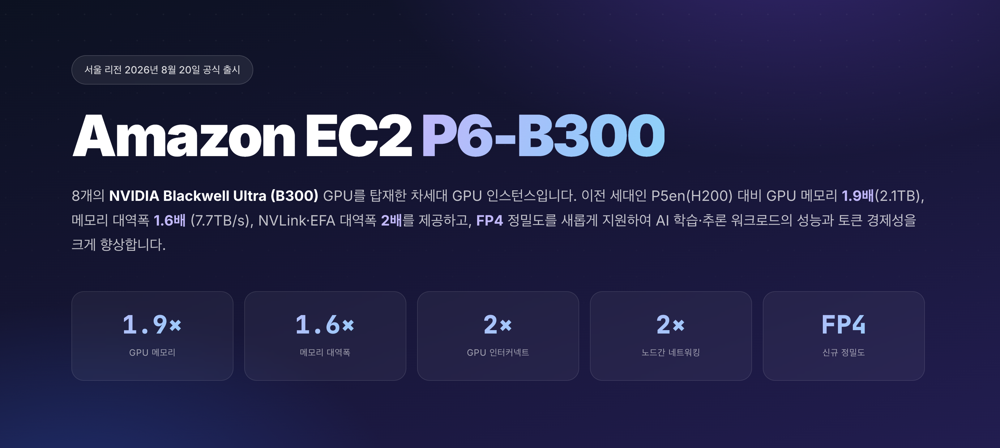
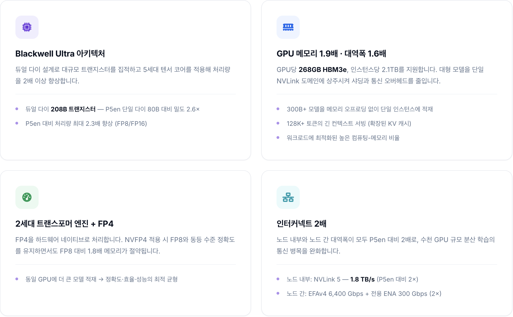

# Amazon EC2 P6-B300 인스턴스 서울 리전 출시

NVIDIA Blackwell Ultra (B300) GPU 8개를 탑재한 Amazon EC2 P6-B300 인스턴스가 서울 리전(ap-northeast-2)에 정식 출시되었습니다. 이전 세대인 P5en(H200) 대비 GPU 메모리 1.9배(2.1TB), 메모리 대역폭 1.6배(7.7TB/s), NVLink·EFA 대역폭 2배를 제공하고, FP4 정밀도를 새롭게 지원하여 AI 학습·추론 워크로드의 성능과 토큰 경제성을 크게 향상합니다.

AWS는 글로벌 주요 CSP 중 유일하게 B300 8-GPU 구성을 지원하며, 미국 리전 외에는 최초로 서울 리전에서 P6-B300을 제공합니다. 이제 한국 고객분들은 데이터 주권을 확보하면서도 최신 Blackwell GPU를 활용할 수 있습니다.

<figure markdown>
{ width="960" }
</figure>

## 1. P6-B300 주요 특징

<figure markdown>
{ width="960" }
</figure>

## 2. 핵심 사양 — 이전 세대(P5en) 대비 향상

| 항목 | P5en (H200) | P6-B300 (B300) | 향상 |
|------|----------------|----------------|------|
| **출시** | '24.12 (서울 '25.03) | '25.11 (서울 '26.08) | — |
| **GPU** | 8 × NVIDIA H200 | 8 × NVIDIA B300 (Blackwell Ultra) | — |
| **아키텍처** | Hopper (단일 다이, 80B) | Blackwell Ultra (듀얼 다이, 208B) | 2.6× 트랜지스터 |
| **GPU 메모리** | 1,128 GB HBM3e (141GB/GPU) | 2,144 GB HBM3e (268GB/GPU) | **1.9×** |
| **메모리 대역폭** | 4.8 TB/s | 7.7 TB/s | **1.6×** |
| **FP8/FP6** | 16 PFLOPS | 36 PFLOPS | **2.25×** |
| **FP4** | 미지원 | 108 PFLOPS (without sparsity) / 144 PFLOPS (with sparsity) | 신규 지원 |
| **FP16/BF16** | 8 PFLOPS | 18 PFLOPS | **2.25×** |
| **NVLink** | NVLink 4 — 900 GB/s | NVLink 5 — 1,800 GB/s | **2×** |
| **네트워킹** | 3,200 Gbps (EFAv3) | 6,400 Gbps (EFAv4) + 300 Gbps 전용 ENA | **EFA 2×, 전용 ENA 신규** |
| **CPU** | Intel Sapphire Rapids | Intel Emerald Rapids | 신규 CPU |
| **시스템 메모리** | 2 TB | 4 TB | **2×** |
| **Nitro System** | Nitro v5 | Nitro v6 | 최신 Nitro |

## 3. 최적 사용 사례

-   :material-server-network:{ .lg .middle } __대규모 추론 서비스__

    ---

    - 70B+ 모델 온라인 추론 최적화 (DeepSeek, Kimi 시리즈 등)
    - 단일 GPU 처리량 100K+ tok/s
    - 268GB로 KV 캐시 전체를 보유해 128K+ 컨텍스트를 네이티브로 서빙
    - **GPU ~50% 절감 · 레이턴시 40~60% ↓**

-   :material-chip:{ .lg .middle } __멀티노드 대규모 학습__

    ---

    - 400B+ 파라미터 모델
    - 6,400 Gbps EFAv4 + NVLink 5로 수천 GPU 이상의 분산 학습
    - 인스턴스 2.1TB+ GPU 메모리로 400B 모델을 충분한 배치·KV 캐시와 함께 서빙
    - **통신 대역폭 2× → 스케일링 효율 ↑**

## 4. 학습(Training) 주요 강점

P6-B300의 메모리·대역폭 향상으로 동일 모델에 필요한 GPU 수가 줄어, 샤딩 전략·분산 학습 오버헤드·디버깅 등 인프라 복잡도가 함께 감소합니다. FP8 네이티브 연산은 P5en 대비 처리량을 2~4배 높여 학습 완료 시간을 단축하고 time-to-market을 개선합니다.

**Phase 1 — Built-in 성능 향상**

- **연산량 4배 향상**: 듀얼 다이 설계와 5세대 텐서코어로 동일 모델·배치 기준 iteration 시간 ~50% 단축
- **GPU 간 대역폭 2배**: NVLink 5로 GPU당 1.8 TB/s 양방향 대역폭 제공 → Tensor/Pipeline Parallelism 필수 네트워크·스토리지 병목 해소
- **AWS 인프라 강화**: EFAv4(6,400 Gbps) + 전용 ENA(300 Gbps) + Nitro v6(NIC당 400 Gbps, RDMA 지원) → 데이터 I/O가 학습 통신을 간섭하지 않아 GPU 유휴 최소화

**Phase 2 — 추가 최적화를 통한 이득**

- **메모리 최적화로 GPU 절감**: GPU당 메모리 1.9배(H200 141GB → B300 268GB) → 절반의 GPU로 동일 모델 학습. 멀티노드 FSDP → 단일 노드 내 DDP 전환 가능(70B 기준)
- **FP8/FP4 양자화**: 하드웨어 네이티브 MXFP8이 BF16 동등 정확도를 유지하며 2배 처리량 제공. NVFP4는 4배 메모리 효율로 더 큰 마이크로 배치 → gradient accumulation 감소 → 처리량 증가
- **데이터파이프라인 최적화(nvCOMP)**: CPU → GPU 전용 하드웨어 압축/해제 오프로드로 I/O 병목 20~30% 감소, 체크포인트 크기 20~30% 단축 → 실험 반복 가속, FSx 비용 절감

## 5. 추론(Inference) 주요 강점

- **메모리 대역폭 1.6배** (4.8 → 7.7 TB/s): 디코드 성능은 메모리 대역폭에 비례 → 토큰당 생성 지연(TPOT) 감소로 실시간 응답성 향상
- **메모리 용량 1.9배** (H200 141GB → B300 268GB/GPU): 모델당 필요 GPU 수 ~50% 절감, TP 차수 감소 → GPU 간 통신 오버헤드 제거. 더 큰 KV 캐시 확보 → 더 많은 동시 세션 또는 더 긴 컨텍스트
- **NVFP4**: FP16 대비 ~4×, FP8 대비 ~1.8× 메모리 절약. 정확도는 FP8 동등 수준 유지, 대용량 prefill 구간 통신 시간 최대 50% 단축
- **NVLink 5** (900 → 1,800 GB/s): MoE 추론 시 Expert Parallel(EP) all-to-all 통신 대역폭 2배 확보 → 대규모 MoE 추론 모델의 멀티 GPU 서빙 지연 감소. Dense 모델 TP AllReduce 병목 완화에도 기여

## 6. Why AWS

-   :material-shield-check:{ .lg .middle } __Expertise__

    ---

    - 업계 최초 클라우드 GPU 서비스 시작, 전 세계 최다 고객 사례 보유
    - 한국 내 GPU 전문 조직 보유
    - AI 인프라 설계·운영·최적화 Best Practice 제공
    - NVIDIA와 15년 이상 협력 및 가장 깊은 SW 공동 최적화

-   :material-speedometer:{ .lg .middle } __Performance__

    ---

    - Nitro System: 전용 하드웨어/하이퍼바이저로 가상화 오버헤드 제거, 베어메탈급 성능
    - 3-Tier 스토리지 구성으로 I/O 병목 제거 및 비용 최적화 (Instance Store + FSx for Lustre + S3)
    - 사전 구성된 Deep Learning AMI/Container로 Time-to-market 단축 및 운영 부담 경감

-   :material-check-decagram:{ .lg .middle } __Reliability__

    ---

    - 99.99% Uptime SLA
    - Nitro 보안칩을 호스트 마더보드에 설치, VM 간 완벽한 격리
    - APAC 주요 클라우드 중 총 다운타임 최소 (Frost & Sullivan 기준, 타사 대비 1/3 미만)

-   :material-puzzle:{ .lg .middle } __Flexibility & Ecosystem__

    ---

    - Major CSP 중 유일한 B300 8-GPU config 지원 (서울 리전 포함)
    - 가장 폭넓은 인스턴스 포트폴리오로 워크로드 특성에 따라 최적의 칩 및 사이즈 선택 가능
    - 다양한 구매 옵션: On-Demand, Capacity Blocks, Spot 인스턴스 등
    - AWS 200+ 서비스와의 네이티브 통합 (S3, FSx, EKS, CloudWatch 등)
    - GPU + Bedrock 하이브리드로 비용 최적화
    - NVIDIA DCGM Exporter, MIG, DRA, Run:ai, NIM 등 NVIDIA Stack 최적화
    - 다양한 오픈소스 및 파트너 생태계

*솔루션 상담 및 도입 문의: smartbae@amazon.com, jaehyun@amazon.com, awsjlee@amazon.com*
